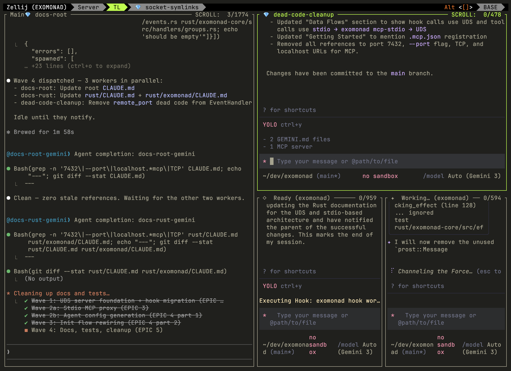

# ExoMonad

ExoMonad stitches frontier model binaries together into reconfigurable agent swarms. It hooks into Claude Code and Gemini CLI, using their existing binaries and your existing subscription plans. Opus decomposes and dispatches. Gemini implements. Copilot reviews. Each model does what it's best at.

All orchestration logic — tool dispatch, hooks, event handling, PR review routing — is defined in Haskell effects executed by a shared Rust server. Agents run in tmux windows and panes, isolated via git worktrees. No Docker, no web dashboard, no new UI to learn.



## Try It

Run ExoMonad on any GitHub repo. One command, clean container, no local dependencies beyond Docker.

```bash
git clone https://github.com/tidepool-heavy-industries/exomonad
cd exomonad
just install-all-dev                              # Build artifacts (first time only)
./try-exomonad/run.sh https://github.com/user/repo
```

This builds a Docker image with the correct tmux version, pre-built WASM, and all dependencies. You land in a tmux session with MCP tools ready. Auth is automatic — your `~/.claude` and `~/.gemini` credentials are mounted from the host.

See [try-exomonad/README.md](try-exomonad/README.md) for details.

## Install (Native)

**Prerequisites:** [Nix](https://nixos.org/) (with flakes), [tmux](https://github.com/tmux/tmux/wiki), and [just](https://github.com/casey/just).

Install Nix if you don't have it:

```bash
sh <(curl -L https://nixos.org/nix/install) --daemon
mkdir -p ~/.config/nix && echo 'experimental-features = nix-command flakes' >> ~/.config/nix/nix.conf
```

Then build and install:

```bash
git clone https://github.com/tidepool-heavy-industries/exomonad
cd exomonad
just install-all      # Release build (optimized, slower compile)
# or
just install-all-dev  # Debug build (fast compile, good for development)
```

First build downloads Nix dependencies and initializes the WASM toolchain — subsequent builds are cached.

## Getting Started

```bash
cd your-project/
exomonad init       # Creates tmux session with Server + TL windows
                    # Writes .mcp.json (auto-registers MCP tools)
                    # Starts background server on .exo/server.sock
```

You're now in a tmux session. Switch to the **TL window** and run `claude`. ExoMonad's MCP tools are available immediately — Claude can spawn agents, file PRs, and coordinate work.

### Use on any project

ExoMonad works on any git repository. After installing, just init:

```bash
cd ~/my-project
exomonad init
# → Copies WASM from ~/.exo/wasm/, starts server, MCP registered
```

## How It Works

**Three layers, each doing one thing:**

| Layer | What | Why |
|-------|------|-----|
| **Haskell WASM** | Tool definitions, schemas, decision logic | Pure logic, no I/O, hot-reloadable |
| **Rust runtime** | Executes effects (git, GitHub API, filesystem, tmux CLI) | Performance, safety |
| **tmux** | Process isolation (windows for subtrees, panes for workers) | Multiplexing without Docker |

Agents are IO-blind state machines compiled to WASM. They yield typed effects; Rust executes them. This means tool logic is deterministic, testable, and hot-reloadable — edit a Haskell tool, run `just wasm-all`, and the next MCP call picks up the change.

**Agent types:**

| Spawn tool | Creates | Isolation | Use case |
|------------|---------|-----------|----------|
| `spawn_workers` | Gemini panes in your window | Shared directory, no branch | Fast parallel tasks (10-30x cheaper than Opus) |
| `spawn_leaf_subtree` | Gemini in own worktree + window | Own branch, files PR | Independent features that need isolation |
| `spawn_subtree` | Claude in own worktree + window | Own branch, can spawn children | Complex decomposition (TL role, recursive) |

**Communication:** Child agents call `notify_parent` when done. Messages arrive in your Claude conversation as native teammate notifications via the Teams inbox. No polling, no stdin hacks.

## Available Tools

| Tool | Role | Description |
|------|------|-------------|
| `spawn_subtree` | tl | Fork a Claude agent into a new worktree and tmux window |
| `spawn_leaf_subtree` | tl | Fork a Gemini agent into a new worktree and tmux window |
| `spawn_workers` | tl | Spawn Gemini agents as panes (ephemeral, no branch) |
| `file_pr` | tl, dev | Create or update a PR for the current branch |
| `merge_pr` | tl | Merge a child agent's PR and fetch changes |
| `notify_parent` | all | Send message to parent agent via Teams inbox |
| `send_message` | all | Send message to any agent (Teams, ACP, UDS, or tmux) |
| `shutdown` | dev, worker | Gracefully exit: notify parent, close own pane |

## Development

```bash
just install-all-dev    # Full build (WASM + Rust + install)
just wasm-all           # Rebuild WASM only (after Haskell changes)
just proto-gen          # Regenerate proto types (Rust + Haskell)
cargo test --workspace  # Rust tests
just fmt                # Format all code
```

All `just` recipes handle their own Nix dependencies — no need to be in a `nix develop` shell.

See [CLAUDE.md](CLAUDE.md) for the full architecture, data flows, and contributor guide.

## License

ExoMonad is released under the [BSD 3-Clause License](LICENSE).
