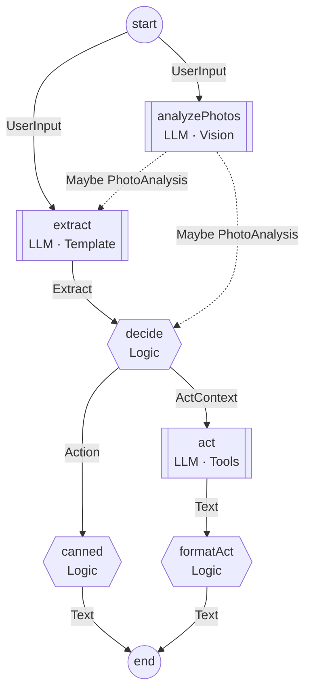

# Tidepool Type-Level DSL for LLM Agent Graphs

A type-level DSL for defining LLM agent state machines. Declare nodes with their dependencies and effects; edges and documentation are derived automatically.

---

## Core Principle

**Everything is an effect. Transitions are the `Goto` effect.**

```haskell
type MyGraph = Graph '[
    Entry :~> UserInput

  , "process" := LLM
      :@ Needs '[UserInput]
      :@ Template ProcessTpl
      :@ Schema Result

  , "decide" := Logic
      :@ Needs '[Result]
      :@ Eff '[Goto "next" Action, Goto Exit Output]

  , Exit :<~ Output
  ]
```

---

## V1 Scope

**In scope:**
- Two node kinds: `LLM` and `Logic`
- `Needs` declarations for dependencies
- `Goto` effect for transitions
- `When` for conditional nodes
- Effect requirements (auto-derived)
- Mermaid generation from types

**Deferred:**
- Model selection (hardcoded per deployment)
- Dynamic fan-out / map over lists
- Subgraph composition

---

## Two Node Kinds

| Kind | Purpose | Inputs | Outputs | Effects |
|------|---------|--------|---------|---------|
| `LLM` | Calls the model | `Needs` | `Schema` (implicit flow) | Implicit LLM |
| `Logic` | Runs Haskell | `Needs` | Via `Goto` (explicit flow) | `Eff '[...]` |

---

## The Goto Effect

Transitions are effects in the stack, not a separate concept:

```haskell
data Goto (target :: k) (a :: Type) :: Effect where
  GotoOp :: a -> Goto target a m ()

goto :: forall target a es. Goto target a :> es => a -> Eff es ()
goto a = send (GotoOp @target a)
```

Usage in handlers:

```haskell
decide = \result -> do
  if shouldContinue result
    then goto @"next" (toAction result)
    else goto @Exit (toOutput result)
```

---

## Defining Nodes

### LLM Nodes

LLM nodes produce via `Schema`. Data flows implicitly to whoever `Needs` it.

```haskell
-- Template-based
"extract" := LLM
    :@ Needs '[UserInput]
    :@ Template ExtractTpl
    :@ Schema Extract

-- Vision-based (photos)
"analyzePhotos" := LLM
    :@ Needs '[UserInput]
    :@ When HasPhotos
    :@ Vision
    :@ Schema PhotoAnalysis

-- With tools
"act" := LLM
    :@ Needs '[ActContext]
    :@ Template ActTpl
    :@ Tools '[ProposeDisposition]
    :@ Schema Text
```

### Logic Nodes

Logic nodes transition via `Goto` effects. No separate "returns" concept.

```haskell
-- Single transition (pure transformation)
"format" := Logic
    :@ Needs '[Answer]
    :@ Eff '[Goto Exit Text]

-- Multiple transitions (branching)
"decide" := Logic
    :@ Needs '[Extract, Maybe PhotoAnalysis]
    :@ Eff '[
        State SessionState
      , Goto "canned" Action
      , Goto "act" ActContext
      ]

-- Effectful with single transition
"retrieve" := Logic
    :@ Needs '[Embedding]
    :@ Eff '[VectorDB, Log, Goto "generate" [Document]]
```

---

## Edge Derivation

Edges come from two sources:

| Source | Edge | Description |
|--------|------|-------------|
| `Schema X` → `Needs '[..X..]` | Implicit | LLM output flows to whoever needs it |
| `Goto "B" X` | Explicit | Logic node transitions to named target |

The `Goto` data type must match one of the target's `Needs`.

```haskell
-- "retrieve" has: Goto "generate" [Document]
-- "generate" has: Needs '[Query, [Document]]
-- Edge: retrieve → generate (provides [Document])
```

---

## Conditional Nodes

Nodes that only run when a condition is met:

```haskell
"analyzePhotos" := LLM
    :@ Needs '[UserInput]
    :@ When HasPhotos
    :@ Vision
    :@ Schema PhotoAnalysis
```

**Downstream nodes automatically receive `Maybe`:**

```haskell
"extract" := LLM
    :@ Needs '[UserInput, Maybe PhotoAnalysis]
    :@ Template ExtractTpl
    :@ Schema Extract
```

---

## Entry and Exit

```haskell
type MyGraph = Graph '[
    Entry :~> InputType          -- Graph input

  , ... nodes ...

  , Exit :<~ OutputType          -- Graph output (what Goto Exit expects)
  ]
```

Exit is just a target for `Goto`:

```haskell
:@ Eff '[Goto Exit FinalResult]

-- In handler:
goto @Exit result
```

---

## Complete Graph Example

```haskell
type TidyingGraph = Graph '[
    Entry :~> UserInput

    -- Observe (conditional)
  , "analyzePhotos" := LLM
      :@ Needs '[UserInput]
      :@ When HasPhotos
      :@ Vision
      :@ Schema PhotoAnalysis

    -- Orient
  , "extract" := LLM
      :@ Needs '[UserInput, Maybe PhotoAnalysis]
      :@ Template ExtractTpl
      :@ Schema Extract

    -- Decide
  , "decide" := Logic
      :@ Needs '[Extract, Maybe PhotoAnalysis]
      :@ Eff '[
          State SessionState
        , Goto "canned" Action
        , Goto "act" ActContext
        ]

    -- Act - canned response
  , "canned" := Logic
      :@ Needs '[Action]
      :@ Eff '[Goto Exit Text]

    -- Act - LLM response
  , "act" := LLM
      :@ Needs '[ActContext]
      :@ Template ActTpl
      :@ Tools '[ProposeDisposition]
      :@ Schema Text

  , "formatAct" := Logic
      :@ Needs '[Text]
      :@ Eff '[Goto Exit Text]

  , Exit :<~ Text
  ]
```

**Edges derived:**
```
Entry ──UserInput──► analyzePhotos ──PhotoAnalysis──► extract
  │                                                      │
  └────────────────────UserInput─────────────────────────┘
                                                         │
                                                      Extract
                                                         │
                                                         ▼
                                                      decide
                                                    ╱        ╲
                                          Action  ╱          ╲  ActContext
                                                 ╱            ╲
                                             canned           act
                                                 │              │
                                              Goto Exit      Schema Text
                                                 │              │
                                                 │          formatAct
                                                 │              │
                                                 └──────┬───────┘
                                                        ▼
                                                      Exit
```

---

## Handlers

Handlers receive what `Needs` declares. Logic nodes return `()` because output is via `Goto`.

```haskell
tidyingHandlers :: Handlers TidyingGraph
tidyingHandlers = Handlers
  { analyzePhotos = \userInput ->
      runVision photoPrompt userInput.photos

  , extract = \userInput mPhotoAnalysis ->
      runLLM extractTemplate (userInput, mPhotoAnalysis)

  , decide = \extract mPhotoAnalysis -> do
      state <- get @SessionState
      let action = decideAction state extract
      if isCanned action
        then goto @"canned" action
        else goto @"act" (ActContext state action)

  , canned = \action ->
      goto @Exit $ case action of
        InstructTrash  -> "Trashed! Next?"
        InstructUnsure -> "Unsure pile. Next?"
        _              -> "What's next?"

  , act = \ctx ->
      runLLMWithTools actTemplate [proposeDisposition] ctx

  , formatAct = \text ->
      goto @Exit text
  }
```

**Handler types derived from the graph:**

```haskell
type Handlers TidyingGraph = Handlers
  { analyzePhotos :: UserInput -> LLM PhotoAnalysis
  , extract :: UserInput -> Maybe PhotoAnalysis -> LLM Extract
  , decide :: Extract -> Maybe PhotoAnalysis -> Eff '[State SessionState, Goto "canned" Action, Goto "act" ActContext] ()
  , canned :: Action -> Eff '[Goto Exit Text] ()
  , act :: ActContext -> LLM Text
  , formatAct :: Text -> Eff '[Goto Exit Text] ()
  }
```

---

## Fan-In: Join Semantics

Multiple nodes can `Goto` the same target with different data:

```haskell
"sentiment" := Logic
    :@ Needs '[Doc]
    :@ Eff '[SomeLLM, Goto "synthesize" Sentiment]

"topics" := Logic
    :@ Needs '[Doc]
    :@ Eff '[SomeLLM, Goto "synthesize" [Topic]]

"entities" := Logic
    :@ Needs '[Doc]
    :@ Eff '[SomeLLM, Goto "synthesize" [Entity]]

"synthesize" := LLM
    :@ Needs '[Sentiment, [Topic], [Entity]]
    :@ Template SynthTpl
    :@ Schema Summary
```

The runner waits for **all** of `synthesize`'s `Needs` to be satisfied before calling it. Each `Goto` provides one piece.

---

## Loops

Use `Goto` to create loops:

```haskell
"generateInitial" := LLM
    :@ Needs '[Spec]
    :@ Template InitialTpl
    :@ Schema Code

"runTests" := Logic
    :@ Needs '[Code]
    :@ Eff '[Process, Log, Goto "evaluate" TestResult]

"evaluate" := Logic
    :@ Needs '[Spec, Code, TestResult]
    :@ Eff '[
        State RetryCount
      , Goto Exit Code              -- Success: exit with code
      , Goto "generateRetry" RetryContext  -- Failure: retry
      ]

"generateRetry" := LLM
    :@ Needs '[RetryContext]
    :@ Template RetryTpl
    :@ Schema Code
    -- Code flows back to runTests via Needs
```

The loop: `runTests → evaluate → generateRetry → runTests`

---

## Effect Requirements

Effects are auto-derived from node declarations:

```haskell
-- Library computes:
-- Requires '[LLM, State SessionState, VectorDB, Log]
-- from all nodes' Eff declarations + implicit LLM effect
```

Explicit declaration for documentation:

```haskell
type MyGraph = Graph '[...]
    :& Requires '[LLM, State SessionState, Log]
```

---

## Mermaid Generation

```haskell
diagram :: Text
diagram = toMermaid @TidyingGraph Proxy
```

Output:



- `[[ ]]` for LLM nodes
- `{{ }}` for Logic nodes
- Dashed lines for `Maybe` (conditional)
- Edge labels show the `Goto` data type

---

## Library Types

```haskell
-- Node kinds
data LLM
data Logic

-- Node properties
data Needs (ts :: [Type])          -- Input dependencies
data Template (t :: Type)          -- Prompt template (LLM)
data Vision                        -- Photo input (LLM)
data Schema (t :: Type)            -- Output schema (LLM)
data Tools (ts :: [Type])          -- Available tools (LLM)
data When (cond :: Type)           -- Conditional execution
data Eff (es :: [Effect])          -- Effect stack (Logic)

-- The transition effect
data Goto (target :: k) (a :: Type) :: Effect

-- Node definition
type (:=) :: Symbol -> Type -> Type
type (:@) :: Type -> Type -> Type

-- Graph
data Graph (nodes :: [Type])
data Entry :~> (inputType :: Type)
data Exit :<~ (outputType :: Type)

-- Annotations
data (:&) (graph :: Type) (annotation :: Type)
data Requires (es :: [Effect])
data Groups (gs :: [(Symbol, [Symbol])])
```

---

## Validation

The library validates at compile time:

1. **Target exists**: Every `Goto "target"` references a real node or `Exit`
2. **Type matches**: The `Goto` data type matches one of target's `Needs`
3. **Needs satisfied**: All `Needs` are satisfiable from Entry, LLM Schema, or Goto
4. **Exit type**: `Goto Exit X` must have `X` matching `Exit :<~ X`

**Error messages:**

```haskell
-- Goto to unknown node
:@ Eff '[Goto "unknown" Data]
-- error: Goto target "unknown" does not exist in graph

-- Type mismatch
-- "target" has Needs '[Foo], but:
:@ Eff '[Goto "target" Bar]
-- error: Goto "target" provides Bar but target needs one of: [Foo]

-- Unsatisfied Needs
"orphan" := Logic :@ Needs '[Xyz] :@ Eff '[...]
-- error: Node "orphan" needs Xyz but nothing provides it
```

---

## Summary

1. **Everything is an effect** - transitions are `Goto` in the effect stack
2. **LLM nodes** produce via `Schema` (implicit flow to whoever `Needs` it)
3. **Logic nodes** transition via `Goto` (explicit flow to named targets)
4. **No Routes/Returns** - just `Eff '[... Goto "target" Type ...]`
5. **Edge derivation** - from Schema→Needs (implicit) and Goto (explicit)
6. **Handler signature** - receives `Needs`, returns `()` for Logic (output via Goto)
7. **Exit is a target** - `Goto Exit Result` terminates the graph
8. **Mermaid from types** - can't drift from code
