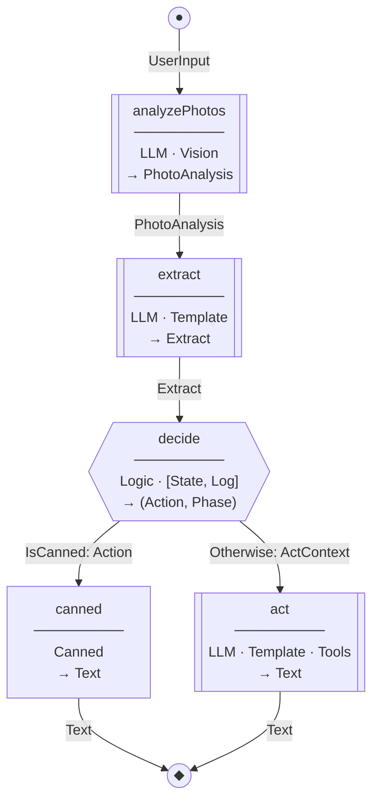
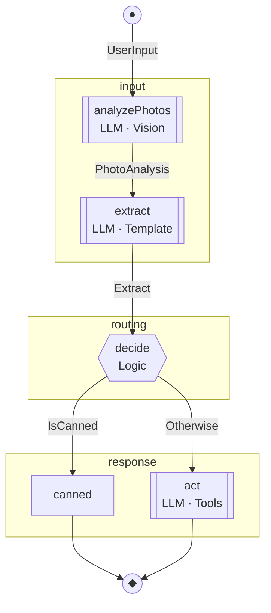

# Tidepool Type-Level DSL for LLM Agent Graphs

A type-level DSL for defining LLM agent state machines with automatic Mermaid diagram generation.

## Design Goals

1. **Nodes and Edges are first-class** — both are named, both carry meaning
2. **Uniform user syntax** — all nodes use `:=` and `:@`, library validates
3. **Complexity hidden in library** — type families do validation, users get nice errors
4. **Mermaid from types** — diagrams derived from type structure, can't drift
5. **Handlers checked against spec** — implementations must match declared signatures

---

## Core Concepts

### Node Kinds

| Kind | Purpose | Required Props | Optional Props | Output Constraint |
|------|---------|----------------|----------------|-------------------|
| `LLM` | LLM invocation | Template or Vision, Schema | Tools | Must have JSON Schema |
| `Logic` | Haskell computation | Sig, Eff or Pure | — | Any type (from Sig) |
| `Canned` | Literal response | Text or Template | — | Text |

### Edges

Edges define data flow between nodes:
- Grouped by source node (`From "x" :-> [...]`)
- Carry type information (`::: PhotoAnalysis`)
- Support guards for branching (`:? IsCanned`)
- Single-target shorthand: `From "a" :-> "b" ::: T` (no list needed)

**Guards are labels, not predicates.** The `:? IsCanned` annotation is for documentation and Mermaid generation. The actual routing logic lives in the handler — when a Logic node returns a value, the runner inspects it to pick which edge to follow. Guards describe the conditions; handlers implement them.

### Data Flow: Accumulator Model

Edges show the **primary data flow** — what triggers the transition. But nodes often need data from multiple upstream sources.

**How it works:** The runner accumulates outputs from all upstream nodes. A node's `Sig` declares what it needs; the runner provides it. Edges show the "triggering" data, not all dependencies.

```
┌──────────────┐         ┌─────────────┐         ┌─────────────┐
│ analyzePhotos│────────►│   extract   │────────►│   decide    │
│              │  Photo  │             │ Extract │             │
└──────────────┘  Analysis└─────────────┘         └─────────────┘
                                                        ▲
       The runner accumulates PhotoAnalysis + Extract   │
       and provides both to decide's handler ───────────┘
```

The `Sig` is the source of truth for what a node receives:
```haskell
type Decide = "decide" := Logic
    :@ Sig (SessionState -> Maybe PhotoAnalysis -> Extract -> ...)
    --     ^^^^^^^^^^^^^^^^^^^^^^^^^^^^^^^^^^^^^^^^^^^^^^^^^^^^
    --     Handler receives all of these, not just the edge data
```

---

## User-Facing Syntax

### Defining Nodes

```haskell
-- LLM nodes: template/vision + schema + optional tools
type AnalyzePhotos = "analyzePhotos" := LLM
    :@ Vision
    :@ Schema PhotoAnalysis

type ExtractIntent = "extract" := LLM
    :@ Template ExtractTpl
    :@ Schema Extract

type ActWithTools = "act" := LLM
    :@ Template ActTpl
    :@ Tools '[ProposeDisposition, ConfirmDone]
    :@ Schema ActOutput

-- Logic nodes: function signature + effects
type Decide = "decide" := Logic
    :@ Sig DecideFromExtract
    :@ Eff '[State SessionState, Log]

type PureCheck = "check" := Logic
    :@ Sig (Action -> Bool)
    :@ Pure  -- sugar for Eff '[]

-- Canned nodes: literal text
type TrashResponse = "trash" := Canned
    :@ Text "Trashed! Next?"

type PlaceResponse = "place" := Canned
    :@ Template "Put it on {location}. Next?"
```

### Collecting Nodes

```haskell
type TidyingNodes = '[
    AnalyzePhotos
  , ExtractIntent
  , Decide
  , CannedResponse
  , ActWithTools
  ]
```

### Defining Edges

```haskell
type TidyingEdges = '[
    -- Entry point
    From Entry :-> '[
        "analyzePhotos" ::: UserInput
      ]

    -- Linear flow
  , From "analyzePhotos" :-> '[
        "extract" ::: PhotoAnalysis
      ]

  , From "extract" :-> '[
        "decide" ::: Extract
      ]

    -- Branching (multiple targets, with guards)
  , From "decide" :-> '[
        "canned" ::: Action      :? IsCanned
      , "act"    ::: ActContext  :? Otherwise
      ]

    -- Convergence
  , From "canned" :-> '[ Exit ::: Text ]
  , From "act"    :-> '[ Exit ::: Text ]
  ]
```

### Composing the Graph

```haskell
type TidyingGraph = Graph TidyingNodes TidyingEdges

-- Optional: grouping for visual organization in Mermaid
type TidyingGraph = Graph TidyingNodes TidyingEdges :& Groups '[
    "input"    := '["analyzePhotos", "extract"]
  , "routing"  := '["decide"]
  , "response" := '["canned", "act"]
  ]
```

---

## Handlers

Handlers provide implementations, checked against the graph spec:

```haskell
tidyingHandlers :: Handlers TidyingGraph
tidyingHandlers = Handlers
  { analyzePhotos = \input ->
      runVision photoAnalysisPrompt input.photos

  , extract = \photoAnalysis ->
      runLLM extractionTemplate (mkContext photoAnalysis)

  , decide = \state photoAnalysis extract ->
      -- Full Haskell logic with effects
      case (phase state, extract.intent) of
        (Surveying, _)
          | not (hasFunction state) -> pure (AskFunction, Surveying)
          | not (hasAnchors state)  -> pure (AskAnchors, Surveying)
          | otherwise               -> pure (FirstInstruction, Sorting)
        (Sorting, IntentDecided) ->
          case extract.choice of
            Just ChoiceTrash -> pure (InstructTrash, Sorting)
            Just ChoicePlace -> pure (InstructPlace loc, Sorting)
            _ -> pure (InstructNext, Sorting)
        -- ... more cases

  , canned = \action -> case action of
      InstructTrash  -> "Trashed! Next?"
      InstructUnsure -> "Unsure pile. Next?"
      InstructNext   -> "What's next?"

  , act = \ctx ->
      runLLMWithTools actTemplate [proposeDisposition] ctx
  }
```

---

## Mermaid Generation

Generated purely from types:

```haskell
mermaid :: Text
mermaid = toMermaid @TidyingGraph Proxy
```

### Output (without groups)



### Output (with groups)



### Mermaid Shape Mapping

| Node Kind | Mermaid Shape | Example |
|-----------|---------------|---------|
| `LLM` | Stadium (rounded) `[[...]]` | `foo[["foo"]]` |
| `Logic` | Diamond `{{...}}` | `foo{{"foo"}}` |
| `Canned` | Rectangle `[...]` | `foo["foo"]` |
| `Entry` | Circle `((●))` | `entry((●))` |
| `Exit` | Circle `((◆))` | `exit((◆))` |

---

## Library Implementation

### Primitives

```haskell
-- ═══════════════════════════════════════════════════════════════
-- NODE KINDS
-- ═══════════════════════════════════════════════════════════════

data LLM      -- LLM invocation node
data Logic    -- Haskell computation node
data Canned   -- Literal text node


-- ═══════════════════════════════════════════════════════════════
-- PROPERTIES
-- ═══════════════════════════════════════════════════════════════

data Template (t :: Type)      -- Jinja template for LLM
data Schema (s :: Type)        -- JSON schema for LLM output
data Tools (ts :: [Type])      -- Available tools for LLM
data Vision                    -- Vision capability for LLM

data Sig (f :: Type)           -- Function signature for Logic
data Eff (es :: [Effect])      -- Effects for Logic
data Pure                      -- No effects (sugar for Eff '[])

data Text (s :: Symbol)        -- Literal text for Canned


-- ═══════════════════════════════════════════════════════════════
-- NODE DEFINITION
-- ═══════════════════════════════════════════════════════════════

-- Attach properties: kind :@ prop :@ prop :@ ...
type family (:@) (base :: Type) (prop :: Type) :: Type

-- Name a node: "name" := kind :@ props...
type family (:=) (name :: Symbol) (spec :: Type) :: Type


-- ═══════════════════════════════════════════════════════════════
-- EDGE DEFINITION
-- ═══════════════════════════════════════════════════════════════

data From (source :: k)                        -- Edge source
data (::->) (from :: Type) (targets :: [Type]) -- Edge bundle

data (target :: k) ::: (dataType :: Type)      -- Data on edge
data (edge :: Type) :? (guard :: Type)         -- Conditional edge

data Entry    -- Graph entry point
data Exit     -- Graph exit point


-- ═══════════════════════════════════════════════════════════════
-- GRAPH DEFINITION
-- ═══════════════════════════════════════════════════════════════

data Graph (nodes :: [Type]) (edges :: [Type])
data (:&) (graph :: Type) (annotations :: Type)
data Groups (gs :: [(Symbol, [Symbol])])
```

### Property Validation

```haskell
-- ═══════════════════════════════════════════════════════════════
-- VALID PROPERTIES PER KIND
-- ═══════════════════════════════════════════════════════════════

type family ValidProperty (kind :: Type) (prop :: Type) :: Constraint where
  -- LLM: Template, Vision, Schema (required), Tools
  ValidProperty LLM (Template t)   = ()
  ValidProperty LLM Vision         = ()
  ValidProperty LLM (Schema s)     = JSONSchema s
  ValidProperty LLM (Tools ts)     = All Tool ts
  ValidProperty LLM (Sig _)        = TypeError (ErrLLMNoSig)
  ValidProperty LLM (Eff _)        = TypeError (ErrLLMNoEff)
  ValidProperty LLM Pure           = TypeError (ErrLLMNoEff)

  -- Logic: Sig (required), Eff or Pure
  ValidProperty Logic (Sig f)      = ValidSig f
  ValidProperty Logic (Eff es)     = All KnownEffect es
  ValidProperty Logic Pure         = ()
  ValidProperty Logic (Template _) = TypeError (ErrLogicNoTemplate)
  ValidProperty Logic (Schema _)   = TypeError (ErrLogicNoSchema)
  ValidProperty Logic (Tools _)    = TypeError (ErrLogicNoTools)

  -- Canned: Text or simple Template only
  ValidProperty Canned (Text s)     = KnownSymbol s
  ValidProperty Canned (Template t) = SimpleTemplate t
  ValidProperty Canned _            = TypeError (ErrCannedOnlyText)


-- ═══════════════════════════════════════════════════════════════
-- REQUIRED PROPERTIES PER KIND
-- ═══════════════════════════════════════════════════════════════

type family HasRequired (kind :: Type) (props :: [Type]) :: Constraint where
  HasRequired LLM props =
    ( RequireProp (Schema _) props (ErrMissingSchema "LLM")
    , RequireOneOf '[Template _, Vision] props (ErrMissingSource "LLM")
    )
  HasRequired Logic props =
    ( RequireProp (Sig _) props (ErrMissingSig "Logic")
    , RequireOneOf '[Eff _, Pure] props (ErrMissingEff "Logic")
    )
  HasRequired Canned props =
    ( RequireOneOf '[Text _, Template _] props (ErrMissingText "Canned")
    )


-- ═══════════════════════════════════════════════════════════════
-- ERROR MESSAGES
-- ═══════════════════════════════════════════════════════════════

type ErrLLMNoSig =
  'Text "LLM nodes don't have Sig — they use Schema for output type"
type ErrLLMNoEff =
  'Text "LLM nodes can't have Eff — LLM effect is implicit"
type ErrLogicNoTemplate =
  'Text "Logic nodes don't have Template — use Sig for the function"
type ErrLogicNoSchema =
  'Text "Logic nodes don't have Schema — output type comes from Sig"
type ErrLogicNoTools =
  'Text "Logic nodes can't call tools — that's what LLM nodes are for"
type ErrCannedOnlyText =
  'Text "Canned nodes only contain text"

type ErrMissingSchema node =
  'Text node ':<>: 'Text " node missing required: Schema"
type ErrMissingSource node =
  'Text node ':<>: 'Text " node needs Template or Vision"
type ErrMissingSig node =
  'Text node ':<>: 'Text " node missing required: Sig"
type ErrMissingEff node =
  'Text node ':<>: 'Text " node needs Eff '[...] or Pure"
type ErrMissingText node =
  'Text node ':<>: 'Text " node needs Text or Template"
```

### Property Extraction

```haskell
-- ═══════════════════════════════════════════════════════════════
-- EXTRACT VALUES FROM PROPERTY LISTS
-- ═══════════════════════════════════════════════════════════════

type family GetSchema (props :: [Type]) :: Type where
  GetSchema (Schema s ': _) = s
  GetSchema (_ ': rest)     = GetSchema rest
  GetSchema '[]             = TypeError ('Text "No Schema found")

type family GetSig (props :: [Type]) :: Type where
  GetSig (Sig f ': _) = f
  GetSig (_ ': rest)  = GetSig rest
  GetSig '[]          = TypeError ('Text "No Sig found")

type family GetEffects (props :: [Type]) :: [Effect] where
  GetEffects (Eff es ': _) = es
  GetEffects (Pure ': _)   = '[]
  GetEffects (_ ': rest)   = GetEffects rest
  GetEffects '[]           = '[]

type family GetTools (props :: [Type]) :: [Type] where
  GetTools (Tools ts ': _) = ts
  GetTools (_ ': rest)     = GetTools rest
  GetTools '[]             = '[]

type family GetTemplate (props :: [Type]) :: Maybe Type where
  GetTemplate (Template t ': _) = 'Just t
  GetTemplate (_ ': rest)       = GetTemplate rest
  GetTemplate '[]               = 'Nothing

type family HasVision (props :: [Type]) :: Bool where
  HasVision (Vision ': _) = 'True
  HasVision (_ ': rest)   = HasVision rest
  HasVision '[]           = 'False
```

### Derived Information

```haskell
-- ═══════════════════════════════════════════════════════════════
-- DERIVE NODE PROPERTIES
-- ═══════════════════════════════════════════════════════════════

type family NodeName (node :: Type) :: Symbol where
  NodeName (Node name _ _) = name

type family NodeKind (node :: Type) :: Type where
  NodeKind (Node _ kind _) = kind

type family NodeOutput (node :: Type) :: Type where
  NodeOutput (Node _ LLM props)    = GetSchema props
  NodeOutput (Node _ Logic props)  = ResultType (GetSig props)
  NodeOutput (Node _ Canned _)     = Text

type family NodeEffects (node :: Type) :: [Effect] where
  NodeEffects (Node _ LLM _)       = '[LLMEffect]
  NodeEffects (Node _ Logic props) = GetEffects props
  NodeEffects (Node _ Canned _)    = '[]


-- ═══════════════════════════════════════════════════════════════
-- DERIVE HANDLER TYPES
-- ═══════════════════════════════════════════════════════════════

type family HandlerType (node :: Type) :: Type where
  HandlerType (Node _ LLM props) =
    LLMHandler (GetTemplate props) (GetTools props) (GetSchema props)
  HandlerType (Node _ Logic props) =
    GetSig props
  HandlerType (Node _ Canned _) =
    ()  -- no handler needed, text is in the type
```

### Mermaid Generation

```haskell
-- ═══════════════════════════════════════════════════════════════
-- MERMAID GENERATION (type-class based)
-- ═══════════════════════════════════════════════════════════════

class KnownGraph (g :: Type) where
  reflectGraph :: Proxy g -> GraphRepr

data GraphRepr = GraphRepr
  { grNodes  :: [NodeRepr]
  , grEdges  :: [EdgeRepr]
  , grGroups :: [(Text, [Text])]
  }

data NodeRepr = NodeRepr
  { nrName   :: Text
  , nrKind   :: NodeKindRepr
  , nrProps  :: [Text]
  , nrOutput :: Text
  }

data NodeKindRepr = LLMRepr | LogicRepr | CannedRepr

data EdgeRepr = EdgeRepr
  { erFrom   :: Text
  , erTo     :: Text
  , erData   :: Text
  , erGuard  :: Maybe Text
  }

-- Render to Mermaid syntax
renderMermaid :: GraphRepr -> Text
renderMermaid gr = T.unlines $
  [ "flowchart TD" ]
  ++ concatMap renderGroup (grGroups gr)
  ++ map renderNode (grNodes gr)
  ++ map renderEdge (grEdges gr)

renderNode :: NodeRepr -> Text
renderNode nr = case nrKind nr of
  LLMRepr    -> nrName nr <> "[[\"" <> label <> "\"]]"
  LogicRepr  -> nrName nr <> "{{\"" <> label <> "\"}}"
  CannedRepr -> nrName nr <> "[\"" <> label <> "\"]"
  where
    label = nrName nr <> "<br/>→ " <> nrOutput nr

renderEdge :: EdgeRepr -> Text
renderEdge er = case erGuard er of
  Nothing -> erFrom er <> " -->|" <> erData er <> "| " <> erTo er
  Just g  -> erFrom er <> " -->|\"" <> g <> ": " <> erData er <> "\"| " <> erTo er

-- Top-level generation
toMermaid :: forall g. KnownGraph g => Proxy g -> Text
toMermaid p = renderMermaid (reflectGraph p)
```

---

## Complete Example

```haskell
{-# LANGUAGE DataKinds #-}
{-# LANGUAGE TypeOperators #-}
{-# LANGUAGE TypeFamilies #-}

module Tidying.Graph where

import Tidepool.Graph

-- ═══════════════════════════════════════════════════════════════
-- NODE DEFINITIONS
-- ═══════════════════════════════════════════════════════════════

type AnalyzePhotos = "analyzePhotos" := LLM
    :@ Vision
    :@ Schema PhotoAnalysis

type ExtractIntent = "extract" := LLM
    :@ Template ExtractTpl
    :@ Schema Extract

type Decide = "decide" := Logic
    :@ Sig (SessionState -> Maybe PhotoAnalysis -> Extract
            -> Eff '[State SessionState, Log] (Action, Phase))
    :@ Eff '[State SessionState, Log]

type CannedResponse = "canned" := Canned
    :@ Text "Response text"  -- actual dispatch in handler

type ActWithTools = "act" := LLM
    :@ Template ActTpl
    :@ Tools '[ProposeDisposition, ConfirmDone]
    :@ Schema ActOutput

type TidyingNodes = '[
    AnalyzePhotos
  , ExtractIntent
  , Decide
  , CannedResponse
  , ActWithTools
  ]


-- ═══════════════════════════════════════════════════════════════
-- EDGE DEFINITIONS
-- ═══════════════════════════════════════════════════════════════

type TidyingEdges = '[
    From Entry :-> '[
        "analyzePhotos" ::: UserInput
      ]

  , From "analyzePhotos" :-> '[
        "extract" ::: PhotoAnalysis
      ]

  , From "extract" :-> '[
        "decide" ::: Extract
      ]

  , From "decide" :-> '[
        "canned" ::: Action      :? IsCanned
      , "act"    ::: ActContext  :? Otherwise
      ]

  , From "canned" :-> '[ Exit ::: Text ]
  , From "act"    :-> '[ Exit ::: Text ]
  ]


-- ═══════════════════════════════════════════════════════════════
-- GRAPH
-- ═══════════════════════════════════════════════════════════════

type TidyingGraph = Graph TidyingNodes TidyingEdges :& Groups '[
    "observe"  := '["analyzePhotos"]
  , "orient"   := '["extract"]
  , "decide"   := '["decide"]
  , "act"      := '["canned", "act"]
  ]


-- ═══════════════════════════════════════════════════════════════
-- HANDLERS
-- ═══════════════════════════════════════════════════════════════

tidyingHandlers :: Handlers TidyingGraph
tidyingHandlers = Handlers
  { analyzePhotos = \input ->
      runVision photoAnalysisPrompt input.photos

  , extract = \photoAnalysis ->
      runLLM extractionTemplate (mkContext photoAnalysis)

  , decide = \state photoAnalysis extract ->
      case (phase state, extract.intent) of
        (Surveying, _)
          | not (hasFunction state) -> pure (AskFunction, Surveying)
          | otherwise               -> pure (FirstInstruction, Sorting)
        (Sorting, IntentDecided) ->
          case extract.choice of
            Just ChoiceTrash -> pure (InstructTrash, Sorting)
            _ -> pure (InstructNext, Sorting)
        _ -> pure (InstructNext, phase state)

  , canned = ()  -- text is in the type, dispatch handled by runner

  , act = \ctx ->
      runLLMWithTools actTemplate [proposeDisposition] ctx
  }


-- ═══════════════════════════════════════════════════════════════
-- MERMAID (generated at compile time)
-- ═══════════════════════════════════════════════════════════════

tidyingDiagram :: Text
tidyingDiagram = toMermaid @TidyingGraph Proxy

-- Can be spliced into documentation, CLAUDE.md, etc.
```

---

## Error Examples

### Missing required property

```haskell
type BadNode = "foo" := LLM
    :@ Template MyTpl
    -- Missing Schema!
```

```
error:
    • LLM node missing required: Schema
    • In the type synonym declaration for 'BadNode'
```

### Invalid property for kind

```haskell
type BadNode = "foo" := LLM
    :@ Template MyTpl
    :@ Schema MyOutput
    :@ Eff '[State S]  -- LLM can't have Eff!
```

```
error:
    • LLM nodes can't have Eff — LLM effect is implicit
    • In the type synonym declaration for 'BadNode'
```

### Wrong kind of node

```haskell
type BadNode = "foo" := Canned
    :@ Tools '[MyTool]  -- Canned can't have Tools!
```

```
error:
    • Canned nodes only contain text
    • In the type synonym declaration for 'BadNode'
```

---

## Future Extensions

### Additional Node Kinds

```haskell
-- Parallel execution
type Parallel = "par" := Fork
    :@ Branches '["a", "b", "c"]
    :@ Join "result"

-- Subgraph reference
type SubFlow = "sub" := Embed OtherGraph
    :@ Input SubInput
    :@ Output SubOutput

-- Retry wrapper
type Resilient = "retry" := Retry
    :@ MaxAttempts 3
    :@ Target "unreliableNode"
```

### Edge Annotations

```haskell
-- Timeout on edge
, From "slow" :-> '[ "next" ::: Data :@ Timeout 5000 ]

-- Transform on edge
, From "a" :-> '[ "b" ::: NewType :@ Via transform ]

-- Conditional + priority
, From "router" :-> '[
      "high"   ::: Data :? IsUrgent   :@ Priority 1
    , "medium" ::: Data :? IsNormal   :@ Priority 2
    , "low"    ::: Data :? Otherwise  :@ Priority 3
    ]
```

### Composition

```haskell
-- Compose subgraphs
type BigGraph =
    PrepareSubgraph
      :>>> ProcessSubgraph
      :>>> FinalizeSubgraph

-- Import/export boundaries
type PrepareSubgraph = Subgraph '[...]
    :=> Exports "prepared"

type ProcessSubgraph = Subgraph '[...]
    :=> Imports "prepared"
    :=> Exports "processed"
```
