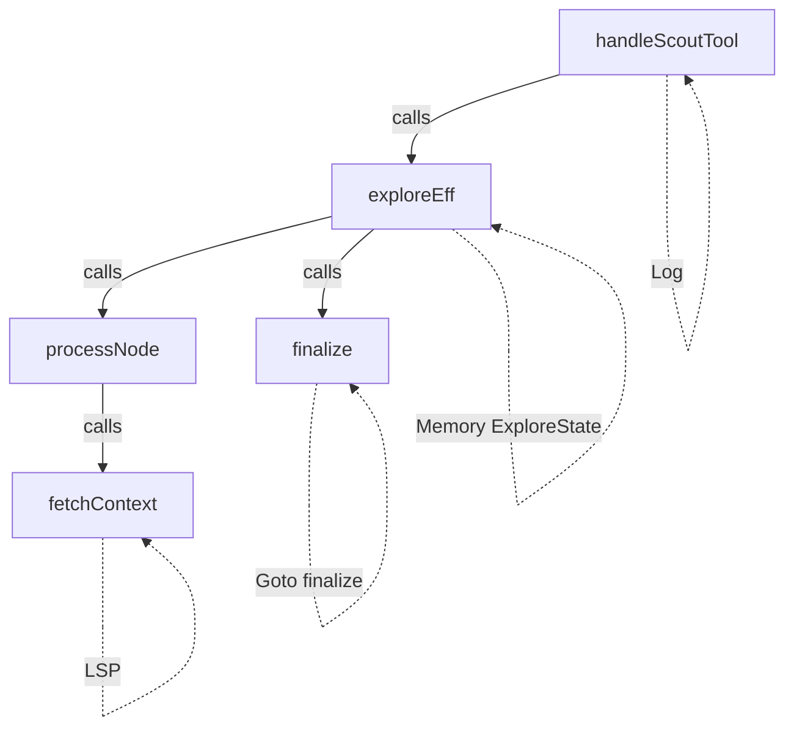

# Find Effects (Transitive)

**Frequency:** 3-5 times per session
**Pain Level:** 8/10 (error-prone, lose track of call depth)

## Problem

In effect-heavy code (freer-simple, polysemy, etc.), I need to know **what effects a function uses transitively**. The type signature only shows direct constraints. Understanding the full effect set requires recursively exploring called functions.

## Current Workflow

1. Read function definition (e.g., `handleScoutTool`)
2. Note direct constraints: `Member Log effs`
3. Find all function calls in body
4. For each called function:
   - Click to definition
   - Read its constraints
   - If it calls other functions, recurse
5. Mentally deduplicate and aggregate
6. Track call depth to understand where effects come from

**Time:** 5-10 minutes per function
**Error rate:** High (easy to miss a call path or duplicate effects)

## Desired Tool

```bash
$ find-effects handleScoutTool
```

**Output:**
```
Direct constraints:
  Member Log effs

Transitive (via exploreEff):
  Member LSP effs          [exploreEff → fetchContext]
  Member (Memory ExploreState) effs  [exploreEff]
  Member (Goto "finalize" TeachingDoc) effs  [exploreEff → finalize]

Via runExploration:
  Member Log effs          [runExploration]

Total unique effects:
  - LSP
  - Log
  - Memory ExploreState
  - Goto "finalize" TeachingDoc

Call depth: 3
```

## Why This Matters

- **Adding constraints:** If I call this function, what constraints do I need?
- **Understanding dependencies:** What external capabilities does this need?
- **Refactoring:** If I remove an effect, what breaks?
- **Interpreter requirements:** What interpreters do I need to run this?

## Example: Real Use Case

When understanding `handleScoutTool` (control-server):

```haskell
handleScoutTool :: (Member Log effs) => ScoutQuery -> Eff effs ScoutResponse
handleScoutTool query = do
  logDebug "Running scout tool"
  result <- exploreEff query  -- What effects does THIS need?
  pure result
```

To call `exploreEff`, I need to know:
- Does it use LSP? (yes → need `runLSP` interpreter)
- Does it use Memory? (yes → need initialization)
- Does it use Goto? (yes → need graph runner)

Without this tool, I have to manually trace through `exploreEff` → `processNode` → `fetchContext` → etc.

## Implementation Approach

### Algorithm

```
function findEffects(functionName, visited = Set.empty):
  if functionName in visited:
    return []  // avoid infinite recursion

  visited.add(functionName)

  1. definition(functionName) → get function body
  2. hover(functionName) → parse type signature for constraints
     - Extract: Member Foo effs, Member (Bar s) effs, etc.

  3. Find all function calls in body:
     - Parse function body for identifiers
     - For each identifier: hover → check if it's a function
     - Filter out: data constructors, imports, local bindings

  4. For each called function:
     - Recurse: findEffects(calledFunc, visited)
     - Track call path: functionName → calledFunc

  5. Aggregate:
     - Deduplicate effects
     - Group by: direct vs transitive
     - Track where each effect comes from (call path)

  6. Stop recursion at interpreters:
     - Recognize: runLSP, runLog, runMemory, etc.
     - These "consume" effects, don't propagate them upward
```

### Heuristics for Finding Function Calls

**Function call patterns:**
```haskell
result <- exploreEff query       -- monadic bind
pure $ exploreEff query          -- in expression
let x = exploreEff query in ...  -- in let binding
```

**NOT function calls:**
```haskell
data Foo = exploreEff            -- constructor
import Foo (exploreEff)          -- import
type Alias = exploreEff          -- type alias
```

**Method:**
1. Parse function body (between `=` and end of definition)
2. Extract identifiers (exclude keywords, operators)
3. For each identifier: `hover` → check if type is `... -> Eff effs ...`
4. If yes, it's a function call

### Handling Interpreters

**Recognizing interpreters:**
```haskell
runLSP :: LSPSession -> Eff (LSP : effs) a -> Eff effs a
runLog :: Eff (Log : effs) a -> Eff effs a
```

Pattern: Function that **removes** an effect from the stack.

**Detection:**
- Name starts with `run` (heuristic)
- Type signature shows `Eff (E : effs) a -> Eff effs a` pattern
- Manually curated list: `runLSP, runLog, runMemory, runM, etc.`

When we hit an interpreter, **stop propagating that effect upward**.

## Test Cases

### Test 1: Simple Direct Effect
```haskell
-- File: Simple.hs
foo :: Member Log effs => Eff effs ()
foo = logDebug "test"
```

**Expected:**
```
Direct: [Log]
Transitive: []
Total: [Log]
```

### Test 2: Transitive Effects
```haskell
-- File: Nested.hs
bar :: Member Log effs => Eff effs ()
bar = foo  -- calls Simple.foo

baz :: Member Log effs => Eff effs ()
baz = bar  -- calls Nested.bar
```

**Expected for `baz`:**
```
Direct: [Log]
Transitive (via bar): [Log] (bar → foo)
Total: [Log]
Call depth: 3
```

### Test 3: Multiple Effects
```haskell
-- File: Multi.hs
process :: (Member LSP effs, Member Log effs) => Eff effs ()
process = do
  logDebug "start"
  info <- hover doc pos  -- uses LSP
  logDebug "done"
```

**Expected:**
```
Direct: [LSP, Log]
Transitive: []
Total: [LSP, Log]
```

### Test 4: Interpreter Boundary
```haskell
-- File: Runner.hs
main :: IO ()
main = do
  session <- initLSP
  runM $ runLog $ runLSP session $ process
```

**Expected for `main`:**
```
Direct: []
Transitive: [] (all effects interpreted)
Total: []

Interpreters used:
  - runM (IO)
  - runLog (Log)
  - runLSP (LSP)
```

## Challenges

### 1. Effect Polymorphism

```haskell
foo :: Eff effs ()  -- no constraints!
foo = pure ()
```

Can't determine effects without constraints. **Solution:** Assume `[]` if no constraints.

### 2. Complex Constraints

```haskell
foo :: (Member (State s) effs, Members '[Log, LSP] effs) => ...
```

Need to parse:
- `Member Foo effs`
- `Member (Bar s) effs` (with type params)
- `Members '[Foo, Bar] effs` (list of effects)

### 3. Higher-Order Functions

```haskell
mapM exploreEff queries
```

`mapM` doesn't add effects, but `exploreEff` does. Need to recognize `exploreEff` as the call target.

### 4. Locally-Defined Functions

```haskell
process = do
  let helper x = logDebug x  -- uses Log
  helper "test"
```

`helper` isn't a top-level symbol. **Solution:** Parse local bindings in function body.

## Future: Effect Call Graph

Could visualize as a graph:

```bash
$ find-effects handleScoutTool --graph
```

**Output (Mermaid):**


## Related Tools

- [find-constrained](../medium-frequency/09-find-constrained.md) - Find all functions with a specific constraint
- [find-callers](04-find-callers.md) - Find what calls this function (inverse problem)
