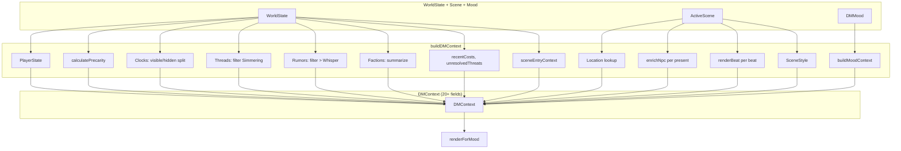
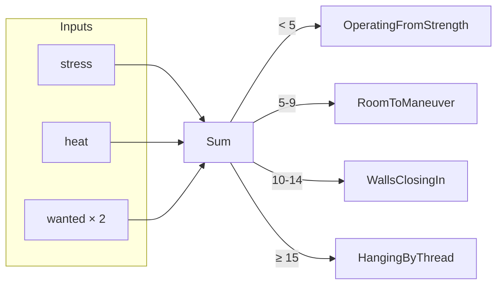
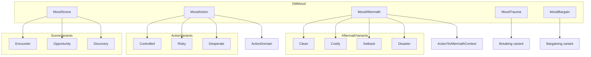
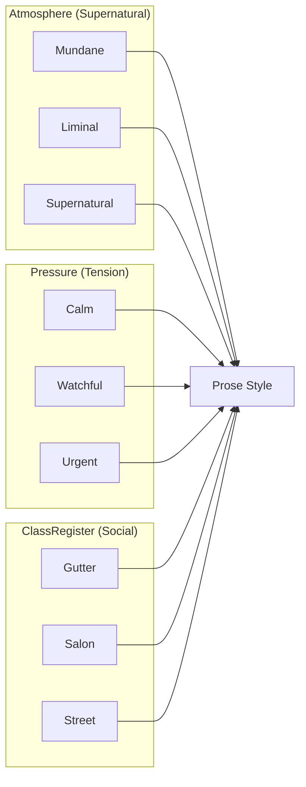
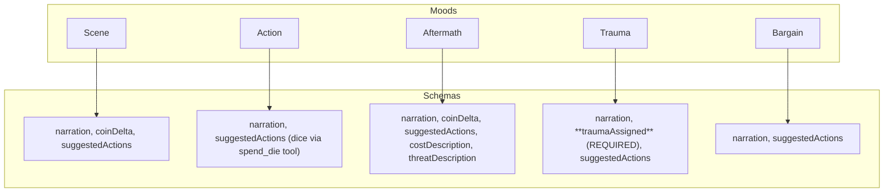
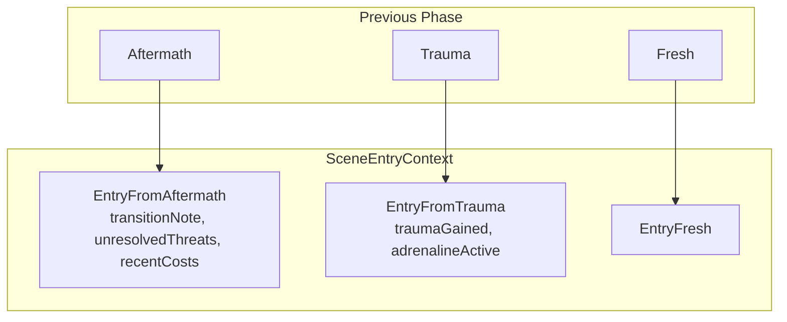

# Context Pipeline

How world state flows into templates. This is the core of LLM behavior modulation.

## DMContext Assembly



**Source:** `Context.hs` buildDMContext

---

## Precarity Calculation

Precarity determines narrative voice intensity.



Note: `hunted` and `recovering` params were removed - if needed later, add fields to PlayerState.

| Precarity | Score | Prose Style |
|-----------|-------|-------------|
| OperatingFromStrength | < 5 | Expansive, bold, carelessness has costs |
| RoomToManeuver | 5-9 | Noir cool, professional, measured |
| WallsClosingIn | 10-14 | Tense, options narrowing, vice tightening |
| HangingByThread | ≥ 15 | Desperate, staccato, world compressed |

**Source:** `Context.hs` calculatePrecarity

---

## MoodVariantContext (~40 nullable fields)

Different mood variants populate different subsets:



### Fields by Variant

| Variant | Fields Populated |
|---------|------------------|
| Encounter | mvcSceneType, mvcSource, mvcSceneUrgency, mvcEscapable |
| Opportunity | mvcSceneType, mvcOfferedBy, mvcNature, mvcCatch |
| Discovery | mvcSceneType, mvcWhat, mvcImplications |
| Controlled | mvcPosition, mvcAdvantageSource, mvcOpportunity, mvcThreat |
| Risky | mvcPosition, mvcThreat, mvcOpportunity |
| Desperate | mvcPosition, mvcWhyDesperate, mvcThreat, mvcOpportunity, mvcPotentialTrauma |
| Clean | mvcOutcomeType, mvcWhatAchieved + action context |
| Costly | mvcOutcomeType, mvcWhatAchieved, mvcCostsPaid, mvcNewComplications + action context |
| Setback | mvcOutcomeType, mvcWhatWentWrong, mvcImmediateDanger, mvcEscapeRoute + action context |
| Disaster | mvcOutcomeType, mvcWhatWentWrong, mvcImmediateDanger, mvcPotentialTrauma + action context |
| Breaking | mvcTraumaType, mvcWhatBroke, mvcAdrenaline |
| Bargaining | mvcBargainContext, mvcCanRetreat, mvcRetreatDesc, mvcPassOutDesc |

**Action context fields** (carried into Aftermath): mvcActionDieChosen, mvcActionPosition, mvcActionEffect, mvcActionTier, mvcActionOtherDice, mvcActionDomain, mvcActionStakes

**Source:** `Context.hs` MoodVariantContext, variant context builders

---

## SceneStyle (3 Compositional Axes)



| Axis | Values | Effect on Prose |
|------|--------|-----------------|
| Atmosphere | Mundane | Physics works, ghosts are stories |
| | Liminal | Wrongness accumulates, peripheral movement |
| | Supernatural | Ghosts present, electroplasm pulsing |
| Pressure | Calm | Long sentences, breathing room |
| | Watchful | Background tension, subtext |
| | Urgent | Staccato, short sentences, compress |
| ClassRegister | Gutter | Rot, desperation, blunt dialogue |
| | Street | Working criminal, codes, reputation |
| | Salon | Polished, calculated, poison over blade |

**Source:** `State.hs` SceneStyle, `templates/_shared/style_shards.jinja`

---

## Output Schema Per Mood

Each mood has a DIFFERENT JSON schema for structured output:



**Key differences:**
- **Action** calls `spend_die` tool for dice mechanics (no structured output for dice)
- **Trauma** requires `traumaAssigned` (the scar gained)
- **Aftermath** has `costDescription` and `threatDescription` for echoing
- **Scene** has no stress/heat deltas (all consequences through dice)
- `continueScene` was removed from all schemas

**Source:** `Templates.hs` mood-specific output schemas

---

## Template Variable Consumption

What templates actually read from DMContext:

```mermaid
flowchart LR
    subgraph DMContext
        CP[ctxPlayer]
        CPR[ctxPrecarity]
        CSS[ctxSceneStyle]
        CMV[ctxMoodVariant]
        CD[ctxDice]
        CL[ctxLocation]
        CN[ctxPresentNpcs]
        CC[ctxVisibleClocks]
        CT[ctxActiveThreads]
        CRC[ctxRecentCosts]
        CUT[ctxUnresolvedThreats]
        CSE[ctxSceneEntry]
        CRR[ctxRelevantRumors]
        CF[ctxFactionsInPlay]
        CSG[ctxSessionGoals]
    end

    subgraph PlayerDerived
        CP --> |".stress"| STHRESH[Stress Thresholds]
        CP --> |".heat"| HTHRESH[Heat Thresholds]
        CP --> |".wanted"| WTHRESH[Wanted Thresholds]
        CP --> |".trauma"| THAND[Trauma Handlers]
    end

    subgraph StyleDerived
        CSS --> |".ssAtmosphere"| ATMOS[Atmosphere Prose]
        CSS --> |".ssPressure"| PRESS[Pressure Prose]
        CSS --> |".ssClass"| CLASS[Class Prose]
    end

    CPR --> PRECPRSE[Precarity Prose]
    CMV --> MVPRSE[Variant-Specific Content]
    CD --> DICEPRSE[Dice Display]
    CSE --> ENTRYPRSE[Entry Context Block]
    CRC --> ECHOPROCE[Echo: "Still rippling"]
    CUT --> SHADOWPRSE[Shadow: "Still looming"]
```

### Stress Thresholds (affects prose)

| Stress | Label | Effect |
|--------|-------|--------|
| ≥ 8 | Fraying | Short sentences, physical symptoms, "one bad moment from breaking" |
| ≥ 5 | Wearing | Cracks visible, NPCs notice |
| ≥ 3 | Functional | Occasional tells |
| < 3 | Clean | Confident prose |

### Heat Thresholds (affects narrative)

| Heat | Label | Effect |
|------|-------|--------|
| ≥ 8 | Hunting | NPCs nervous, surveillance present |
| ≥ 5 | Watching | Strangers linger, prices higher |
| ≥ 3 | Ripples | Rumors spreading |

### Trauma Handlers

Templates have explicit prose guidance for each trauma type:
- **Paranoid**: Threats that may/may not be real
- **Cold**: Clinical observation, emotional distance
- **Obsessed**: Fixation bleeds into everything
- **Reckless**: Safe options feel like cowardice
- **Haunted**: Ghosts, memories, faces in crowds
- **Vicious**: Violence as first solution
- **Volatile**: Emotions spike without warning
- **Soft**: Every victim is personal

**Source:** `templates/scene/main.jinja`, `templates/action/main.jinja`

---

## Scene Entry Context

Templates know HOW you arrived at the current scene:



Note: `EntryFromDowntime` was removed - downtime phase not implemented.

Templates render this as `<how_they_arrived>` block with phase-specific prose.

**Source:** `State.hs` SceneEntryContext, `templates/scene/main.jinja`

---

## Filtering Logic

Not all world state reaches templates:

| Source | Filter | Result |
|--------|--------|--------|
| Clocks | `clockVisible` | ctxVisibleClocks vs ctxHiddenClocks |
| Threads | `tension != Simmering` | ctxActiveThreads |
| Rumors | `spread > Whisper` | ctxRelevantRumors |
| NPCs | Present in scene | Enriched with disposition, currentWant |
| Factions | All | Summarized with attitude, currentGoal |

**Source:** `Context.hs` buildDMContext filtering logic
