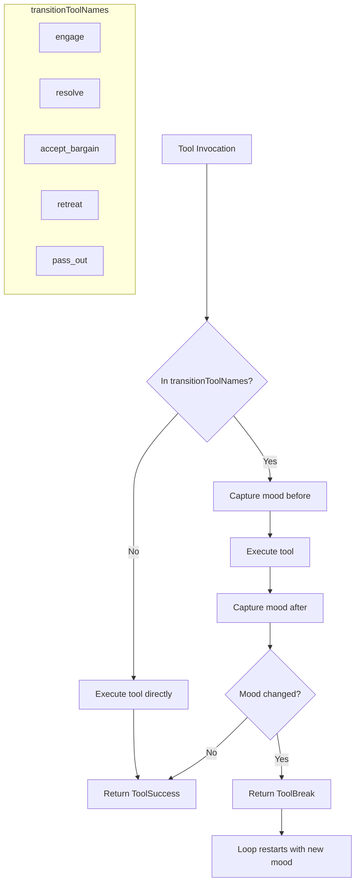
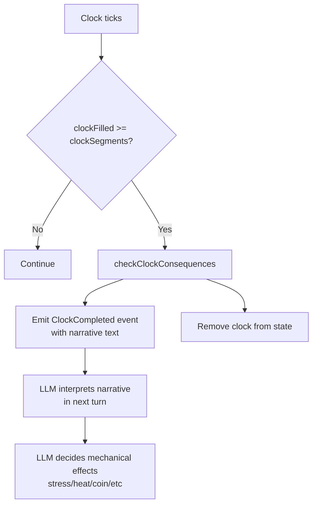
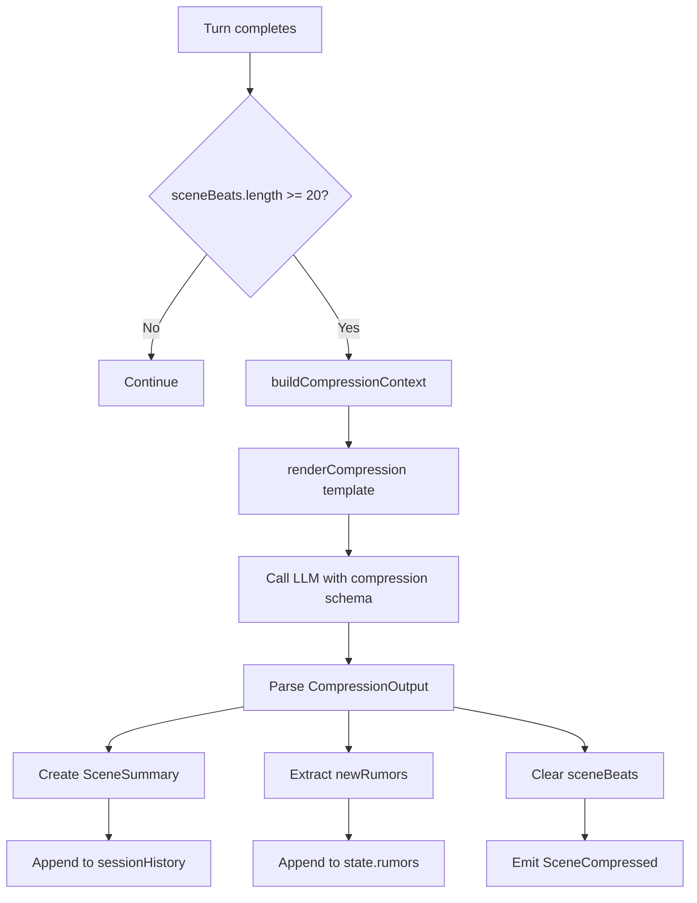
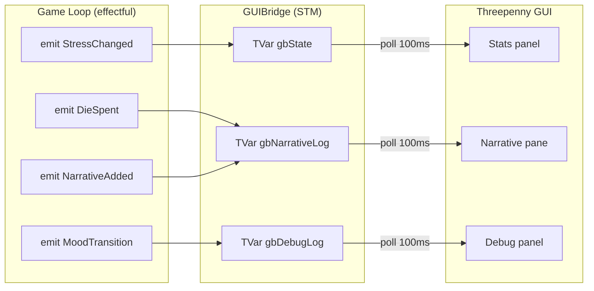

# Flowcharts

Decision flows and data pipelines.

## Tool Dispatch

How tool calls are executed and how transition tools restart the loop.



**Source:** `Tools.hs` transitionToolNames

```haskell
transitionToolNames :: [Text]
transitionToolNames = ["engage", "resolve", "accept_bargain", "retreat", "pass_out"]
```

Note: `accept` is NOT a transition tool - it completes the turn, doesn't restart it.

---

## Clock Completion & Consequences

What happens when a clock fills.



**Source:** `Loop.hs` checkClockConsequences

### Narrative-Based Consequences

Clock consequences are 2-3 sentences of narrative text describing what happens when the clock fills. The LLM interprets this at runtime and applies appropriate mechanical effects through its normal output (stress/heat/coin deltas).

---

## Compression Flow

Scene beats get summarized when they exceed 20 entries.



**Source:** `Loop.hs` compressIfNeeded, `Output.hs` CompressionOutput

### CompressionOutput

```haskell
data CompressionOutput = CompressionOutput
  { summary :: Text           -- One paragraph summary
  , keyMoments :: [Text]      -- 3-5 key moments
  , consequenceSeeds :: Text  -- Comma-separated seeds
  , stressChange :: Int       -- Net stress change
  , coinChange :: Int         -- Net coin change
  , newRumors :: [RumorInit]  -- Rumors that emerged
  }
```

---

## Event Flow (Game -> GUI)

How events flow from the effectful game loop to the threepenny GUI.



**Source:** `Tidepool/GUI/Core.hs` GUIBridge type, `DM/GUI/App.hs` polling loop

### Key Events

| Event | Purpose |
|-------|---------|
| NarrativeAdded | Primary channel for DM prose to GUI |
| StressChanged | Triggers stats panel update |
| DieSpent | Logs die usage to narrative |
| MoodTransition | Debug tracking of state changes |
| ClockCompleted | Fires consequence, updates clocks panel |
