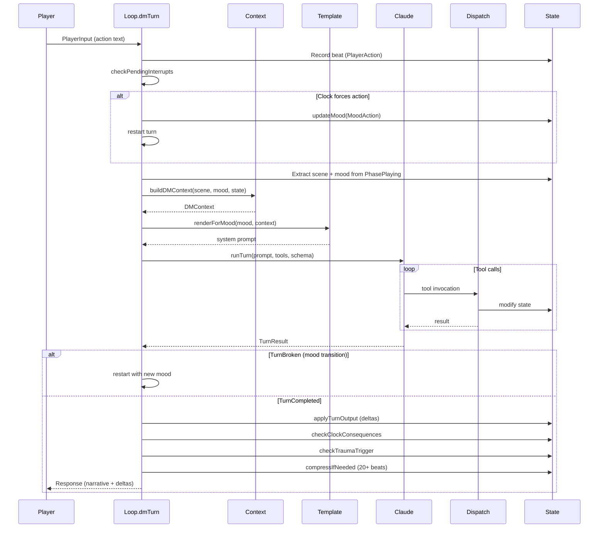
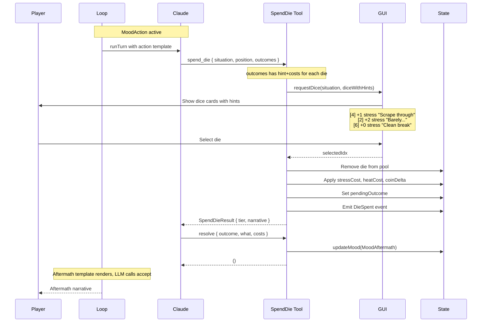

# Sequence Diagrams

Turn-by-turn message flows.

## Main Turn Sequence (dmTurn)

The core game loop. Shows how player input flows through context building, LLM call, and state mutation.



**Source:** `Loop.hs` dmTurn

### Key Steps

1. **Record input** - Append to `sceneBeats` for history
2. **Check interrupts** - Clock may have forced an action
3. **Build context** - Gather all state into DMContext
4. **Render template** - Mood selects which template
5. **Call LLM** - With tools and output schema
6. **Dispatch tools** - Tools modify state, may trigger transition
7. **Apply deltas** - stress/heat/coin changes
8. **Check consequences** - Clock completion, trauma trigger
9. **Compress** - Summarize if 20+ beats

---

## Dice Selection Flow

The precommitted outcome pattern. LLM calls `spend_die` tool, which handles dice selection and populates `pendingOutcome` for the `resolve` tool.



**Source:** `Tools.hs` SpendDie, Resolve

### What Player Sees

```
Pool: [4] [2] [6]

[4] +1 stress, +0 heat — "Scrape through, bruised"
[2] +2 stress, +1 heat — "Barely, and they saw your face"
[6] +0 stress, +0 heat — "Clean break"
```

High dice = good outcomes but cost opportunity. Low dice = bad outcomes but save high dice for later.
