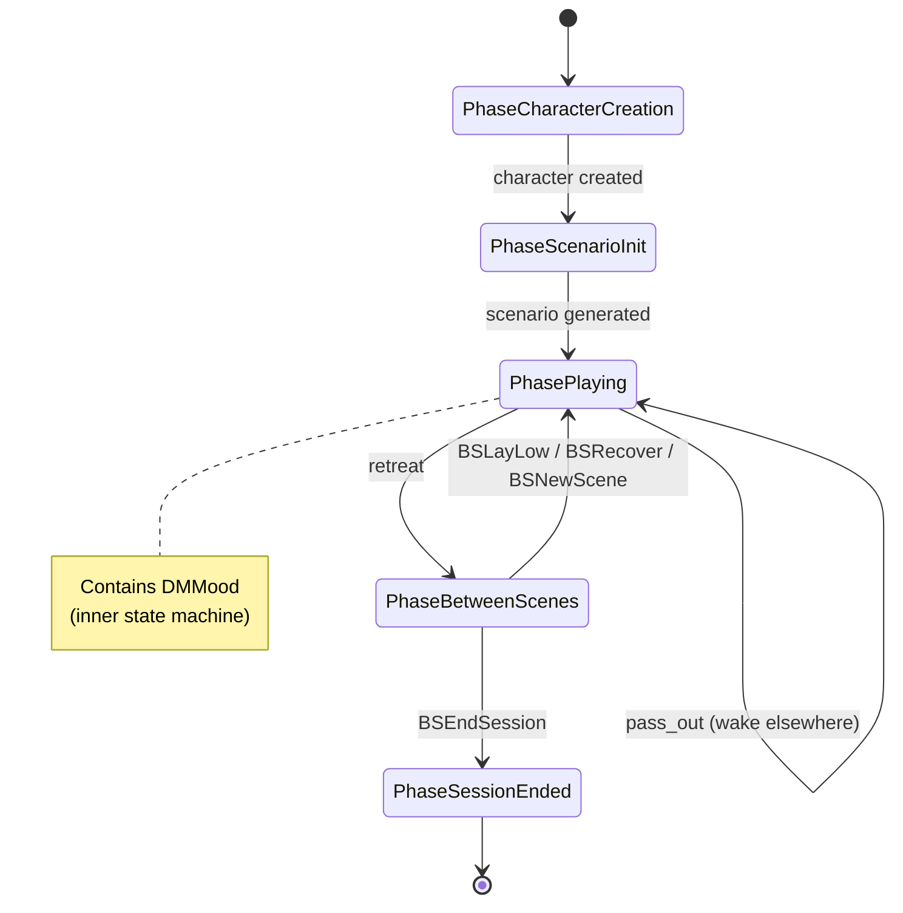
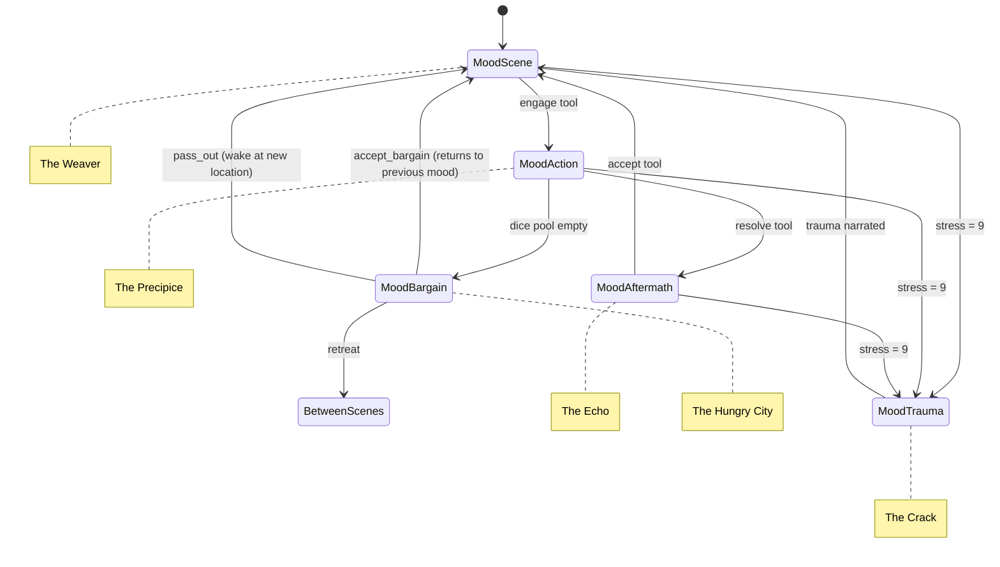

# State Machines

Two nested state machines control game flow.

## GamePhase (Outer Lifecycle)

Governs session lifecycle. Most gameplay happens in `PhasePlaying`.



**Source:** `State.hs:313-324`

```haskell
data GamePhase
  = PhaseCharacterCreation
  | PhaseScenarioInit CharacterChoices
  | PhasePlaying ActiveScene DMMood
  | PhaseBetweenScenes BetweenScenesContext
  | PhaseSessionEnded
```

---

## DMMood (Inner Turn-by-Turn)

Active during `PhasePlaying`. Each mood has a template persona.



**Source:** `State.hs` DMMood type, `Loop.hs` transition logic

### Template Personas

| Mood | Persona | Voice |
|------|---------|-------|
| Scene | The Weaver | Shows possibilities, offers doors, never punishes directly |
| Action | The Precipice | The edge of the moment, presents dice choices |
| Aftermath | The Echo | What comes after, consequences as physics |
| Trauma | The Crack | Breaking point, assigns permanent scar |
| Bargain | The Hungry City | Offers dark deals when dice run out |
