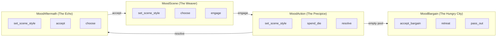

# Tool Availability Matrix

Which tools exist and how they interact with moods.

## Current Implementation

**Note:** Per-mood filtering is NOT currently implemented. All 9 tools in `dmToolList` are available to the LLM in all moods. The template guidance steers usage contextually.

```haskell
dmToolList :: ToolList DMEvent WorldState DMEffects
  '[SetSceneStyle, Choose, SpendDie, Engage, Resolve, Accept, AcceptBargain, Retreat, PassOut]
```

## Tool Reference

| Tool | Description | Mood Transition? |
|------|-------------|------------------|
| `set_scene_style` | Shift atmosphere/pressure/class axes | No |
| `choose` | Weighted random choice | No |
| `spend_die` | Player picks die, apply precommitted outcome | No (but triggers MoodBargain if pool empties) |
| `engage` | Scene → Action | Yes |
| `resolve` | Action → Aftermath | Yes |
| `accept` | Aftermath → Scene | No (completes turn) |
| `accept_bargain` | Accept deal, refresh dice, return to previous mood | Yes |
| `retreat` | Leave scene → BetweenScenes | Yes |
| `pass_out` | Collapse, wake elsewhere → new Scene | Yes |

## Removed Tools

These tools were removed (Tools.hs:780-781) as they added noise without value:

- ~~`think`~~ - DM internal reasoning (removed)
- ~~`speak_as_npc`~~ - NPC dialogue (removed)
- ~~`ask_player`~~ - Request clarification (removed)

Player clarification now happens via `suggestedActions` in structured output.

## Transition Tools

These can change mood, causing `TurnBroken` and loop restart:

```haskell
transitionToolNames :: [Text]
transitionToolNames = ["engage", "resolve", "accept_bargain", "retreat", "pass_out"]
```

Note: `accept` is NOT a transition - it completes the aftermath, doesn't restart.

## Intended Flow (via templates)

Templates guide the LLM on which tools make sense in each mood:



**Source:** `Tools.hs` dmToolList (lines 782-792), transitionToolNames (lines 806-808)
