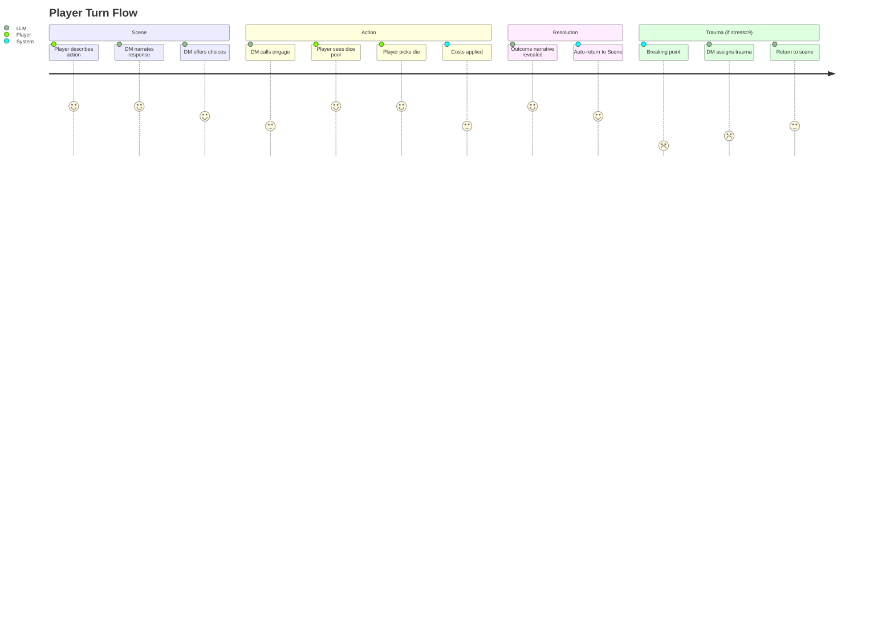
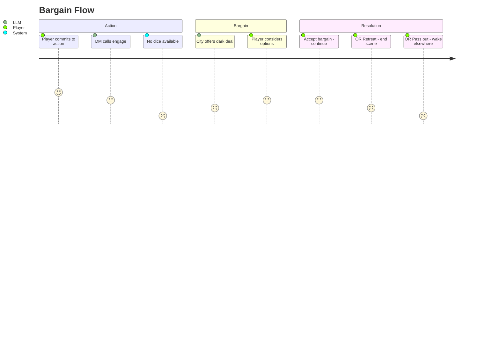
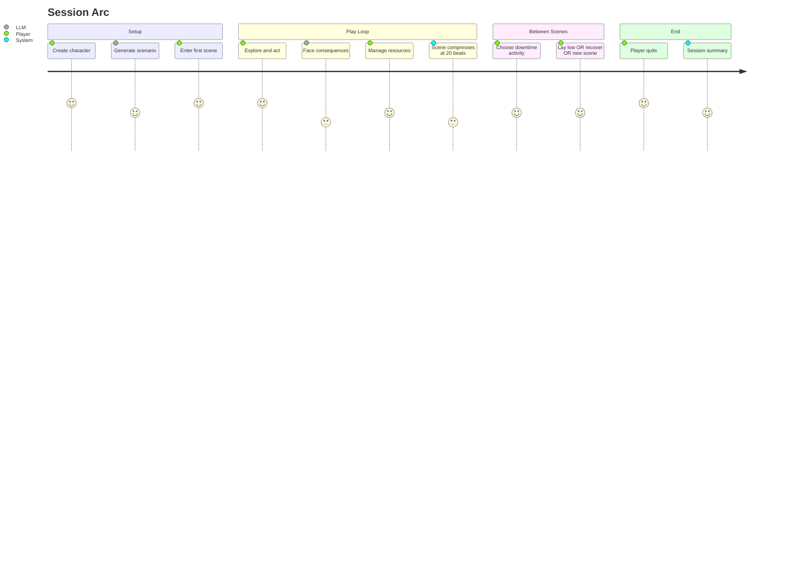
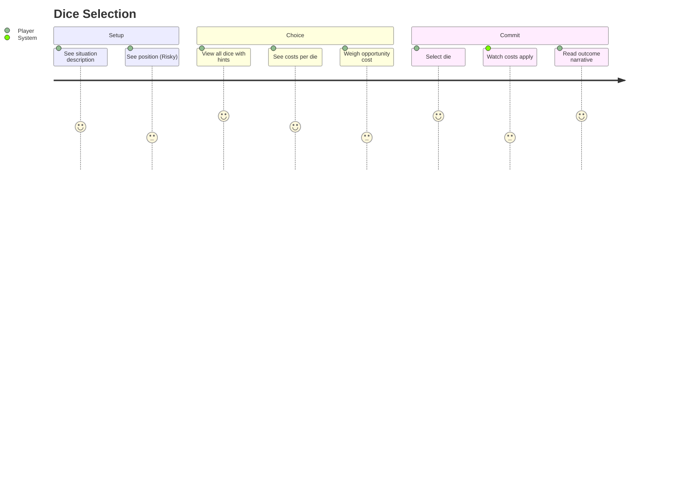

# User Journeys

Player experience flows.

## Happy Path: Player Turn

Standard flow through Scene -> Action -> Scene (dice auto-returns to Scene).



## Bargain Path: Out of Dice

When the dice pool is empty during Action mood.



## Session Arc

Full session from character creation to end.



## Dice Selection Experience

What the player sees and decides during Action mood.



### Dice Display Example

```
SITUATION: Dodging the Bluecoat's blade
POSITION: Risky

Your dice pool:
┌─────────────────────────────────────────────────┐
│ [4]  +1 stress  │  "Scrape through, bruised"    │
├─────────────────────────────────────────────────┤
│ [2]  +2 stress  │  "Barely, they saw your face" │
│      +1 heat    │                               │
├─────────────────────────────────────────────────┤
│ [6]  +0 stress  │  "Clean break"                │
└─────────────────────────────────────────────────┘
```

The player must choose which future to spend. High dice give good outcomes but cost opportunity for future actions.
