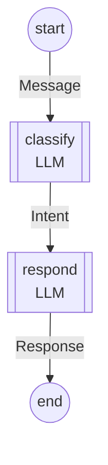

# Graph DSL - Generated Diagrams

This file contains Mermaid diagrams generated from the example graphs in `Example.hs`.

---

## SimpleGraph

A linear graph: Entry → classify → respond → Exit

```haskell
type SimpleGraph = Graph
  '[ Entry :~> Message
   , "classify" := LLM :@ Needs '[Message] :@ Schema Intent
   , "respond"  := LLM :@ Needs '[Message, Intent] :@ Schema Response
   , Exit :<~ Response
   ]
```

### Flowchart



### State Diagram


### Sequence Diagram


---

## BranchingGraph

A graph with Logic node routing to different targets via Goto.

```haskell
type BranchingGraph = Graph
  '[ Entry :~> Message
   , "route"  := Logic
       :@ Needs '[Message]
       :@ Eff '[Goto "refund" Message, Goto "answer" Message, Goto Exit Response]
   , "refund" := LLM :@ Needs '[Message] :@ Schema Response
   , "answer" := LLM :@ Needs '[Message] :@ Schema Response
   , Exit :<~ Response
   ]
```

### Flowchart


> **Note**: The `entry → refund` and `entry → answer` edges are technically correct
> (those nodes only need `Message` which Entry provides) but semantically misleading.
> In practice, they're only reachable via `Goto` from `route`. A future improvement
> would filter out entry edges to nodes that are Goto targets.

### State Diagram


### Sequence Diagram (refund path)


### Sequence Diagram (answer path)


---

## AnnotatedGraph

A graph with various annotations: Template, Vision, Tools, When.

```haskell
type AnnotatedGraph = Graph
  '[ Entry :~> Message
   , "analyze" := LLM
       :@ Needs '[Message]
       :@ Schema Intent
       :@ Template MyTemplate
       :@ Vision
       :@ Tools '[PhotoTool]
   , "conditional" := LLM
       :@ Needs '[Intent]
       :@ Schema Response
       :@ When Intent  -- Only runs when Intent is present
   , Exit :<~ Response
   ]
```

### Flowchart


### State Diagram


---

## Diagram Type Comparison

| Diagram Type | Best For | Limitations |
|--------------|----------|-------------|
| **Flowchart** | Visual overview, node shapes show LLM vs Logic | Shows data flow edges, not just control flow |
| **State Diagram** | Accurate state machine representation | Less visual distinction between node types |
| **Sequence Diagram** | Showing specific execution paths | Requires choosing a path through branches |

## Node Shapes (Flowchart)

- `((circle))` - Entry/Exit points
- `[["double brackets"]]` - LLM nodes
- `{{"hexagon"}}` - Logic nodes

## Edge Semantics

- **Schema → Needs**: Implicit data flow (solid arrow)
- **Goto**: Explicit control flow (solid arrow)
- **When**: Conditional edges (dashed arrow `-.->`)
