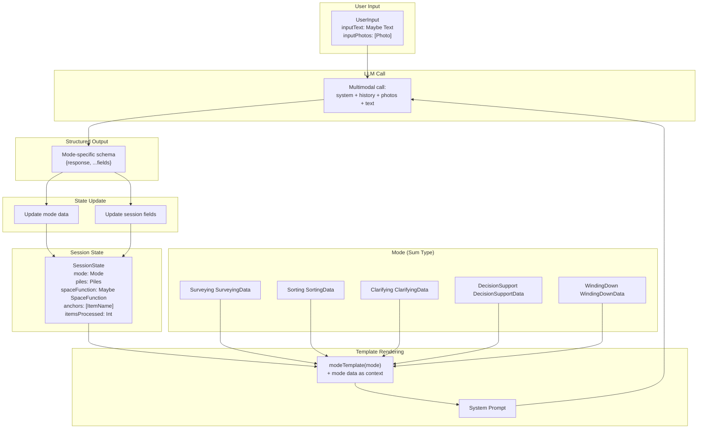
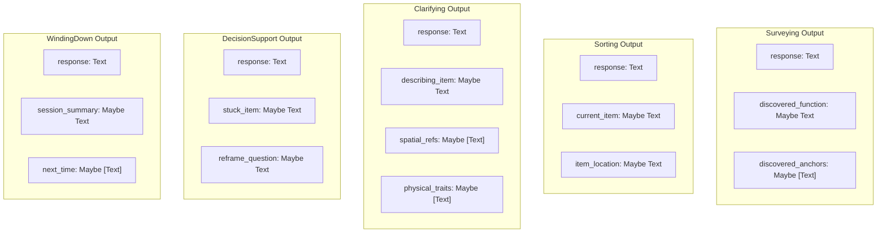
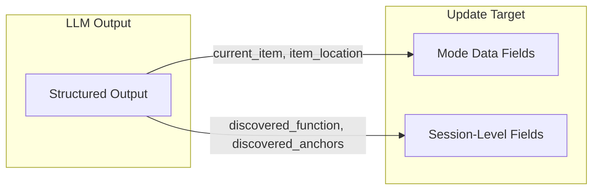
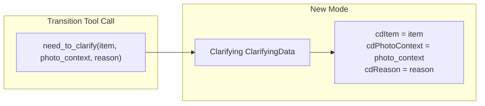
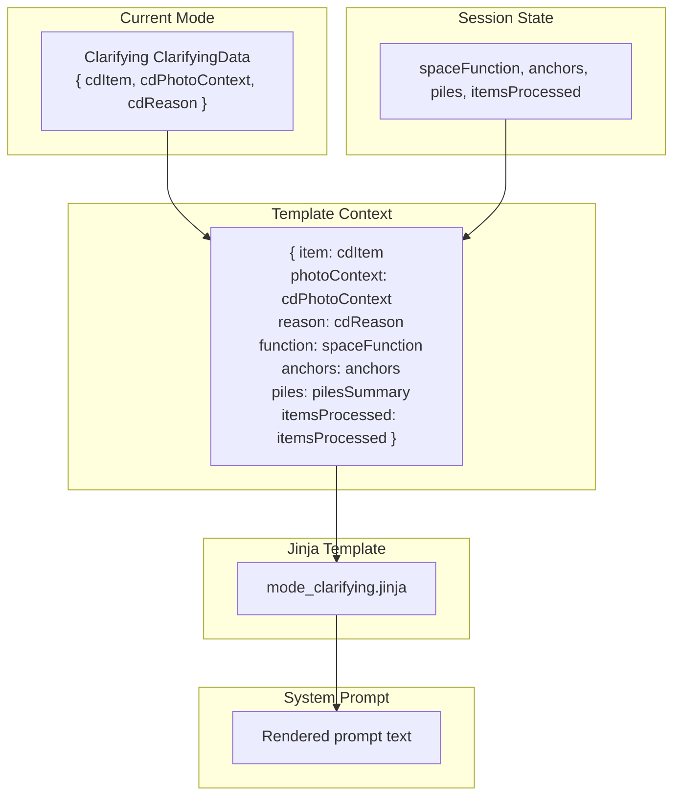
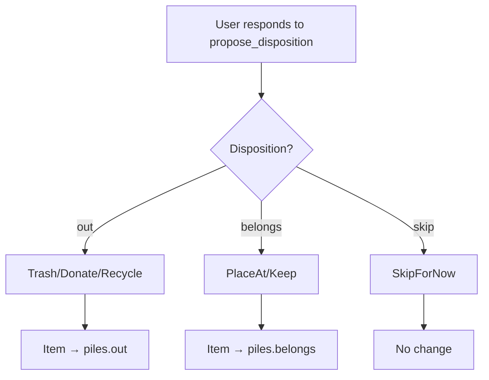

# Data Flow

Type pipeline and data transformations in the Tidying agent.

## Complete Type Pipeline



## Mode as Sum Type

Mode is NOT an enum - each variant carries its own data:

```mermaid
classDiagram
    class Mode {
        <<sum type>>
    }

    class SurveyingData {
        (empty - discoveries go to SessionState)
    }

    class SortingData {
        sdCurrentItem: Maybe Text
        sdItemLocation: Maybe Text
    }

    class ClarifyingData {
        cdItem: Text
        cdPhotoContext: Text
        cdReason: Text
    }

    class DecisionSupportData {
        dsdStuckItem: Text
    }

    class WindingDownData {
        wdSessionSummary: Maybe Text
        wdNextTime: [Text]
    }

    Mode <|-- SurveyingData : Surveying
    Mode <|-- SortingData : Sorting
    Mode <|-- ClarifyingData : Clarifying
    Mode <|-- DecisionSupportData : DecisionSupport
    Mode <|-- WindingDownData : WindingDown
```

## SessionState

```haskell
data SessionState = SessionState
  { mode :: Mode                          -- Sum type with mode-specific data
  , piles :: Piles                        -- belongs/out/unsure
  , itemsProcessed :: Int                 -- Progress count
  , sessionStart :: Maybe UTCTime
  -- Discovered in Surveying, persists across all modes:
  , spaceFunction :: Maybe SpaceFunction
  , anchors :: [ItemName]
  }

data Piles = Piles
  { belongs :: [ItemName]   -- Items that stay
  , out :: [ItemName]       -- Items to remove
  , unsure :: [ItemName]    -- Not yet classified
  }
```

## Mode-Specific Output Schemas

Each mode has its own structured output that the LLM produces:



## Output → Mode Data Updates



| Mode | Output Fields | Updates |
|------|--------------|---------|
| Surveying | discovered_function, discovered_anchors | SessionState.spaceFunction, SessionState.anchors |
| Sorting | current_item, item_location | SortingData |
| Clarifying | describing_item, spatial_refs, physical_traits | ClarifyingData |
| DecisionSupport | stuck_item, reframe_question | DecisionSupportData |
| WindingDown | session_summary, next_time | WindingDownData |

## Transition Tool → Mode Data

When a transition tool is called, its arguments become the new mode's initial data:



## Input Types

```haskell
data UserInput = UserInput
  { inputPhotos :: [Photo]
  , inputText   :: Maybe Text
  }

data Photo = Photo
  { photoData :: Text  -- Base64 encoded or URL
  , photoMime :: Text  -- "image/jpeg", "image/png"
  }
```

## Template Context

Mode data becomes the context for Jinja template rendering:



## Piles Updates

Tools update piles based on user decisions:



## Type Definitions

```haskell
-- Newtypes for type safety
newtype ItemName = ItemName Text
newtype SpaceFunction = SpaceFunction Text
newtype Location = Location Text

-- Mode sum type
data Mode
  = Surveying SurveyingData
  | Sorting SortingData
  | Clarifying ClarifyingData
  | DecisionSupport DecisionSupportData
  | WindingDown WindingDownData

-- Mode data types
data SurveyingData = SurveyingData
  deriving (Eq, Show, Generic, ToJSON, FromJSON)

data SortingData = SortingData
  { sdCurrentItem :: Maybe Text
  , sdItemLocation :: Maybe Text
  } deriving (Eq, Show, Generic, ToJSON, FromJSON)

data ClarifyingData = ClarifyingData
  { cdItem :: Text
  , cdPhotoContext :: Text
  , cdReason :: Text
  } deriving (Eq, Show, Generic, ToJSON, FromJSON)

data DecisionSupportData = DecisionSupportData
  { dsdStuckItem :: Text
  } deriving (Eq, Show, Generic, ToJSON, FromJSON)

data WindingDownData = WindingDownData
  { wdSessionSummary :: Maybe Text
  , wdNextTime :: [Text]
  } deriving (Eq, Show, Generic, ToJSON, FromJSON)
```

## Key Files

- `State.hs` - Mode sum type, mode data types, SessionState
- `Output.hs` - Mode-specific output schemas
- `Context.hs` - Template context building
- `Loop.hs` - Output parsing and state updates
