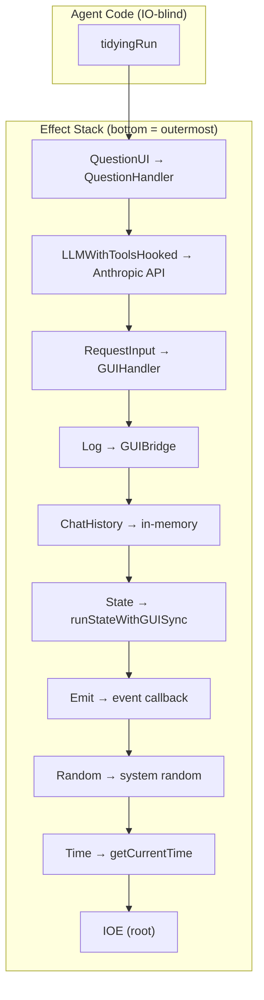
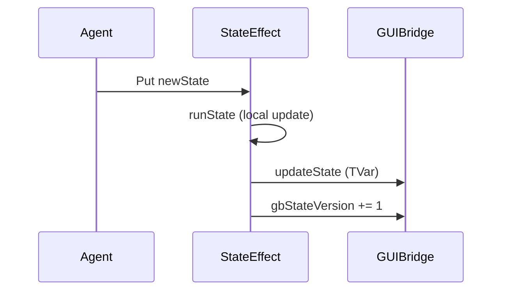
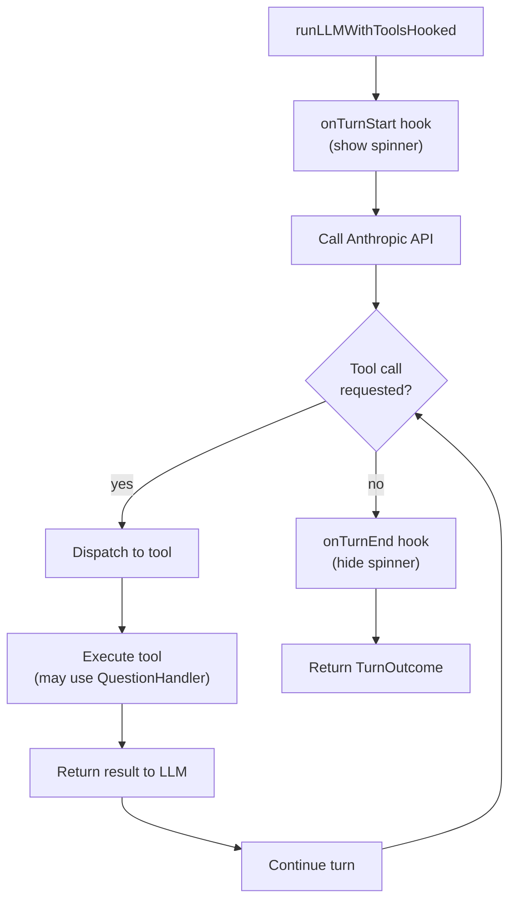

# Effect Stack

Effect interpretation order and capabilities in the Tidying agent.

## Effect Interpretation Order

The agent code is **IO-blind** - all IO happens through effect interpreters.



## Effect Capabilities

| Effect | Capability | Interpreter |
|--------|-----------|-------------|
| `State SessionState` | Get/Put session state | `runStateWithGUISync` (syncs to TVar) |
| `LLM` | Vision, extraction, response | `runLLMWithToolsHooked` |
| `Emit TidyingEvent` | Send events to GUI | Callback to narrative log |
| `Log` | Debug/info/warning | `runLogWithBridge` |
| `Time` | Get current time | `runTime` (IO-blind) |
| `RequestInput` | User choice/text | `runRequestInput` |
| `QuestionUI` | Mid-turn questions | `runQuestionUI` |
| `Random` | Randomness | `runRandom` |

## Agent vs Runner Effect Types

```mermaid
flowchart LR
    subgraph Agent["BaseEffects (IO-blind)"]
        B1["LLM"]
        B2["State SessionState"]
        B3["Emit TidyingEvent"]
        B4["RequestInput"]
        B5["Log"]
        B6["ChatHistory"]
        B7["Random"]
        B8["Time"]
    end

    subgraph Runner["RunnerEffects (with IOE)"]
        R1["LLM"]
        R2["RequestInput"]
        R3["Log"]
        R4["ChatHistory"]
        R5["State SessionState"]
        R6["Emit TidyingEvent"]
        R7["Random"]
        R8["Time"]
        R9["IOE"]
    end

    Agent -->|inject| Runner
```



## State Synchronization

State effect syncs to GUI TVar after every `Put`:



## LLM Effect with Tools



## Key Interpreters

### runStateWithGUISync

```haskell
runStateWithGUISync :: GUIBridge state -> state -> Eff (State state : es) a -> Eff es a
runStateWithGUISync bridge initial = reinterpret (runState initial) $ \_ -> \case
  Get -> EState.get
  Put s -> do
    EState.put s
    liftIO $ updateState bridge (const s)  -- Sync to TVar
```

### runLLMWithToolsHooked

```haskell
runLLMWithToolsHooked
  :: LLMHooks
  -> LLMConfig
  -> ToolDispatcher
  -> Eff (LLM : es) a
  -> Eff es a
```

### runQuestionUI

```haskell
runQuestionUI :: QuestionHandler -> Eff (QuestionUI : es) a -> Eff es a
runQuestionUI handler = interpret $ \_ (AskQuestion q) ->
  liftIO $ handler q
```

## Key Files

- `Tidepool/Effect.hs` - Core effects, BaseEffects, RunnerEffects
- `GUI/Runner.hs` - Effect stack wiring
- `GUI/Handler.hs` - GUIHandler, makeGUIHandler
