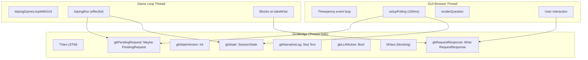
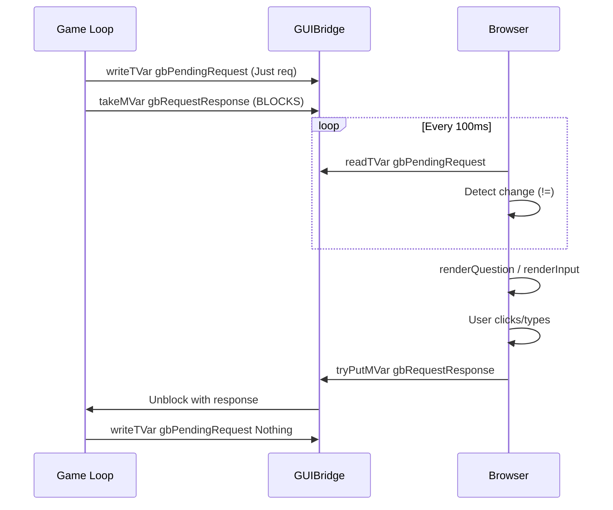
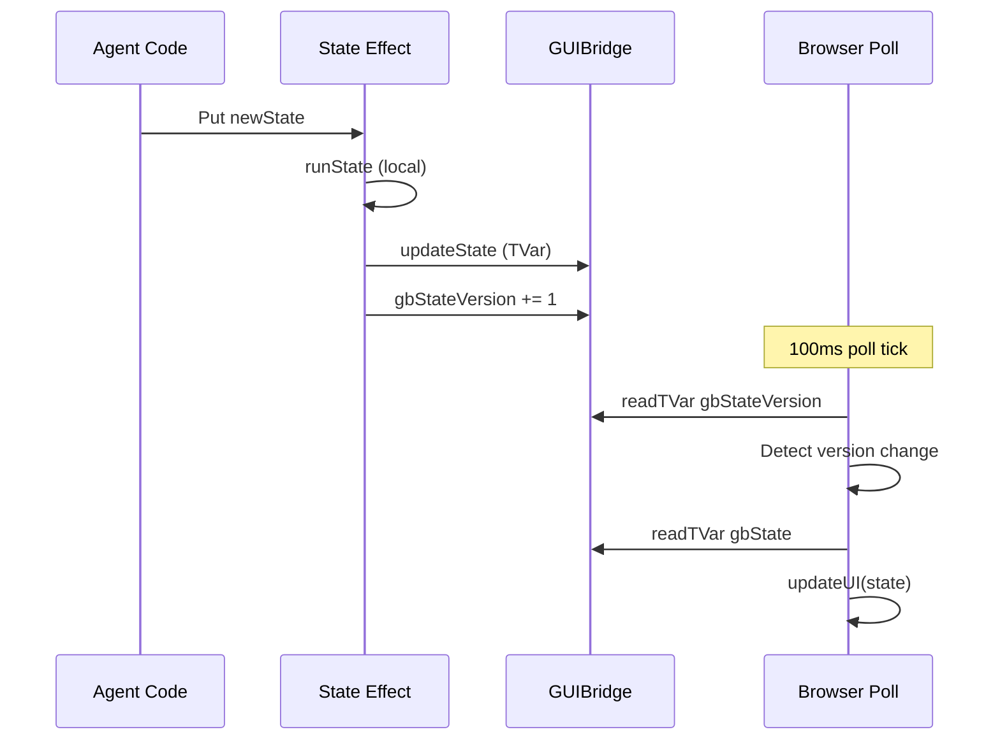
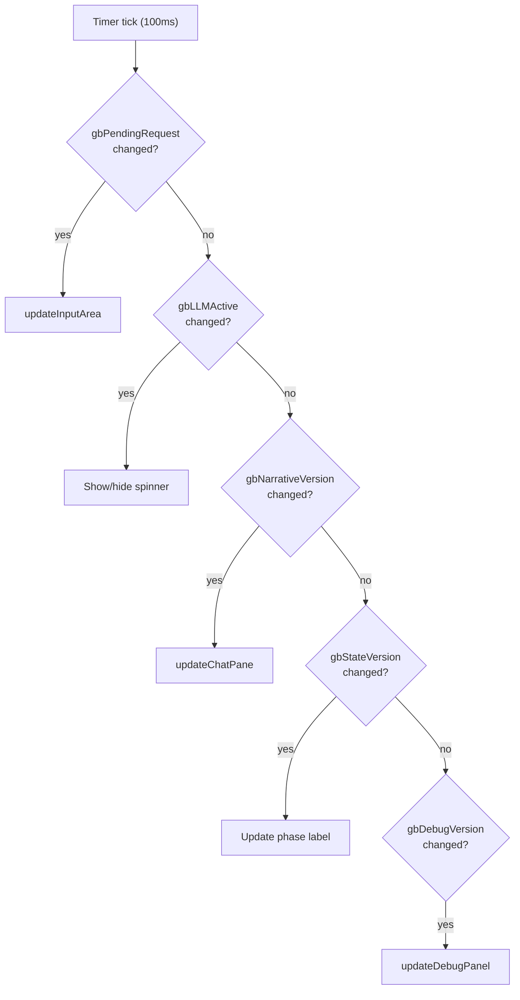

# GUI Communication

Two-thread architecture and TVar/MVar synchronization patterns.

## Two-Thread Architecture



## GUIBridge Type

```haskell
data GUIBridge state = GUIBridge
  { gbState            :: TVar state           -- Game state for display
  , gbStateVersion     :: TVar Int             -- Version for change detection
  , gbPendingRequest   :: TVar (Maybe PendingRequest)
  , gbRequestResponse  :: MVar RequestResponse -- Blocks game loop
  , gbNarrativeLog     :: TVar (Seq Text)
  , gbNarrativeVersion :: TVar Int
  , gbDebugLog         :: TVar (Seq DebugEntry)
  , gbDebugVersion     :: TVar Int
  , gbLLMActive        :: TVar Bool            -- Loading spinner
  }
```

## Request/Response Sequence



## State Sync Pattern



## Request Types

```haskell
data PendingRequest
  = PendingText Text                    -- Text input (with photo option)
  | PendingChoice Text [(Text, Int)]    -- Choice buttons
  | PendingPhoto Text                   -- Photo upload
  | PendingDice Text [(Int, Int, Text)] -- Dice selection (DM agent)
  | PendingCustom Text Value            -- JSON (for Question DSL)
```

## Response Types

```haskell
data RequestResponse
  = ChoiceResponse Int                      -- Button index
  | TextResponse Text                       -- Text input
  | TextWithPhotoResponse Text Text Text    -- text + base64 + mime
  | PhotoResponse Text Text                 -- base64 + mime
  | CustomResponse Value                    -- JSON (for Answer)
```

## Polling Loop

The GUI polls for changes every 100ms:



## Double-Click Prevention

`safeSubmitResponse` uses `tryPutMVar` to never block:

```haskell
safeSubmitResponse :: GUIBridge state -> RequestResponse -> IO Bool
safeSubmitResponse bridge response = tryPutMVar bridge.gbRequestResponse response
-- Returns False if MVar already full (double-click ignored)
```

## Key Files

- `Tidepool/GUI/Core.hs` - GUIBridge, PendingRequest, RequestResponse
- `Tidepool/GUI/Handler.hs` - makeGUIHandler, guiChoice, guiText
- `Tidying/GUI/App.hs` - setupPolling, updateInputArea
- `Tidying/GUI/Runner.hs` - tidyingGameLoopWithGUI
