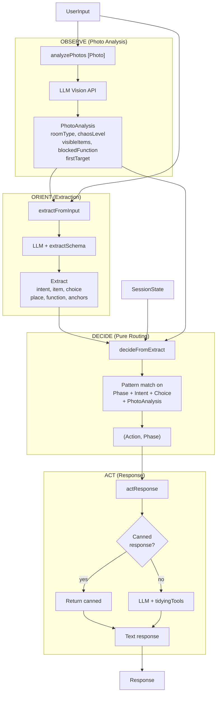
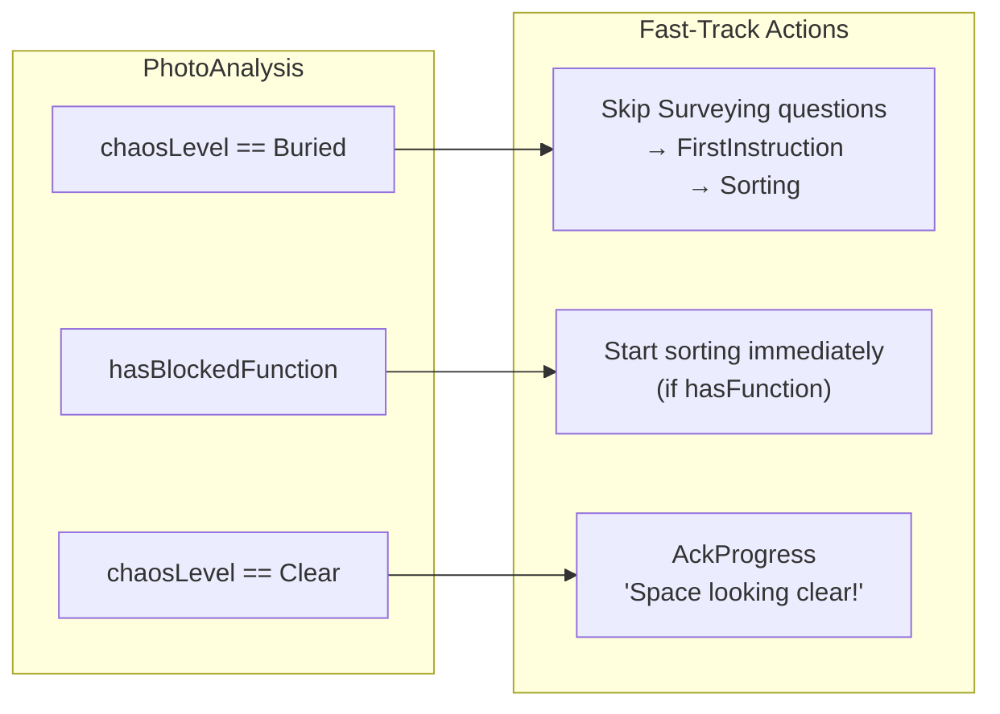
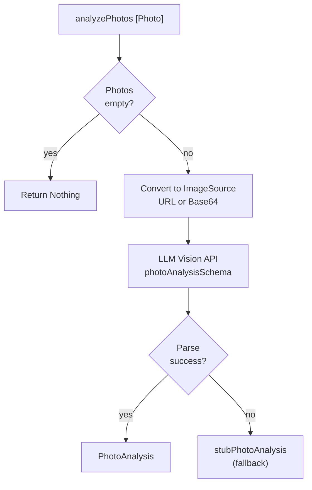
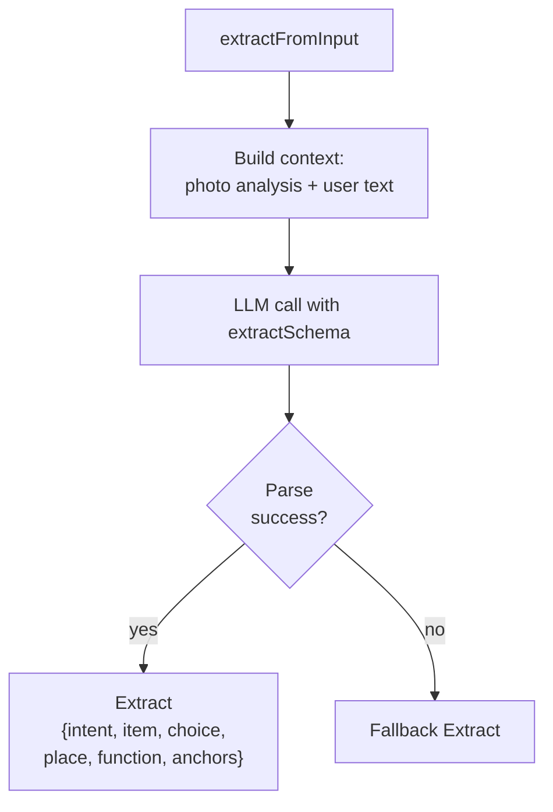
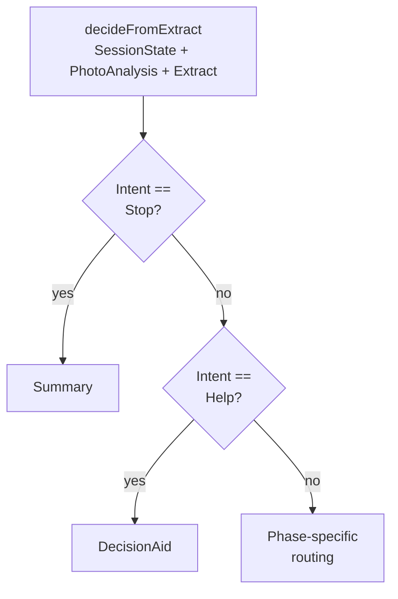
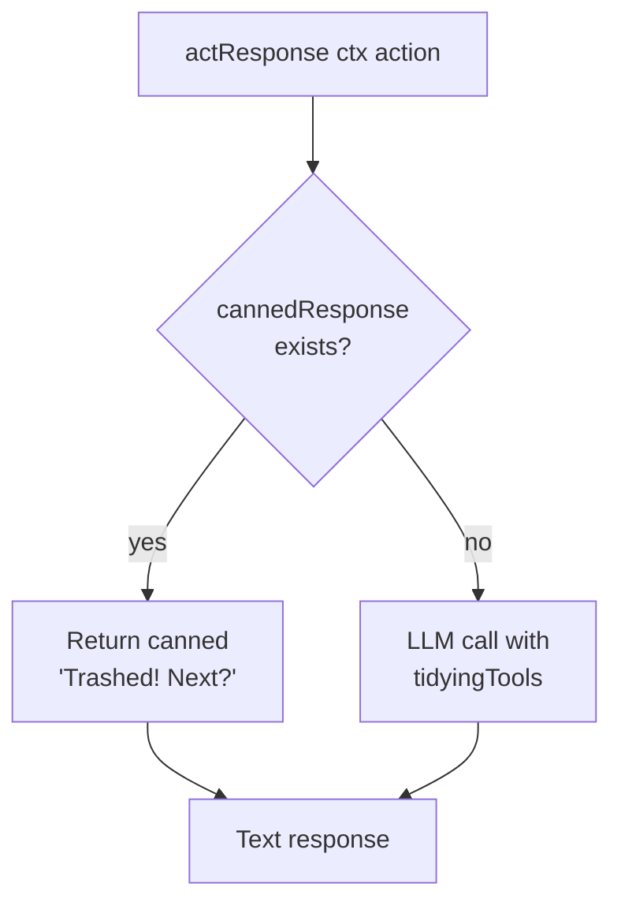

# OODA Loop

The tidying agent follows an OODA (Observe-Orient-Decide-Act) pattern.

## Main OODA Cycle

## Photo-Aware Fast-Track Routing

Photo analysis enables fast-track routing decisions:

## OBSERVE: Photo Analysis

## ORIENT: Extraction

### Extract Fields

| Field | Type | Description |
|-------|------|-------------|
| `exIntent` | `Intent` | start/continue/item/decided/help/stop |
| `exItem` | `Maybe ItemName` | Item mentioned |
| `exChoice` | `Maybe Choice` | trash/keep/place/unsure |
| `exPlace` | `Maybe Location` | Where to put it |
| `exFunction` | `Maybe SpaceFunction` | Space purpose |
| `exAnchors` | `Maybe [ItemName]` | Anchor items |

## DECIDE: Pure Routing

No LLM calls - pure function from state to action:

## ACT: Response Generation

## Key Files

- `Loop.hs` - tidyingTurn, analyzePhotos, extractFromInput
- `Decide.hs` - decideFromExtract
- `Act.hs` - actResponse, cannedResponse
- `Output.hs` - Extract, Intent, Choice schemas
