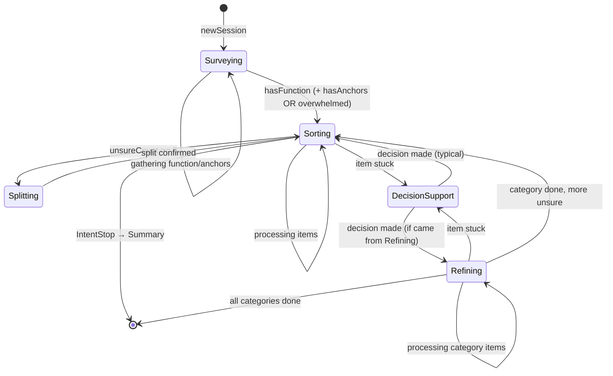
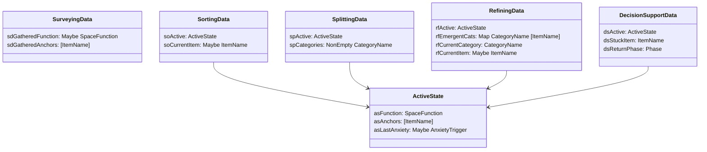
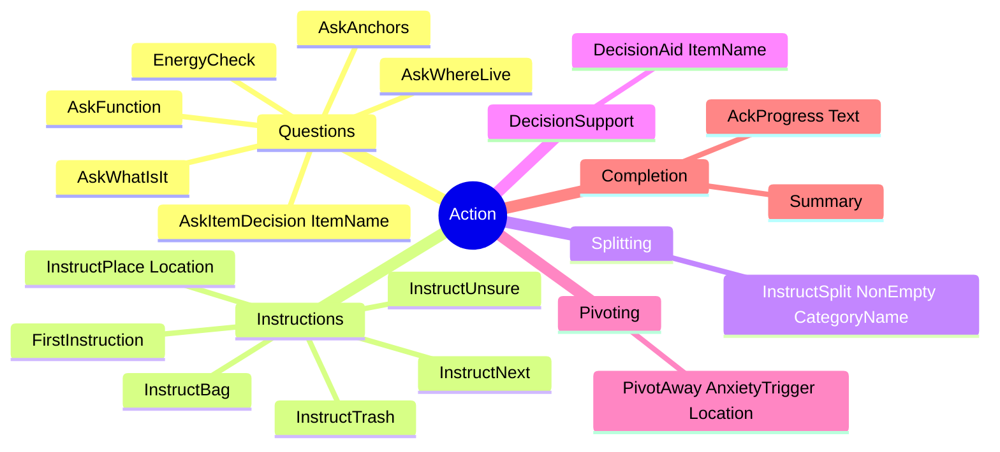

# State Machine

Phase states, transitions, and PhaseData types for the Tidying agent.

## Phase State Machine

## PhaseData Types

The `ActiveState` record factors out common fields shared by all phases except Surveying:

## Transition Triggers

| From | To | Trigger |
|------|-----|---------|
| Surveying | Surveying | AskFunction, AskAnchors |
| Surveying | Sorting | hasFunction + (hasAnchors OR Buried chaos) |
| Sorting | Sorting | InstructTrash, InstructPlace, InstructUnsure, InstructNext |
| Sorting | Splitting | ChoiceUnsure + unsureCount >= 5 |
| Sorting | DecisionSupport | IntentHelp or Stuck |
| Splitting | Sorting | Split confirmed |
| Refining | Refining | Processing category |
| Refining | DecisionSupport | IntentHelp |
| DecisionSupport | [return] | Decision made |
| Any | Summary | IntentStop |

## Action Types

## Canned vs LLM-Generated Responses

| Canned (no LLM) | LLM-Generated |
|-----------------|---------------|
| InstructTrash → "Trashed! Next?" | FirstInstruction |
| InstructUnsure → "Unsure pile. Next?" | AskItemDecision |
| InstructNext → "Next?" | DecisionAid |
| InstructBag → "Bag the trash." | PivotAway |
| InstructPlace → "Put it on [loc]. Next." | Summary |
| | AckProgress |
| | InstructSplit |

## Key Files

- `State.hs` - Phase, PhaseData, ActiveState, SessionState
- `Decide.hs` - decideFromExtract (pure routing)
- `Action.hs` - Action ADT
