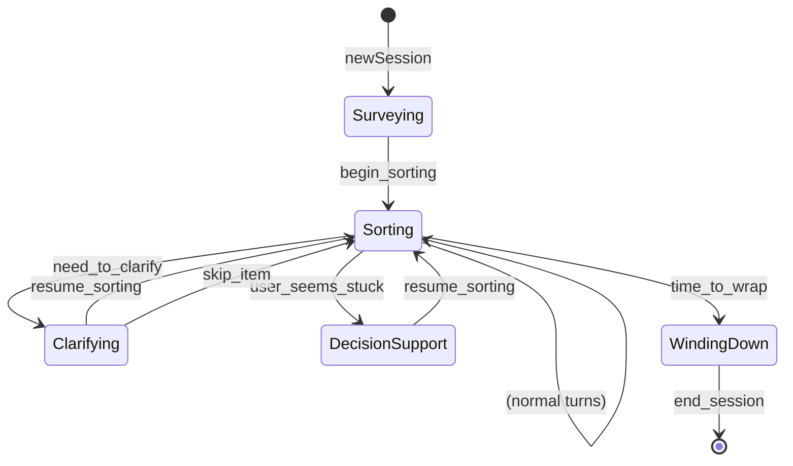

# Mode State Machine

Mode states, transitions, and mode-specific data for the Tidying agent.

## Mode State Machine

The LLM navigates between modes via **transition tools**. Each mode has a persona, tool set, and output schema.



## Mode = Sum Type with Data

Mode is NOT an enum - each mode carries its own data:

```mermaid
classDiagram
    class Mode {
        <<sum type>>
    }

    class SurveyingData {
        (empty - discoveries go to session)
    }

    class SortingData {
        sdCurrentItem: Maybe Text
        sdItemLocation: Maybe Text
    }

    class ClarifyingData {
        cdItem: Text
        cdPhotoContext: Text
        cdReason: Text
    }

    class DecisionSupportData {
        dsdStuckItem: Text
    }

    class WindingDownData {
        (summary fields)
    }

    Mode <|-- SurveyingData : Surveying
    Mode <|-- SortingData : Sorting
    Mode <|-- ClarifyingData : Clarifying
    Mode <|-- DecisionSupportData : DecisionSupport
    Mode <|-- WindingDownData : WindingDown
```

## Mode Personas

| Mode | Persona | Voice | Goal |
|------|---------|-------|------|
| Surveying | Curious, orienting | "What is this space? What stays?" | Discover function + anchors |
| Sorting | Terse, directive | "Trash. Next." | Keep momentum, process items |
| Clarifying | Patient, descriptive | "The green device by the desk leg..." | Help user identify item |
| DecisionSupport | Gentle, reframing | "Does this help with [function]?" | Unstick without pressure |
| WindingDown | Warm, factual | "Good stopping point." | Acknowledge progress, wrap up |

## Transition Tools

Transition tools take arguments that become the **new mode's initial data**:

| Tool | From | To | Arguments → Data |
|------|------|-----|------------------|
| `begin_sorting` | Surveying | Sorting | {} → SortingData {} |
| `need_to_clarify` | Sorting | Clarifying | {item, photo_context, reason} → ClarifyingData |
| `user_seems_stuck` | Sorting | DecisionSupport | {stuck_item} → DecisionSupportData |
| `time_to_wrap` | Sorting | WindingDown | {} → WindingDownData {} |
| `resume_sorting` | Clarifying | Sorting | {} → SortingData {} |
| `resume_sorting` | DecisionSupport | Sorting | {} → SortingData {} |
| `skip_item` | Clarifying | Sorting | {} → SortingData {} |
| `end_session` | WindingDown | (end) | {} |

## Transition Mechanism

When LLM calls a transition tool:

```mermaid
sequenceDiagram
    participant LLM
    participant Tool
    participant State
    participant Loop

    LLM->>Tool: need_to_clarify(item, context, reason)
    Tool->>State: mode = Clarifying(ClarifyingData {...})
    Tool->>Loop: return ToolBreak("[Continue as: Clarifying]")
    Loop->>Loop: End current turn
    Loop->>Loop: Inject synthetic user message
    Loop->>LLM: New turn with Clarifying template + tools
```

## Mode-Specific Tool Sets

Each mode only has access to relevant tools:

| Mode | Available Tools |
|------|-----------------|
| Surveying | `begin_sorting` |
| Sorting | `propose_disposition`, `need_to_clarify`, `user_seems_stuck`, `time_to_wrap` |
| Clarifying | `resume_sorting`, `skip_item` |
| DecisionSupport | `resume_sorting` |
| WindingDown | `end_session` |

## Mode-Specific Output Schemas

Each mode has its own structured output that updates mode data:

| Mode | Output Fields | Updates |
|------|--------------|---------|
| Surveying | `{response, discovered_function?, discovered_anchors?}` | Session-level fields |
| Sorting | `{response, current_item?, item_location?}` | SortingData |
| Clarifying | `{response, describing_item?, spatial_refs?, physical_traits?}` | ClarifyingData |
| DecisionSupport | `{response, stuck_item?, reframe_question?}` | DecisionSupportData |
| WindingDown | `{response, session_summary?, next_time?}` | WindingDownData |

## Session State

Mode data is ephemeral; session-level data persists across modes:

```haskell
data SessionState = SessionState
  { mode :: Mode              -- Sum type with mode-specific data
  , piles :: Piles            -- belongs/out/unsure
  , itemsProcessed :: Int     -- Progress count
  , sessionStart :: Maybe UTCTime
  -- Discovered in Surveying, used everywhere:
  , spaceFunction :: Maybe SpaceFunction
  , anchors :: [ItemName]
  }
```

## Key Files

- `State.hs` - Mode sum type, mode data types, SessionState
- `Tools.hs` - Transition tools, `toolsForMode`
- `Loop.hs` - ToolBreak handling, mode transitions
