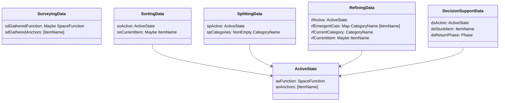

# State Machine

Phase states, transitions, and PhaseData types for the Tidying agent.

## Phase State Machine

## PhaseData Types

The `ActiveState` record factors out common fields shared by all phases except Surveying:

## Transition Triggers

| From | To | Trigger |
|------|-----|---------|
| Surveying | Surveying | AskFunction, AskAnchors |
| Surveying | Sorting | Buried chaos |
| Surveying | Sorting | hasBlockedFunction + hasFunction |
| Surveying | Sorting | overwhelmed signal + hasFunction |
| Surveying | Sorting | hasFunction + hasAnchors |
| Sorting | Sorting | InstructTrash, InstructPlace, InstructUnsure, InstructNext |
| Sorting | Splitting | ChoiceUnsure + unsureCount >= 5 |
| Sorting | DecisionSupport | IntentHelp or Stuck |
| Splitting | Sorting | Split confirmed |
| Refining | Refining | Processing category |
| Refining | DecisionSupport | IntentHelp |
| DecisionSupport | [return] | Decision made |
| Any | Summary | IntentStop |

## Action Types

## Response Generation

All responses go through LLM for natural, context-aware conversation.
No canned responses - the Action just informs the system prompt.

Key actions that use tools:
- `AskFunction` → calls `ask_space_function` tool for UI choices
- `AskItemDecision` → calls `propose_disposition` tool with thoughtful options
- `FirstInstruction` → calls `propose_disposition` for first item

## Split Suggestion Patterns

When unsure pile >= 5, `suggestSplit` pattern-matches items to suggest categories:

| Pattern | Suggested Categories |
|---------|---------------------|
| `cable`, `cord` | `cables`, `other` |
| `paper`, `document` | `papers`, `other` |
| `book` | `books`, `other` |
| `clothes`, `shirt` | `clothes`, `other` |
| (default) | `keep-maybe`, `donate-maybe` |

## Constants

| Constant | Value | Location |
|----------|-------|----------|
| `unsureThreshold` | 5 items | `Decide.hs` |
| Question handler timeout | 5 minutes | `GUI/Runner.hs` |
| Polling interval | 100ms | `GUI/App.hs` |

## Key Files

- `State.hs` - Phase, PhaseData, ActiveState, SessionState
- `Decide.hs` - decideFromExtract, suggestSplit
- `Action.hs` - Action ADT
