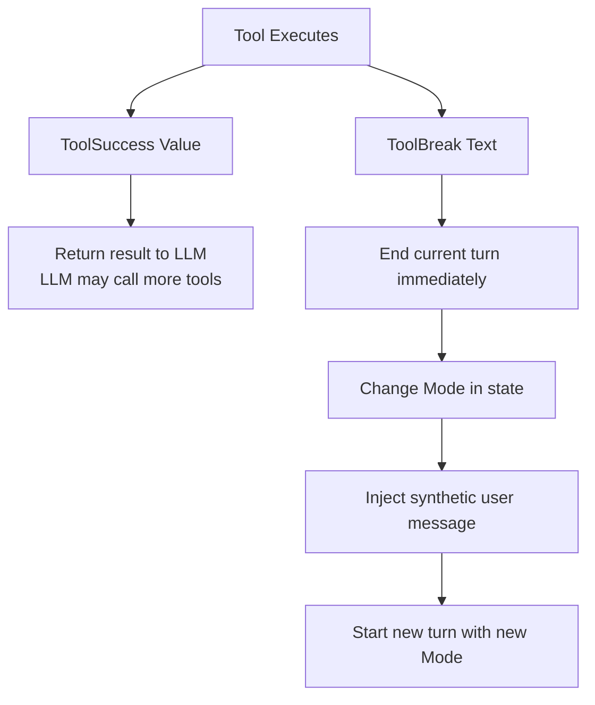
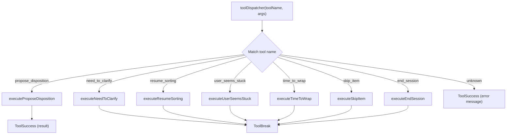
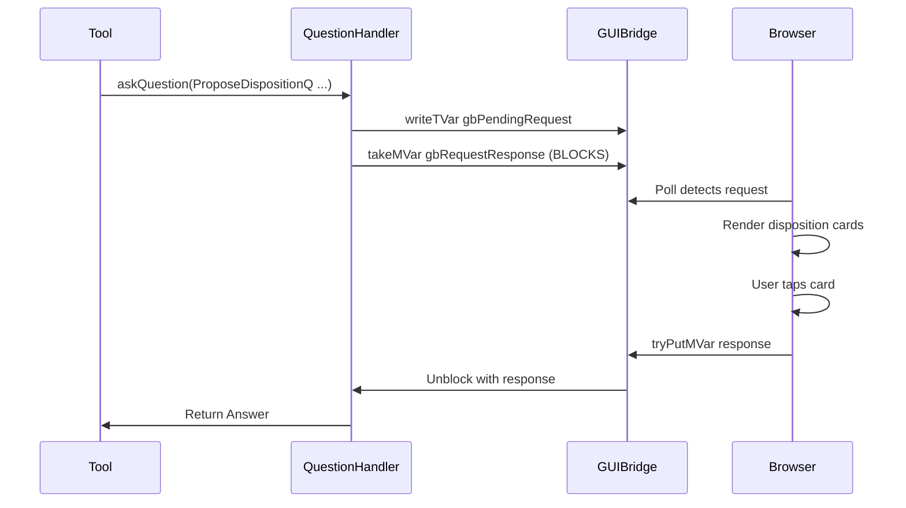

# Tool Execution

How tools execute during LLM turns, including transition tools and ToolBreak.

## Tool Result Types

Tools can return two types of results:

```haskell
data ToolResult
  = ToolSuccess Value    -- Continue current turn
  | ToolBreak Text       -- End turn, inject message, transition mode
```



## Tool Categories

### Regular Tools (ToolSuccess)

Execute an action, return result, LLM continues:

| Tool | Mode | Purpose |
|------|------|---------|
| `propose_disposition` | Sorting | Propose item disposition, get user confirmation |

### Transition Tools (ToolBreak)

Change mode, end turn, start fresh:

| Tool | From → To | Initial Data |
|------|-----------|--------------|
| `begin_sorting` | Surveying → Sorting | SortingData {} |
| `need_to_clarify` | Sorting → Clarifying | ClarifyingData {item, photoContext, reason} |
| `user_seems_stuck` | Sorting → DecisionSupport | DecisionSupportData {stuckItem} |
| `time_to_wrap` | Sorting → WindingDown | WindingDownData {} |
| `resume_sorting` | Clarifying/DecisionSupport → Sorting | SortingData {} |
| `skip_item` | Clarifying → Sorting | SortingData {} |
| `end_session` | WindingDown → (end) | N/A |

## Transition Tool Flow

```mermaid
sequenceDiagram
    participant LLM
    participant Dispatcher
    participant Tool
    participant State
    participant Loop

    LLM->>Dispatcher: Tool call: need_to_clarify({item, context, reason})
    Dispatcher->>Tool: executeNeedToClarify(args)
    Tool->>State: mode = Clarifying(ClarifyingData {...})
    Tool->>Tool: emit ModeChanged event
    Tool->>Dispatcher: return ToolBreak("[Continue as: Clarifying]")
    Dispatcher->>Loop: ToolBreak received
    Loop->>Loop: End current turn
    Loop->>Loop: Append synthetic user message to history
    Loop->>LLM: Start new turn with Clarifying template/tools
```

## Tool Dispatcher

Routes tool calls to executors, handles ToolBreak:



## Transition Tool Implementation

```haskell
executeNeedToClarify
  :: (State SessionState :> es, Emit TidyingEvent :> es)
  => NeedToClarifyInput
  -> Eff es ToolResult
executeNeedToClarify input = do
  oldMode <- gets @SessionState mode

  -- Create new mode with initial data from tool args
  let newModeData = ClarifyingData
        { cdItem = input.item
        , cdPhotoContext = input.photoContext
        , cdReason = input.reason
        }

  -- Update state
  modify @SessionState $ \s -> s { mode = Clarifying newModeData }

  -- Emit event for debugging/GUI
  emit $ ModeChanged oldMode (Clarifying newModeData)

  -- Return ToolBreak to end turn and inject synthetic message
  pure $ ToolBreak $ "[Continue as: Clarifying. Describe: " <> input.item <> "]"
```

## Regular Tool Implementation

```haskell
executeProposeDisposition
  :: (State SessionState :> es, Emit TidyingEvent :> es, IOE :> es)
  => QuestionHandler
  -> ProposeDispositionInput
  -> Eff es ToolResult
executeProposeDisposition askQuestion input = do
  -- Emit event
  emit $ ItemProposed input.item input.choices

  -- Ask user via QuestionHandler (blocks for response)
  answer <- liftIO $ askQuestion (ProposeDispositionQ input.item input.choices)

  -- Process answer, update piles
  processDispositionAnswer input.item answer

  -- Return success - LLM continues turn
  pure $ ToolSuccess (toJSON result)
```

## QuestionHandler (for Regular Tools)

Regular tools that need user input use the QuestionHandler:



## Mode-Specific Tool Sets

```haskell
toolsForMode :: Mode -> [Value]
toolsForMode (Surveying _) =
  [ beginSortingTool
  ]

toolsForMode (Sorting _) =
  [ proposeDispositionTool
  , needToClarifyTool
  , userSeemsStuckTool
  , timeToWrapTool
  ]

toolsForMode (Clarifying _) =
  [ resumeSortingTool
  , skipItemTool
  ]

toolsForMode (DecisionSupport _) =
  [ resumeSortingTool
  ]

toolsForMode (WindingDown _) =
  [ endSessionTool
  ]
```

## Tool Schema Example

```json
{
  "name": "need_to_clarify",
  "description": "User can't identify the item. Transition to Clarifying mode to describe it in detail. This ENDS the current turn.",
  "input_schema": {
    "type": "object",
    "properties": {
      "item": {
        "type": "string",
        "description": "What item we're clarifying"
      },
      "photo_context": {
        "type": "string",
        "description": "What we observed in the photo (location, nearby objects)"
      },
      "reason": {
        "type": "string",
        "description": "Why user is confused (their response)"
      }
    },
    "required": ["item", "photo_context", "reason"]
  }
}
```

## Events Emitted

| Event | When | Data |
|-------|------|------|
| `ModeChanged` | Transition tool executed | oldMode, newMode |
| `ItemProposed` | propose_disposition called | item, choices |
| `UserConfirmed` | User accepted disposition | item, disposition |
| `UserCorrected` | User provided different location | item, location |
| `SessionEnded` | end_session called | itemsProcessed |

## Key Files

- `Tools.hs` - Tool definitions, executors, `toolsForMode`
- `Loop.hs` - ToolBreak handling, turn continuation
- `GUI/Runner.hs` - QuestionHandler implementation
- `Events.hs` - ModeChanged and other events
