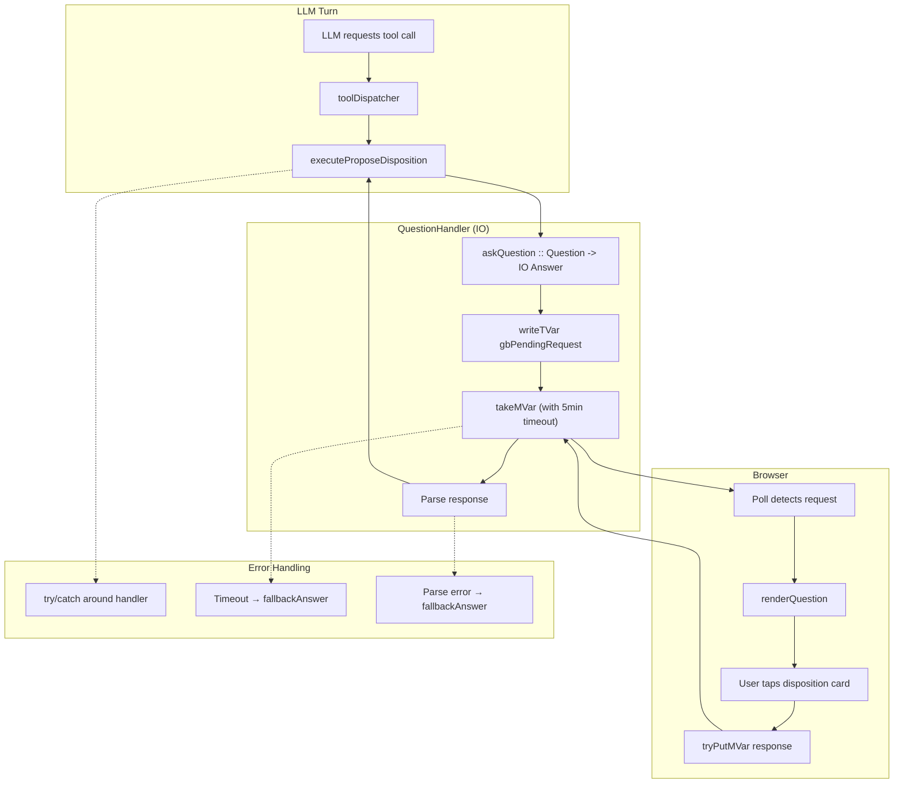
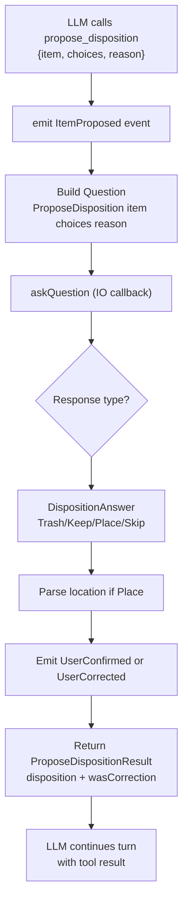
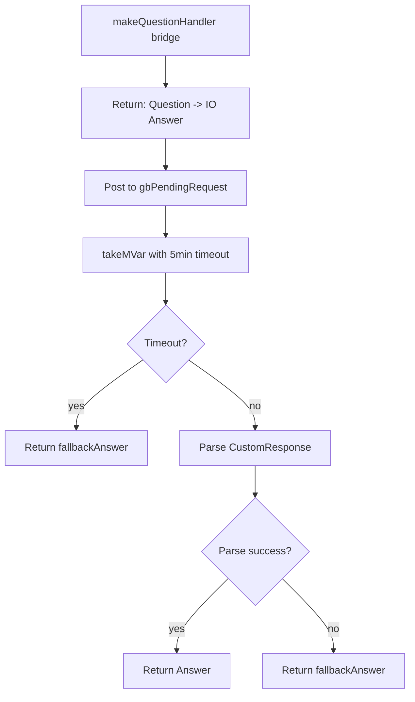
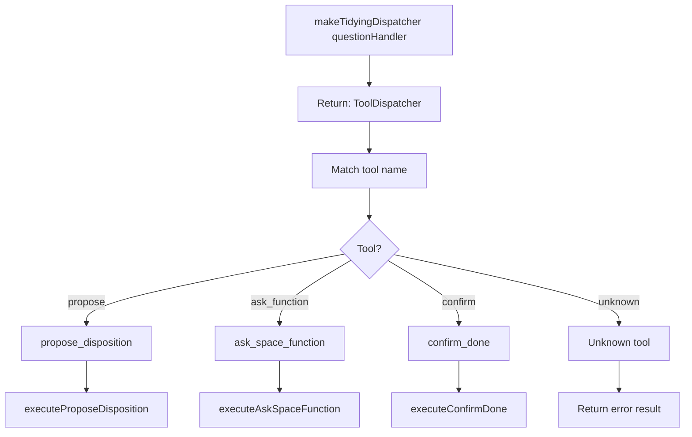

# Tool Execution

How tools execute during LLM turns and communicate with the GUI.

## Tool → QuestionHandler → GUI Flow



## ProposeDisposition Tool Flow

The main tool for item disposition:



## ItemDisposition Enum

Where an item can go (no "Unsure" option - that's an antipattern):

```haskell
data ItemDisposition
  = PlaceAt Text      -- Specific location: "kitchen counter"
  | Trash             -- Garbage
  | Donate            -- Give away
  | Recycle           -- Recycling bin
  | SkipForNow        -- Put it back, come back later
  | NeedMoreInfo      -- Agent needs more context
```

## Question Types and Answers

| Question Type | Answer Type | Fallback |
|---------------|-------------|----------|
| `ProposeDisposition item choices fallback` | `DispositionAnswer ItemDisposition` | `SkipForNow` |
| `Confirm prompt default` | `ConfirmAnswer Bool` | `default` |
| `Choose prompt qid options` | `ChoiceAnswer Text` | `""` |
| `FreeText prompt placeholder` | `TextAnswer Text` | `""` |

## QuestionHandler Implementation



## Tool Dispatcher

Routes tool calls to their executors:



## Error Handling Pattern

All tool execution wraps the QuestionHandler in try/catch:

```haskell
executeProposeDisposition askQuestion input = do
  emit $ ItemProposed ...

  -- Wrapped in try/catch for robustness
  result <- liftIO $ try @SomeException $ askQuestion question

  case result of
    Left err -> do
      logWarn "Question handler failed"
      pure fallback
    Right answer ->
      processAnswer answer
```

## Fallback Answers

When handler fails or times out:

```haskell
fallbackAnswer :: Question -> Answer
fallbackAnswer = \case
  ProposeDisposition _ _ _ -> DispositionAnswer SkipForNow
  Confirm _ defVal         -> ConfirmAnswer defVal
  Choose _ _ _             -> ChoiceAnswer ""
  FreeText _ _             -> TextAnswer ""
```

## TidyingEvent List (All 12 Events)

| Event | Description |
|-------|-------------|
| `PhotoAnalyzed Text` | Photo was analyzed |
| `SituationClassified Text` | Situation/intent classified |
| `ActionTaken Action` | Action was decided |
| `PhaseChanged Phase Phase` | Phase transition (from, to) |
| `SessionEnded Int` | Session ended with item count |
| `UserInputReceived Text` | User input for chat display |
| `ResponseGenerated Text` | Response for chat display |
| `ItemProposed Text [Text]` | Tool: item + dispositions |
| `UserConfirmed Text Text` | Tool: item + chosen disposition |
| `UserCorrected Text Text` | Tool: item + user-provided location |
| `FunctionChosen Text` | Tool: space function selected |
| `SessionConfirmedDone` | Tool: user confirmed done |

## Tool Schema Example

```json
{
  "name": "propose_disposition",
  "description": "Propose what to do with an item",
  "input_schema": {
    "type": "object",
    "properties": {
      "item": { "type": "string" },
      "choices": {
        "type": "array",
        "items": {
          "type": "object",
          "properties": {
            "label": { "type": "string" },
            "description": { "type": "string" }
          }
        }
      },
      "reason": { "type": "string" }
    },
    "required": ["item", "choices"]
  }
}
```

## Why IO Callback (not Effect)?

Tools run **inside** the LLM interpreter where `QuestionUI` has already been consumed:

```
runLLMWithToolsHooked  -- LLM effect interpreted here
  └── tool calls       -- Tools execute during interpretation
       └── need QuestionHandler (IO) not QuestionUI (Effect)
```

The `QuestionHandler` type bridges this:
```haskell
type QuestionHandler = Question -> IO Answer
```

## Key Files

- `Tools.hs` - ProposeDisposition, tool schemas, executors
- `Question.hs` - Question DSL, Answer types, fallbackAnswer
- `GUI/Runner.hs` - makeQuestionHandler, makeTidyingDispatcher
- `GUI/Widgets/Question.hs` - renderQuestion (GUI side)
