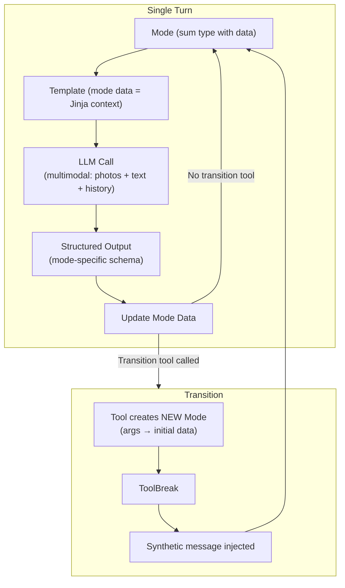
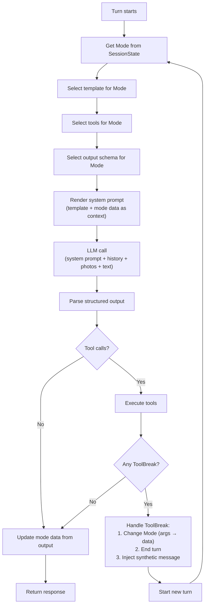
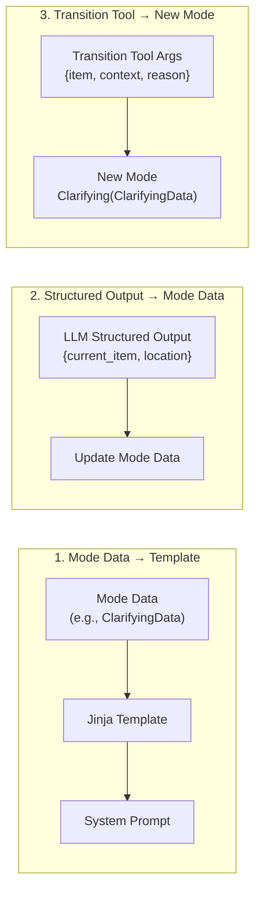
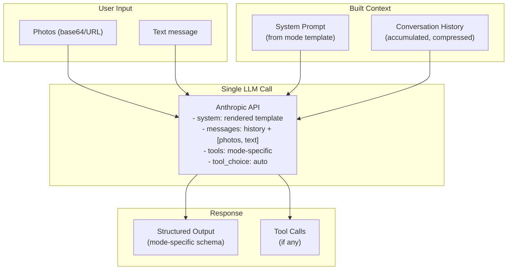
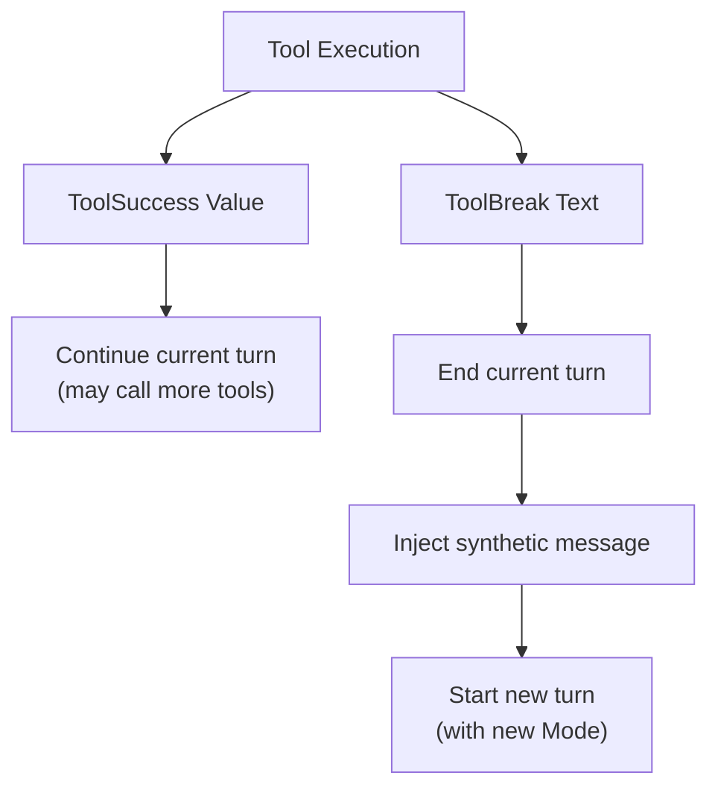
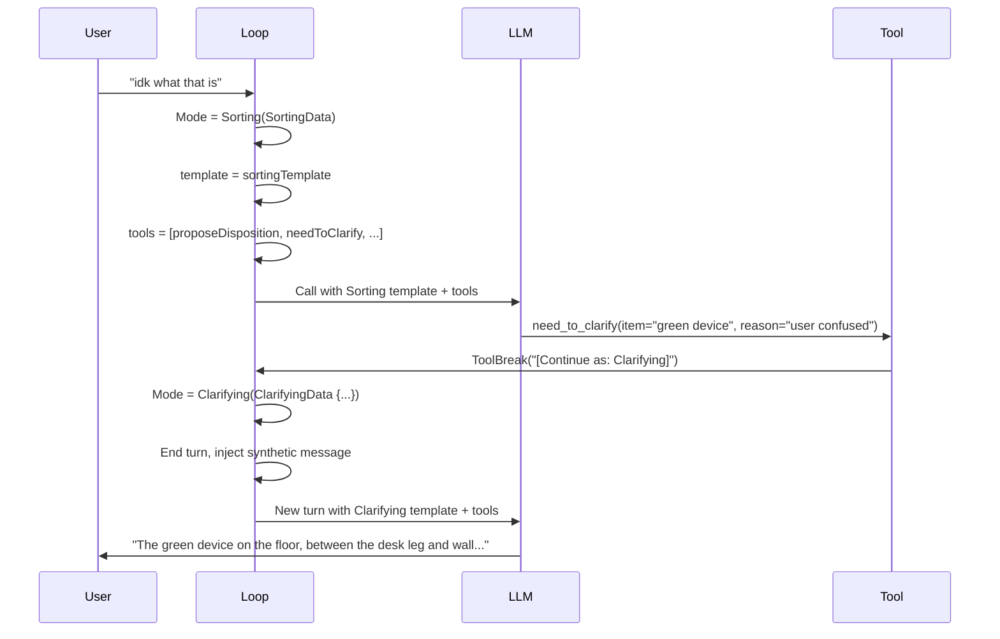
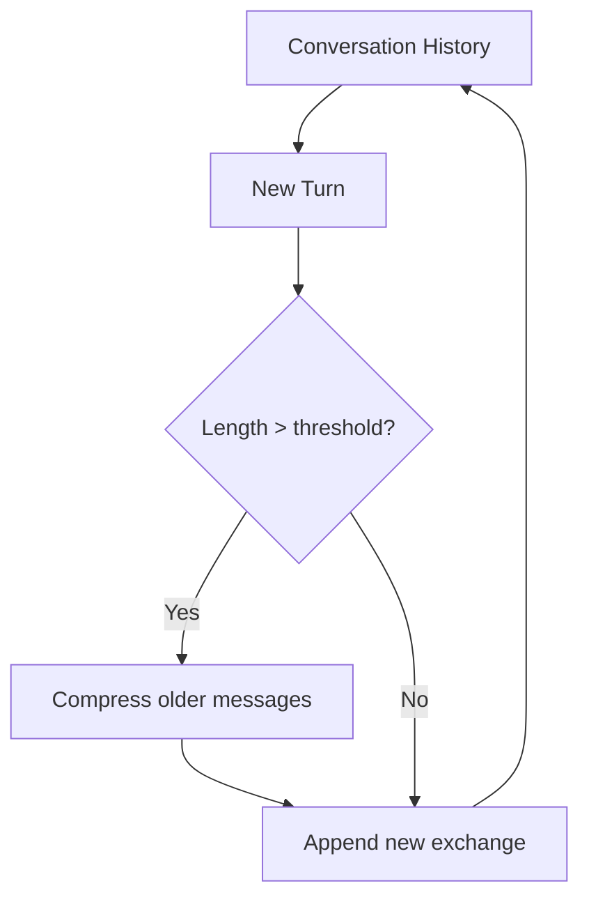

# Turn Loop

The core loop of the Tidying agent. Each turn: Mode → Template → LLM → Output → Update.

## Core Loop



## Detailed Turn Flow



## Three Data Flows



## Multimodal LLM Call

Photos and text are sent together in a single call:



## Mode Selection

```haskell
templateForMode :: Mode -> Template
templateForMode (Surveying _)       = surveyingTemplate
templateForMode (Sorting _)         = sortingTemplate
templateForMode (Clarifying _)      = clarifyingTemplate
templateForMode (DecisionSupport _) = decisionSupportTemplate
templateForMode (WindingDown _)     = windingDownTemplate

toolsForMode :: Mode -> [Tool]
toolsForMode (Surveying _)       = [beginSorting]
toolsForMode (Sorting _)         = [proposeDisposition, needToClarify, userSeemsStuck, timeToWrap]
toolsForMode (Clarifying _)      = [resumeSorting, skipItem]
toolsForMode (DecisionSupport _) = [resumeSorting]
toolsForMode (WindingDown _)     = [endSession]

schemaForMode :: Mode -> Schema
schemaForMode (Surveying _)       = surveyingOutputSchema
schemaForMode (Sorting _)         = sortingOutputSchema
-- etc.
```

## ToolBreak vs ToolSuccess



## Example Turn Sequence

**Sorting mode, user says "idk what that is"**:



## Conversation History

History accumulates across turns and is occasionally compressed:



## Key Files

- `Loop.hs` - `runTurn`, ToolBreak handling
- `Templates.hs` - `templateForMode`, template rendering
- `Tools.hs` - `toolsForMode`, tool definitions
- `Output.hs` - Mode-specific output schemas
