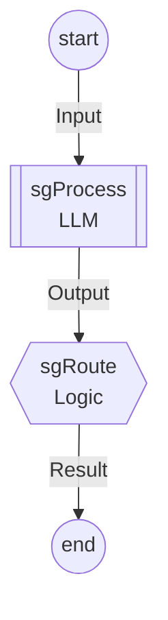
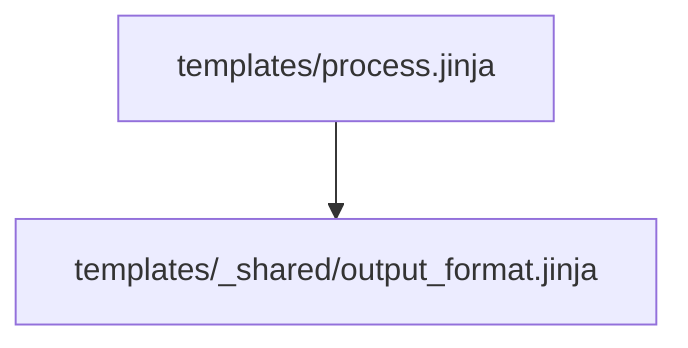

# Tidepool Agent Template

A minimal template for building LLM agents with the tidepool Graph DSL.

## Cold Start Solution

This template solves the "cold start" problem for Claude Code agents. When Claude starts working on a new tidepool-based project, it can immediately see:

1. **`docs/graph.md`** - Auto-generated documentation including:
   - Agent state machine diagram (Mermaid flowchart from type-level Graph DSL)
   - Node reference with inputs, outputs, and transitions
   - Data flow table showing all typed edges
   - Template content with includes resolved inline
   - Template dependency tree (from Jinja includes/extends)
2. **`CLAUDE.md`** - Project-specific instructions for Claude Code sessions

The documentation is generated from code, so it's always accurate and reflects the actual types.

## Quick Start

```bash
# Build
just build

# Generate/regenerate documentation
just generate-docs
```

## Structure

```
template/
├── src/Template/
│   ├── Context.hs      # Template context type (ToGVal)
│   ├── Templates.hs    # TH template compilation + TemplateDef
│   ├── Graph.hs        # Type-level graph definition
│   └── Handlers.hs     # Handler implementations
├── templates/
│   ├── process.jinja   # Main Jinja template (wired to graph)
│   └── _shared/        # Shared partials
├── app/
│   └── GenerateDocs.hs # Mermaid generator
├── docs/
│   └── graph.md        # Generated diagrams
├── CLAUDE.md           # Instructions for Claude Code
└── justfile            # Build automation
```

## The Graph



## Template Dependencies



## Dependencies

This template depends on `tidepool-core`. The `cabal.project` uses a path-based dependency for monorepo development. When moving to a standalone repo, update to a git-based dependency.

## License

MIT
