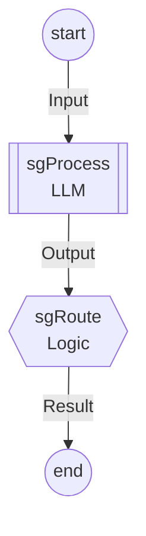
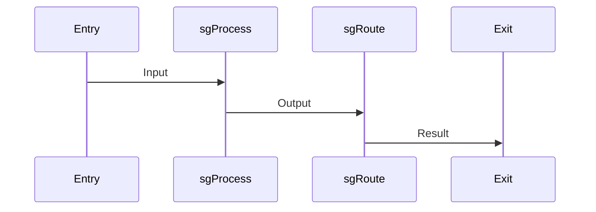

# Agent Documentation

Generated automatically from types and templates.

## Graph Overview



## Node Reference

### `sgProcess` (LLM Node)

**Inputs**: Input
**Outputs**: Output

### `sgRoute` (Logic Node)

**Inputs**: Output
**Transitions**: Exit


## Data Flow

| From | To | Type |
|------|-----|------|
| Entry | sgProcess | Input |
| sgProcess | sgRoute | Output |
| sgRoute | Exit | Result |

## Templates

See [`templates/process.jinja`](../templates/process.jinja) for the main prompt template.

### Dependencies

```mermaid
flowchart TD

    %% Template Dependencies
    "templates/process.jinja" --> "templates/_shared/output_format.jinja"

```

## Type Definitions

### Input

_What enters the graph_

| Field | Type | Description |
|-------|------|-------------|
| inputText | String |  The input text to process |

### Output

_LLM structured output_

| Field | Type | Description |
|-------|------|-------------|
| outputText | String | The processed output text from the LLM |

### Result

_What exits the graph_

| Field | Type | Description |
|-------|------|-------------|
| resultText | String |  The final result text |

## JSON Schema (LLM Output)

The LLM node expects JSON matching this schema:

```json
{
    "additionalProperties": false,
    "properties": {
        "outputText": {
            "description": "The processed output text from the LLM",
            "type": "string"
        }
    },
    "required": [
        "outputText"
    ],
    "type": "object"
}
```

## Context to Template Mapping

The LLM handler builds a `ProcessContext` which is rendered into the template:

| Context Field | Template Variable | Source |
|---------------|-------------------|--------|
| `input` | `{{ input }}` | `Input.inputText` |
| `history` | `{{ history }}` | `ChatHistory` effect (formatted messages) |

See [`src/Template/Context.hs`](../src/Template/Context.hs) for the full context definition.

## Example Execution Trace



### Walkthrough

1. **Entry** receives `Input { inputText = "..." }`
2. **sgProcess** builds template context, renders prompt, LLM returns `Output`
3. **sgRoute** wraps output in `Result`, calls `gotoExit`
4. **Exit** returns final `Result`

## Validation Rules

The graph is validated at compile time:

| Rule | What It Checks |
|------|----------------|
| Single Entry/Exit | Exactly one `Entry` and one `Exit` field |
| Valid Gotos | All `Goto` targets exist as node field names |
| Reachability | Every node is reachable from Entry via data flow or Goto |
| Exit Coverage | Every Logic node has a path to Exit |
| Type Safety | Goto payloads satisfy target node's `Needs` |

## Available Effects

| Node Type | Handler Type | Available Effects |
|-----------|--------------|-------------------|
| LLM Node | `LLMHandler needs schema targets es tpl` | Graph-level effects + Goto |
| Logic Node | `needs -> Eff es (GotoChoice targets)` | Graph-level effects + Goto |

Common effects: `State s`, `Memory s`, `Emit event`, `RequestInput`, `Log`

## Handler Implementations

See [`src/Template/Handlers.hs`](../src/Template/Handlers.hs) for handler implementations.
