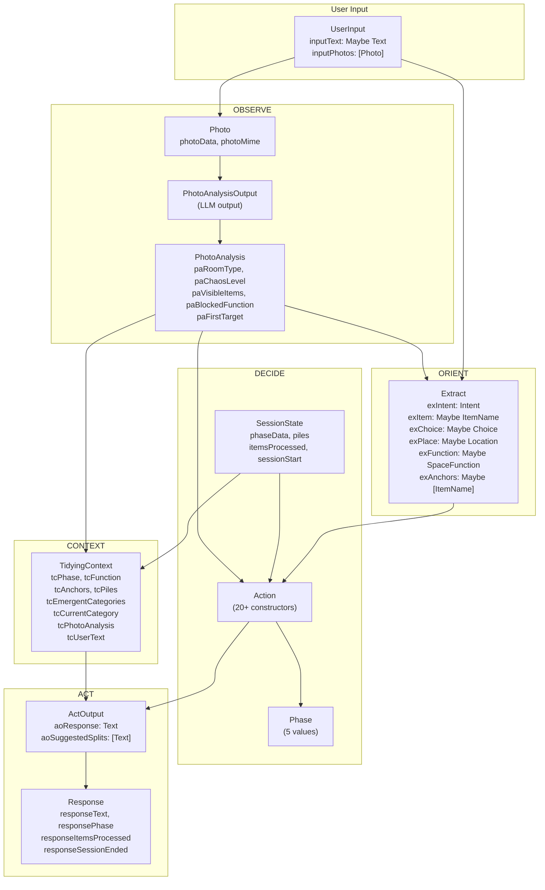
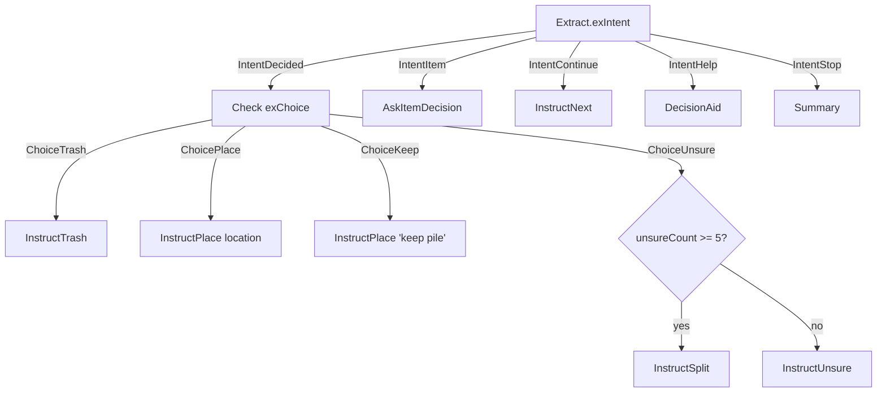
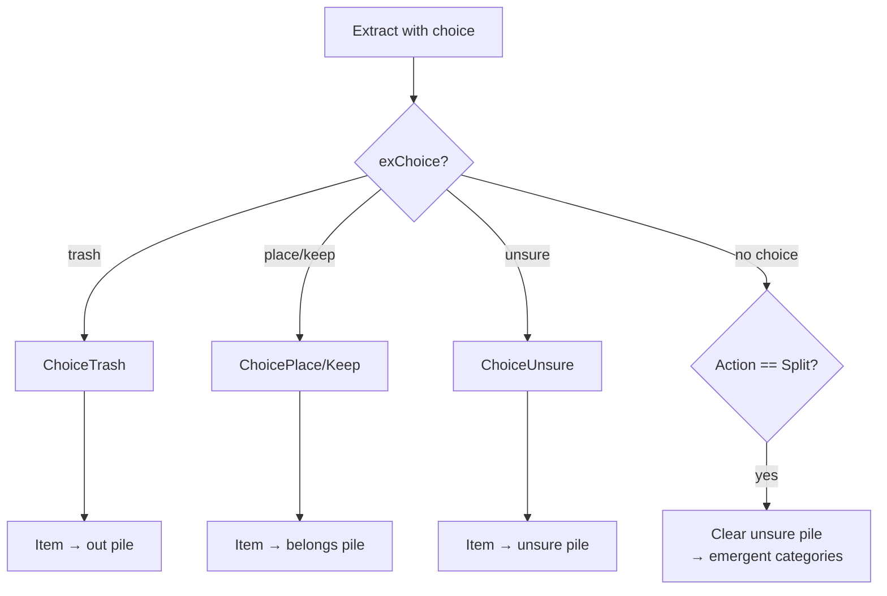

# Data Flow

Type transformations through the Tidying agent pipeline.

## Complete Type Pipeline



## Intent → Action Mapping (Sorting Phase)



## Pile Updates



## Type Reference

### Input Types

```haskell
data UserInput = UserInput
  { inputPhotos :: [Photo]
  , inputText   :: Maybe Text
  }

data Photo = Photo
  { photoData :: Text  -- Base64 or URL
  , photoMime :: Text  -- "image/jpeg", "image/png"
  }
```

### Photo Analysis Types

```haskell
data PhotoAnalysis = PhotoAnalysis
  { paRoomType        :: Text
  , paChaosLevel      :: ChaosLevel  -- Buried | Cluttered | Moderate | Clear
  , paVisibleItems    :: [Text]
  , paBlockedFunction :: Maybe Text
  , paFirstTarget     :: Maybe Text
  }
```

### Extract Types

```haskell
data Extract = Extract
  { exIntent   :: Intent           -- REQUIRED
  , exItem     :: Maybe ItemName
  , exChoice   :: Maybe Choice
  , exPlace    :: Maybe Location
  , exFunction :: Maybe SpaceFunction
  , exAnchors  :: Maybe [ItemName]
  }

data Intent = IntentStart | IntentContinue | IntentItem
            | IntentDecided | IntentHelp | IntentStop

data Choice = ChoiceTrash | ChoiceKeep | ChoicePlace | ChoiceUnsure
```

### Output Types

```haskell
data Response = Response
  { responseText           :: Text
  , responsePhase          :: Phase
  , responseItemsProcessed :: Int
  , responseSessionEnded   :: Bool
  }
```

## Key Files

- `State.hs` - UserInput, Photo, SessionState, Piles
- `Context.hs` - TidyingContext, PhotoAnalysis
- `Output.hs` - Extract, Intent, Choice, ActOutput
- `Loop.hs` - Response, type transformations
