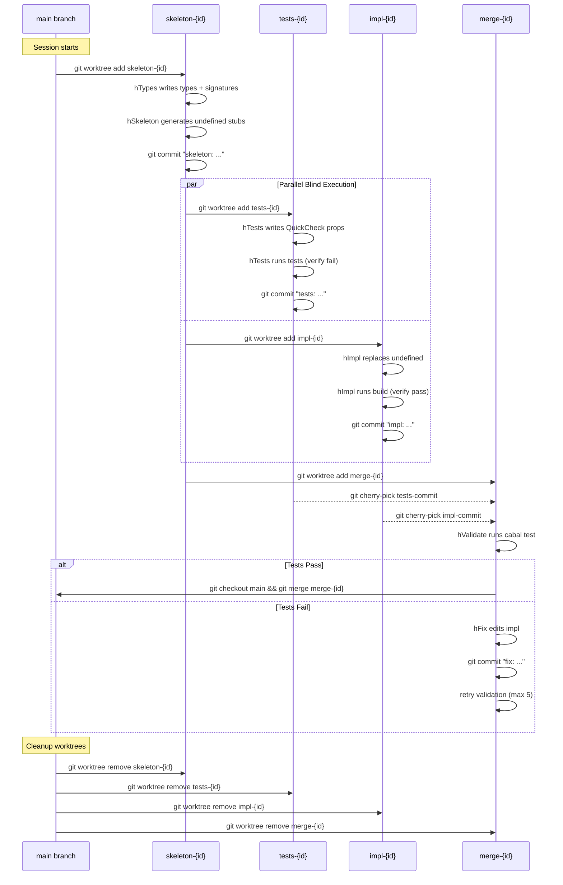

# Hybrid TDD Graph Design

> Parallel blind execution with adversarial verification

## Philosophy

### The Core Insight

TDD's sequential execution enforces an **information barrier through time** - tests can't cheat because the implementation doesn't exist yet. But there's another way to enforce information barriers: **space** (isolation).

If two agents work in separate worktrees, blind to each other's code, they can run in parallel while maintaining the same honesty guarantee. The trick is: **verify the TDD properties post-hoc**.

### Parallel LLM Spawning

Parallel spawning provides both speed and **epistemic diversity**: builder agents create (types, tests, impl), while adversary agents destroy (typeAdversary, mutationAdversary). Fresh-spawned adversaries have no sunk cost bias.

### Key Properties

| Property | How Achieved |
|----------|--------------|
| Tests can't cheat | Blind separation (worktrees) |
| Tests are meaningful | TDD checkpoint (verify fail on skeleton) |
| Types are sound | Type adversary (red team) |
| Tests are robust | Mutation adversary (red team) |
| Parallelism | Concurrent agent spawning |

### Structured Output Principle

**Structured output is semantic metadata, NOT code.**

LLM agents write code to DISK (via ClaudeCode). The structured output they return describes WHAT was written:
- **Identifiers**: Function names, property names, type names
- **Coverage claims**: Which specs/examples are covered
- **Semantic descriptions**: Prose descriptions, NOT code snippets
- **Classifications**: Property types, mutation types, severity levels

This principle enables:
- **Templating**: Semantic info renders flexibly to different formats
- **Iteration analysis**: Classifications are machine-actionable
- **Compact JSON**: No bloated code dumps in outputs
- **Composability**: Typed enums enable programmatic analysis

### Design Qualities

The graph embodies several properties through its structure:

- **Gradual stiffening**: Each node adds constraint without rework
- **Echoes**: Agents share shape (signatures, property names) but not substance
- **Teaching constraints**: Adversary findings strengthen downstream agents
- **Organic adaptation**: The fix loop accumulates understanding, not just retries
- **Illumination**: A witness node maintains coherent understanding of the whole

These aren't bolted on — they're woven into the types, templates, and handlers below.

---

## Git & Worktree Structure

Each agent that writes code operates in an isolated git worktree.
This enforces the blind barrier and enables parallel execution.

### Worktree Topology

```mermaid
graph TD
    subgraph "Main Repository"
        MAIN[main branch]
    end

    subgraph "Session Worktrees"
        SKEL[skeleton-{session}]
        TESTS[tests-{session}]
        IMPL[impl-{session}]
        MERGE[merge-{session}]
    end

    MAIN -->|"git worktree add"| SKEL
    SKEL -->|"skeleton generated"| TESTS
    SKEL -->|"skeleton generated"| IMPL
    TESTS -->|"cherry-pick tests"| MERGE
    IMPL -->|"cherry-pick impl"| MERGE
    MERGE -->|"merge commit"| MAIN
```

### Node → Worktree Mapping

| Node | Worktree | Purpose | Commits |
|------|----------|---------|---------|
| hTypes | `skeleton-{session}` | Initial type design | `types: define Stack data type` |
| hSkeleton | `skeleton-{session}` | Generate stubs | `skeleton: add undefined stubs` |
| hTypeAdversary | (read-only) | Probes skeleton, no changes | (none) |
| **hTests** | `tests-{session}` | Write QuickCheck properties | `tests: add prop_pushPop...` |
| **hImpl** | `impl-{session}` | Implement functions | `impl: implement push, pop...` |
| hMerge | `merge-{session}` | Cherry-pick + resolve | `merge: combine tests + impl` |
| hFix | `merge-{session}` | Fix implementation | `fix: handle empty stack case` |
| hMutationAdversary | `merge-{session}` (read-only) | Probes merged code | (none) |

### Detailed Worktree Lifecycle



### Branch Strategy

```
main
├── skeleton-abc123          (types + stubs)
│   ├── tests-abc123         (properties only)
│   └── impl-abc123          (implementation only)
└── merge-abc123             (combined, validated)
         ↓
      main (fast-forward on success)
```

### Isolation Guarantees

1. **hTests cannot see hImpl's code**: Separate worktrees, no shared state
2. **hImpl cannot see hTests's code**: Same isolation in reverse
3. **Both see skeleton**: Branched from same point (types + undefined)
4. **Merge is fresh**: Neither tests nor impl worktree is mutated
5. **Adversaries are read-only**: No commits, just analysis

### Commit Convention

```
<phase>: <brief description>

<structured output summary>

Session: {session_id}
Node: {node_name}
Cost: ${api_cost}
```

Example:
```
tests: add QuickCheck properties for Stack

Properties: prop_pushPopInverse, prop_sizeIncrement, prop_emptyIsEmpty
Coverage: 3/3 functions, 5/5 examples, 4/4 sketches
Self-verified: tests fail on skeleton ✓

Session: abc123
Node: hTests
Cost: $0.02
```

---

## Graph Structure

```
Entry(StackSpec)
    │
    ▼
┏━━━━━━━━━━━━━━━━━━━━━━━━━━━━━━━━━━━━━━━━━━━━━━━━━━━━━━━━━━━━━┓
┃  hTypes (LLMNode, ClaudeCode Haiku)                         ┃
┃  → Designs: TypeDefinitions + FunctionSemantics + Examples  ┃
┗━━━━━━━━━━━━━━━━━━━━━━━━━━━━━━━━━━━━━━━━━━━━━━━━━━━━━━━━━━━━━┛
    │
    ├───────────────────────────────────┐
    │                                   │
    ▼                                   ▼
┏━━━━━━━━━━━━━━━━━━━━━┓      ┏━━━━━━━━━━━━━━━━━━━━━━━━━━━━━━━┓
┃  hSkeleton          ┃      ┃  hTypeAdversary (Haiku)       ┃
┃  (LogicNode, fast)  ┃      ┃  "Find holes in type system"  ┃
┃  → SkeletonState    ┃      ┃  → TypeAdversaryResult        ┃
┗━━━━━━━━━┳━━━━━━━━━━━┛      ┗━━━━━━━━━━━━━━━┳━━━━━━━━━━━━━━┛
          │                                  │
          │    ┌─────────────────────────────┘
          │    │
          ▼    ▼
    ┏━━━━━━━━━━━━━━━━━━━━━━━━━━━━━━━━━━━━━━━━━━━━━━━━━━━━━━━━┓
    ┃  hGate (JoinNode)                                      ┃
    ┃  Collects: SkeletonState + TypeAdversaryResult         ┃
    ┃                                                        ┃
    ┃  IF critical holes → Goto "hTypesFix"                  ┃
    ┃  IF clean/minor   → Goto "hFork"                       ┃
    ┗━━━━━━━━━━━━━━━━━━━━━━━━━━━━━━━━━━━━━━━━━━━━━━━━━━━━━━━━┛
          │                              │
          │ [holes]                      │ [clean]
          ▼                              ▼
    ┏━━━━━━━━━━━━━━━━┓           ╔═══════════════════════════════════════════╗
    ┃  hTypesFix     ┃           ║  PARALLEL BLIND EXECUTION                 ║
    ┃  (LLMNode)     ┃           ║                                           ║
    ┃  → fixes types ┃           ║  hFork (LogicNode)                        ║
    ┃  → back to     ┃           ║    │                                      ║
    ┃    hTypes      ┃           ║    ├──► hTests (LLMNode, ClaudeCode)      ║
    ┗━━━━━━━━━━━━━━━━┛           ║    │    :@ tests-worktree                 ║
                                 ║    │    → TestsWithProof                  ║
                                 ║    │                                      ║
                                 ║    └──► hImpl (LLMNode, ClaudeCode)       ║
                                 ║         :@ impl-worktree                  ║
                                 ║         → ImplWritten                     ║
                                 ║                                           ║
                                 ║  (Agents are BLIND to each other)         ║
                                 ╚═══════════════════════════════════════════╝
                                           │              │
                                           └──────┬───────┘
                                                  ▼
                                 ┏━━━━━━━━━━━━━━━━━━━━━━━━━━━━━━━━━━━━━━━━━━┓
                                 ┃  hJoin (JoinNode)                        ┃
                                 ┃  Collects: TestsWithProof + ImplWritten  ┃
                                 ┃  → BlindResults                          ┃
                                 ┗━━━━━━━━━━━━━━━━━━━━━━━━━━━━━━━━━━━━━━━━━━┛
                                                  │
                                                  ▼
                                 ┏━━━━━━━━━━━━━━━━━━━━━━━━━━━━━━━━━━━━━━━━━━┓
                                 ┃  hVerifyTDD (LogicNode)                  ┃
                                 ┃  EXTERNAL DOUBLE-CHECK:                  ┃
                                 ┃  1. Checkout tests on skeleton           ┃
                                 ┃  2. Run tests, verify FAIL               ┃
                                 ┃  3. If PASS → tests are trivial, reject  ┃
                                 ┃  → VerifiedResults                       ┃
                                 ┗━━━━━━━━━━━━━━━━━━━━━━━━━━━━━━━━━━━━━━━━━━┛
                                                  │
                                                  ▼
                                 ┏━━━━━━━━━━━━━━━━━━━━━━━━━━━━━━━━━━━━━━━━━━┓
                                 ┃  hMerge (LogicNode)                      ┃
                                 ┃  1. Create fresh merge-worktree          ┃
                                 ┃  2. Cherry-pick tests commit             ┃
                                 ┃  3. Cherry-pick impl commit              ┃
                                 ┃  → MergedState                           ┃
                                 ┗━━━━━━━━━━━━━━━━━━━━━━━━━━━━━━━━━━━━━━━━━━┛
                                                  │
                                                  ▼
                                 ┏━━━━━━━━━━━━━━━━━━━━━━━━━━━━━━━━━━━━━━━━━━┓
                                 ┃  hValidate (LogicNode)                   ┃
                                 ┃  Run: cabal test                         ┃
                                 ┃                                          ┃
                                 ┃  [PASS] → Goto "hPostValidate"           ┃
                                 ┃  [FAIL] → Goto "hFix"                    ┃
                                 ┗━━━━━━━━━━━━━━━━━━━━━━━━━━━━━━━━━━━━━━━━━━┛
                                      │                    │
                          [pass]      │                    │ [fail]
                                      ▼                    ▼
    ┏━━━━━━━━━━━━━━━━━━━━━━━━━━━━━━━━━━━━━━━┓    ┏━━━━━━━━━━━━━━━━━━━━━━━┓
    ┃  hPostValidate (LogicNode)            ┃    ┃  hFix (LLMNode)       ┃
    ┃  1. Spawn mutationAdversary (async)   ┃    ┃  Weighted trust:      ┃
    ┃  2. Route to Exit                     ┃    ┃  - HighTrust: fix impl┃
    ┃                                       ┃    ┃  - MedTrust: fix impl ┃
    ┃  mutationAdversary runs in background ┃    ┃  - LowTrust: reject   ┃
    ┃  → findings included in output        ┃    ┃  → back to hValidate  ┃
    ┗━━━━━━━━━━━━━━━━━━━━━━━━━━━━━━━━━━━━━━━┛    ┗━━━━━━━━━━━━━━━━━━━━━━━┛
                      │
                      ▼
    ┏━━━━━━━━━━━━━━━━━━━━━━━━━━━━━━━━━━━━━━━━━━━━━━━━━━━━━━━━━━━━━━━━━━━┓
    ┃  hExit                                                            ┃
    ┃  → HybridResult                                                   ┃
    ┃     (includes: success, attempts, confidence, adversary findings) ┃
    ┗━━━━━━━━━━━━━━━━━━━━━━━━━━━━━━━━━━━━━━━━━━━━━━━━━━━━━━━━━━━━━━━━━━━┛
```

---

## Graph Definition (Haskell)

```haskell
{-# LANGUAGE DataKinds #-}
{-# LANGUAGE TypeOperators #-}

module TypesFirstDev.Graph.Hybrid
  ( TypesFirstGraphHybrid(..)
  ) where

import GHC.Generics (Generic)
import Tidepool.Graph.Types
import Tidepool.Graph.Generic (GraphMode(..))
import qualified Tidepool.Graph.Generic as G
import Tidepool.Graph.Goto (Goto)

import TypesFirstDev.Types.Hybrid

data TypesFirstGraphHybrid mode = TypesFirstGraphHybrid
  { ----------------------------------------------------------------------------
    -- ENTRY
    ----------------------------------------------------------------------------
    hEntry :: mode :- G.Entry StackSpec

    ----------------------------------------------------------------------------
    -- PHASE 1: TYPE DESIGN
    ----------------------------------------------------------------------------

    -- | Design types with semantic descriptions and examples.
    -- Examples are MANDATORY - they serve as alignment anchors.
    --
    -- Schema: TypesAgentOutput (semantic metadata about what was written)
    -- Handler wraps in TypesResult (adds sessionId, cost)
  , hTypes :: mode :- G.LLMNode
      :@ Input StackSpec
      :@ Template TypesTpl
      :@ Schema TypesAgentOutput         -- LLM returns semantic metadata
      :@ UsesEffects '[ Goto "hSkeleton" TypesResult
                      , Goto "hTypeAdversary" TypesAgentOutput
                      ]
      :@ ClaudeCode 'Haiku 'Nothing

    ----------------------------------------------------------------------------
    -- PHASE 2: PARALLEL GATE (skeleton || typeAdversary)
    ----------------------------------------------------------------------------

    -- | Generate skeleton with undefined stubs.
    -- Fast LogicNode - template rendering + cabal build check.
    -- Handler produces SkeletonState (internal type, not schema).
  , hSkeleton :: mode :- G.LogicNode
      :@ Input TypesResult
      :@ UsesEffects '[Goto "hGate" SkeletonState]

    -- | TYPE ADVERSARY: Red team for type system.
    -- Tries to construct invalid states the type system allows.
    -- Runs in PARALLEL with skeleton (doesn't add latency).
    --
    -- Schema: TypeAdversaryOutput (holes found, analysis)
    -- Handler wraps in TypeAdversaryResult (adds derived verdict)
  , hTypeAdversary :: mode :- G.LLMNode
      :@ Input TypesAgentOutput
      :@ Template TypeAdversaryTpl
      :@ Schema TypeAdversaryOutput      -- No verdict - handler derives
      :@ UsesEffects '[Goto "hGate" TypeAdversaryResult]
      :@ ClaudeCode 'Haiku 'Nothing

    -- | Gate: Join skeleton + typeAdversary results.
    -- Routes to fork (clean) or typesFix (holes found).
  , hGate :: mode :- G.JoinNode
      :@ Inputs '[SkeletonState, TypeAdversaryResult]
      :@ UsesEffects '[ Goto "hFork" GatedState
                      , Goto "hTypesFix" TypeHolesFound
                      ]

    -- | Fix type holes if adversary found issues.
    -- Routes back to hSkeleton with fixed types.
  , hTypesFix :: mode :- G.LLMNode
      :@ Input TypeHolesFound
      :@ Template TypesFixTpl
      :@ Schema TypesAgentOutput         -- Returns new type design
      :@ UsesEffects '[Goto "hSkeleton" TypesResult]
      :@ ClaudeCode 'Haiku 'Nothing

    ----------------------------------------------------------------------------
    -- PHASE 3: PARALLEL BLIND EXECUTION (tests || impl)
    ----------------------------------------------------------------------------

    -- | Fork into parallel blind agents.
    -- Creates two worktrees, spawns tests and impl agents concurrently.
    -- Handler creates TestsTemplateCtx and ImplTemplateCtx for templates.
  , hFork :: mode :- G.LogicNode
      :@ Input GatedState
      :@ UsesEffects '[ Goto "hTests" TestsTemplateCtx
                      , Goto "hImpl" ImplTemplateCtx
                      ]

    -- | TESTS AGENT: Writes QuickCheck properties.
    -- Blind to impl. Must self-verify tests fail on skeleton.
    --
    -- Schema: TestsAgentOutput (properties written, coverage, self-verified)
    -- Handler wraps in TestsResult (adds worktree, commit, failures)
  , hTests :: mode :- G.LLMNode
      :@ Input TestsTemplateCtx
      :@ Template TestsTpl
      :@ Schema TestsAgentOutput         -- Semantic metadata only
      :@ UsesEffects '[Goto "hJoin" TestsResult]
      :@ ClaudeCode 'Haiku 'Nothing

    -- | IMPL AGENT: Writes implementation.
    -- Blind to tests. Must verify build passes.
    --
    -- Schema: ImplAgentOutput (functions implemented, design notes)
    -- Handler wraps in ImplResult (adds worktree, commit)
  , hImpl :: mode :- G.LLMNode
      :@ Input ImplTemplateCtx
      :@ Template ImplTpl
      :@ Schema ImplAgentOutput          -- Semantic metadata only
      :@ UsesEffects '[Goto "hJoin" ImplResult]
      :@ ClaudeCode 'Haiku 'Nothing

    -- | Join: Barrier collecting both blind agents' results.
  , hJoin :: mode :- G.JoinNode
      :@ Inputs '[TestsResult, ImplResult]
      :@ UsesEffects '[Goto "hVerifyTDD" BlindResults]

    ----------------------------------------------------------------------------
    -- PHASE 4: TDD VERIFICATION (external double-check)
    ----------------------------------------------------------------------------

    -- | External TDD verification.
    -- Re-runs tests on skeleton to confirm they fail.
    -- Belt-and-suspenders: don't trust agent's self-report alone.
  , hVerifyTDD :: mode :- G.LogicNode
      :@ Input BlindResults
      :@ UsesEffects '[ Goto "hMerge" VerifiedResults
                      , Goto "hTestsReject" TrivialTestsError
                      ]

    -- | Handle trivial tests (passed on skeleton = broken).
  , hTestsReject :: mode :- G.LogicNode
      :@ Input TrivialTestsError
      :@ UsesEffects '[Goto "hFork" GatedState]  -- Re-run tests agent

    ----------------------------------------------------------------------------
    -- PHASE 5: MERGE
    ----------------------------------------------------------------------------

    -- | Merge into fresh worktree.
    -- Cherry-picks tests and impl commits into clean worktree.
  , hMerge :: mode :- G.LogicNode
      :@ Input VerifiedResults
      :@ UsesEffects '[Goto "hValidate" MergedState]

    ----------------------------------------------------------------------------
    -- PHASE 6: VALIDATION LOOP
    ----------------------------------------------------------------------------

    -- | Run tests on merged code.
  , hValidate :: mode :- G.LogicNode
      :@ Input MergedState
      :@ UsesEffects '[ Goto "hPostValidate" ValidatedState
                      , Goto "hFix" ValidationFailure
                      ]

    -- | Fix implementation based on test failures.
    -- Uses weighted trust: verified tests are gospel.
    --
    -- Schema: FixAgentOutput (changes made, fix types)
  , hFix :: mode :- G.LLMNode
      :@ Input ValidationFailure
      :@ Template FixTpl
      :@ Schema FixAgentOutput           -- Semantic fix descriptions
      :@ UsesEffects '[Goto "hValidate" MergedState]
      :@ ClaudeCode 'Haiku 'Nothing

    ----------------------------------------------------------------------------
    -- PHASE 7: POST-VALIDATION (advisory mutation testing)
    ----------------------------------------------------------------------------

    -- | Post-validation: spawn mutation adversary, route to exit.
    -- Mutation adversary is ADVISORY - doesn't block exit.
  , hPostValidate :: mode :- G.LogicNode
      :@ Input ValidatedState
      :@ UsesEffects '[ Goto "hMutationAdversary" MutationTemplateCtx
                      , Goto "hExit" HybridResult
                      ]

    -- | MUTATION ADVERSARY: Red team for test suite.
    -- Introduces bugs, checks if tests catch them.
    -- ADVISORY: Findings included in output, don't block exit.
    --
    -- Schema: MutationAdversaryOutput (survivors, analysis)
    -- Handler wraps in MutationAdversaryResult (adds derived verdict)
  , hMutationAdversary :: mode :- G.AdvisoryNode
      :@ Input MutationTemplateCtx
      :@ Template MutationAdversaryTpl
      :@ Schema MutationAdversaryOutput  -- No verdict - handler derives
      :@ ClaudeCode 'Haiku 'Nothing
      :@ ReportsTo "hExit"

    ----------------------------------------------------------------------------
    -- WITNESS (Illumination - observes without modifying)
    ----------------------------------------------------------------------------

    -- | Witness node observes all LLM nodes and maintains coherent understanding.
    -- Doesn't change code - illuminates what's happening.
    -- Reports to exit, providing context on the journey.
  , hWitness :: mode :- G.ObserverNode
      :@ Observes '[hTypes, hTests, hImpl, hFix]
      :@ Emits WitnessReport
      :@ ReportsTo "hExit"

    ----------------------------------------------------------------------------
    -- EXIT
    ----------------------------------------------------------------------------

  , hExit :: mode :- G.Exit HybridResult
  }
  deriving Generic
```

---

## Type Definitions

Types are organized into:
1. **Schema types** - What LLMs return (structured output)
2. **Internal types** - Handler state (not LLM-produced)
3. **Template context types** - What templates render

### Design Principle: Semantic Metadata

LLM outputs describe WHAT was written, not the code itself:

```
BAD:  { propertyCode: "prop_pushPop x s = pop (push x s) == (x, s)" }
GOOD: { propertyName: "prop_pushPop", type: Inverse, covers: ["push", "pop"] }
```

The code lives on disk. The output is semantic metadata for analysis and templating.

```haskell
module TypesFirstDev.Types.Hybrid where

import Data.Text (Text)
import Data.List.NonEmpty (NonEmpty)
import GHC.Generics (Generic)
import Data.Aeson (FromJSON, ToJSON)

-- ════════════════════════════════════════════════════════════════════════════
-- SHARED CONTRACT: The Spec (Input to multiple agents)
-- ════════════════════════════════════════════════════════════════════════════

-- | Entry specification for the hybrid TDD workflow.
-- Includes strictness configuration for per-task behavior.
data StackSpec = StackSpec
  { specModuleName        :: Text               -- "Data.Stack"
  , specDescription       :: Text               -- What we're building
  , specAcceptanceCriteria :: [Text]            -- Must-have features
  , specImplPath          :: FilePath           -- Where to write impl
  , specTestPath          :: FilePath           -- Where to write tests
  , specStrictness        :: StrictnessConfig   -- Per-task strictness
  }
  deriving stock (Show, Eq, Generic)
  deriving anyclass (FromJSON, ToJSON)

-- | Per-task strictness configuration.
-- Controls when mutation adversary blocks vs advises.
data StrictnessConfig = StrictnessConfig
  { scMutationBlocking :: Bool        -- If True, 0 survivors required for exit
  , scMaxFixAttempts   :: Int         -- Default: 5
  , scRequireCoverage  :: Bool        -- Block if PropertySketches unimplemented
  }
  deriving stock (Show, Eq, Generic)
  deriving anyclass (FromJSON, ToJSON)

-- | Default strictness for normal development.
defaultStrictness :: StrictnessConfig
defaultStrictness = StrictnessConfig
  { scMutationBlocking = False  -- Advisory mode
  , scMaxFixAttempts   = 5
  , scRequireCoverage  = True   -- PropertySketches must be implemented
  }

-- | High-stakes strictness for critical code.
strictMode :: StrictnessConfig
strictMode = StrictnessConfig
  { scMutationBlocking = True   -- 0 survivors required
  , scMaxFixAttempts   = 5
  , scRequireCoverage  = True
  }

-- | Concrete example: specific input/output pair.
-- Used for alignment - both agents see the same concrete cases.
data ConcreteExample = ConcreteExample
  { ceDescription :: Text   -- "Pushing onto empty stack"
  , ceInput       :: Text   -- "push 1 empty"
  , ceExpected    :: Text   -- "Stack containing just 1"
  , ceEdgeCase    :: Bool   -- Is this an edge case worth extra attention?
  }
  deriving stock (Show, Eq, Generic)
  deriving anyclass (FromJSON, ToJSON)

-- | Property sketch: informal description of a property to test.
-- NOT code - prose/pseudocode that tests agent interprets.
data PropertySketch = PropertySketch
  { psName        :: Text           -- "pushPopInverse"
  , psDescription :: Text           -- "Pushing then popping returns original stack"
  , psInvariant   :: Text           -- "∀x s. pop (push x s) ≡ (x, s)"
  , psType        :: PropertyType   -- Classification for analysis
  }
  deriving stock (Show, Eq, Generic)
  deriving anyclass (FromJSON, ToJSON)

-- | Classification of property types (for coverage analysis).
data PropertyType
  = Inverse         -- f . g = id (or similar)
  | Idempotent      -- f . f = f
  | Commutative     -- f x y = f y x
  | Associative     -- f (f x y) z = f x (f y z)
  | Identity        -- f identity x = x
  | Preservation    -- Some property preserved across operation
  | Boundary        -- Edge case behavior
  | Monotonic       -- Order preservation
  | Other Text      -- Freeform classification
  deriving stock (Show, Eq, Generic)
  deriving anyclass (FromJSON, ToJSON)

-- | Complete specification for a function.
-- Single source of truth - no duplicate name/signature fields.
--
-- INVARIANT ENFORCED BY TYPES: Both examples AND properties are REQUIRED.
-- Using NonEmpty guarantees at least one element at parse time.
-- No runtime validation needed - the type system enforces it.
data FunctionSpec = FunctionSpec
  { fnName        :: Text                       -- "push"
  , fnSignature   :: Text                       -- "a -> Stack a -> Stack a"
  , fnBrief       :: Text                       -- One-line for code comments
  , fnBehavior    :: Text                       -- Detailed prose for agents
  , fnExamples    :: NonEmpty ConcreteExample   -- REQUIRED: Type enforces ≥1
  , fnProperties  :: NonEmpty PropertySketch    -- REQUIRED: Type enforces ≥1
  , fnPriority    :: Int                        -- Implementation order hint
  }
  deriving stock (Show, Eq, Generic)
  deriving anyclass (FromJSON, ToJSON)

-- No validateFunctionSpec needed - NonEmpty enforces the invariant at parse time.
-- If JSON has empty array for fnExamples or fnProperties, parsing fails.

-- ════════════════════════════════════════════════════════════════════════════
-- TYPES AGENT OUTPUT (Schema)
-- ════════════════════════════════════════════════════════════════════════════

-- | Output from types agent. Semantic descriptions, not code.
-- The agent WRITES code to disk; this describes what was written.
data TypesAgentOutput = TypesAgentOutput
  { taoTypeName       :: Text           -- "Stack"
  , taoTypeKind       :: Text           -- "* -> *" or "Type -> Type"
  , taoTypeDescription :: Text          -- Prose: what this type represents
  , taoConstructors   :: [Text]         -- Constructor names: ["Empty", "Push"]
  , taoFunctions      :: [FunctionSpec] -- Full specs for each function
  , taoImports        :: [Text]         -- Module imports needed
  , taoDesignNotes    :: Text           -- Why this representation?
  , taoBlocker        :: Maybe Text     -- If blocked, explain
  }
  deriving stock (Show, Eq, Generic)
  deriving anyclass (FromJSON, ToJSON)

-- ════════════════════════════════════════════════════════════════════════════
-- TYPE ADVERSARY OUTPUT (Schema)
-- ════════════════════════════════════════════════════════════════════════════

-- | A hole found in the type system.
-- Describes the hole semantically - counterexample is pseudocode/prose.
data TypeHole = TypeHole
  { thHoleType        :: HoleType       -- Classification
  , thDescription     :: Text           -- "Empty stack can claim non-empty"
  , thInvariantBroken :: Text           -- "NonEmpty should guarantee ≥1 element"
  , thExploitSketch   :: Text           -- Pseudocode showing exploit (not compilable)
  , thSeverity        :: Severity
  , thSuggestedFix    :: Text           -- "Use newtype with smart constructor"
  }
  deriving stock (Show, Eq, Generic)
  deriving anyclass (FromJSON, ToJSON)

data HoleType
  = RepresentableInvalid   -- Can construct value violating invariant
  | LeakyAbstraction       -- Internal representation exposed
  | PartialFunction        -- Function undefined for some valid inputs
  | TypeConfusion          -- Different semantic meanings share type
  deriving stock (Show, Eq, Generic)
  deriving anyclass (FromJSON, ToJSON)

data Severity = Critical | Major | Minor | Informational
  deriving stock (Show, Eq, Generic)
  deriving anyclass (FromJSON, ToJSON)

-- | Type adversary output. No verdict field - derived from holes.
data TypeAdversaryOutput = TypeAdversaryOutput
  { taoHoles     :: [TypeHole]
  , taoAnalysis  :: Text        -- Approach taken, areas examined
  , taoConfident :: Bool        -- "I thoroughly checked" vs "might have missed"
  }
  deriving stock (Show, Eq, Generic)
  deriving anyclass (FromJSON, ToJSON)

-- Verdict derived by handler, not produced by LLM:
-- deriveVerdict :: [TypeHole] -> TypeSystemVerdict

-- ════════════════════════════════════════════════════════════════════════════
-- TESTS AGENT OUTPUT (Schema)
-- ════════════════════════════════════════════════════════════════════════════

-- | Description of a property that was written.
-- NOT the code - semantic metadata about the property.
data PropertyWritten = PropertyWritten
  { pwName            :: Text           -- "prop_pushPopInverse"
  , pwTargetFunctions :: [Text]         -- ["push", "pop"]
  , pwPropertyType    :: PropertyType   -- Inverse
  , pwDescription     :: Text           -- "Verifies push/pop are inverses"
  , pwCoversExamples  :: [Int]          -- Indices into FunctionSpec.fnExamples
  , pwCoversSketch    :: Maybe Text     -- Which PropertySketch this implements
  }
  deriving stock (Show, Eq, Generic)
  deriving anyclass (FromJSON, ToJSON)

-- | Coverage report - what fraction of spec is tested?
data CoverageReport = CoverageReport
  { crFunctionsCovered   :: [Text]      -- Functions with ≥1 property
  , crFunctionsUncovered :: [Text]      -- Functions with no properties
  , crExamplesCovered    :: Int         -- Examples referenced by properties
  , crExamplesTotal      :: Int         -- Total examples in spec
  , crSketchesCovered    :: [Text]      -- PropertySketch names implemented
  , crSketchesUncovered  :: [Text]      -- PropertySketch names NOT implemented
  }
  deriving stock (Show, Eq, Generic)
  deriving anyclass (FromJSON, ToJSON)

-- | Tests agent output. Describes what was written, not the code.
data TestsAgentOutput = TestsAgentOutput
  { testsProperties   :: [PropertyWritten]
  , testsCoverage     :: CoverageReport
  , testsSelfVerified :: Bool           -- "I ran tests, they fail on skeleton"
  , testsCommitMsg    :: Text           -- For the commit
  , testsStrategy     :: Text           -- Prose: approach taken
  , testsBlocker      :: Maybe Text
  }
  deriving stock (Show, Eq, Generic)
  deriving anyclass (FromJSON, ToJSON)

-- ════════════════════════════════════════════════════════════════════════════
-- IMPL AGENT OUTPUT (Schema)
-- ════════════════════════════════════════════════════════════════════════════

-- | Description of a function that was implemented.
data FunctionImplemented = FunctionImplemented
  { fiName           :: Text            -- "push"
  , fiApproach       :: Text            -- "Recursive cons-cell construction"
  , fiComplexity     :: Maybe Text      -- "O(1)" - if agent knows
  , fiHandlesEdges   :: [Text]          -- Edge cases explicitly handled
  }
  deriving stock (Show, Eq, Generic)
  deriving anyclass (FromJSON, ToJSON)

-- | Impl agent output. Describes implementation decisions, not code.
data ImplAgentOutput = ImplAgentOutput
  { implFunctions      :: [FunctionImplemented]
  , implDataRepr       :: Text          -- "Recursive ADT with spine"
  , implDesignNotes    :: Text          -- Key decisions, tradeoffs
  , implBuildPassed    :: Bool          -- "cabal build succeeded"
  , implCommitMsg      :: Text
  , implBlocker        :: Maybe Text
  }
  deriving stock (Show, Eq, Generic)
  deriving anyclass (FromJSON, ToJSON)

-- ════════════════════════════════════════════════════════════════════════════
-- FIX AGENT OUTPUT (Schema)
-- ════════════════════════════════════════════════════════════════════════════

-- | Description of a fix applied.
data FixApplied = FixApplied
  { faFunction     :: Text              -- "push"
  , faWhatChanged  :: Text              -- "Fixed off-by-one in size tracking"
  , faWhyFailed    :: Text              -- "Wasn't handling empty stack edge case"
  , faFixType      :: FixType
  }
  deriving stock (Show, Eq, Generic)
  deriving anyclass (FromJSON, ToJSON)

data FixType
  = EdgeCaseFix         -- Missing edge case handling
  | LogicFix            -- Incorrect logic/algorithm
  | TypeFix             -- Type mismatch or conversion issue
  | BoundaryFix         -- Off-by-one or boundary condition
  | InitializationFix   -- Wrong initial value
  | OtherFix Text
  deriving stock (Show, Eq, Generic)
  deriving anyclass (FromJSON, ToJSON)

data FixAgentOutput = FixAgentOutput
  { fixChanges     :: [FixApplied]
  , fixBuildPassed :: Bool
  , fixCommitMsg   :: Text
  , fixBlocker     :: Maybe Text
  }
  deriving stock (Show, Eq, Generic)
  deriving anyclass (FromJSON, ToJSON)

-- ════════════════════════════════════════════════════════════════════════════
-- MUTATION ADVERSARY OUTPUT (Schema)
-- ════════════════════════════════════════════════════════════════════════════

-- | Classification of mutation types.
data MutationType
  = BoundaryMutation     -- Changed >, <, >=, <=
  | ConditionFlip        -- Negated a condition
  | OffByOne             -- +1/-1 changes
  | SwappedArgs          -- Arguments in wrong order
  | RemovedCheck         -- Deleted a guard/validation
  | ChangedOperator      -- +/-, *//, etc.
  | ReturnedWrongBranch  -- Swapped if/else results
  | OtherMutation Text
  deriving stock (Show, Eq, Generic)
  deriving anyclass (FromJSON, ToJSON)

-- | A mutation that survived (tests didn't catch).
-- Semantic description, not the actual mutated code.
data SurvivingMutant = SurvivingMutant
  { smFunction       :: Text            -- "push"
  , smMutationType   :: MutationType    -- BoundaryMutation
  , smDescription    :: Text            -- "Changed > to >= in length check"
  , smWhyDangerous   :: Text            -- "Allows stack overflow"
  , smMissingTest    :: Text            -- "Need property for max capacity"
  , smSuggestedProp  :: PropertySketch  -- Informal spec for missing property
  }
  deriving stock (Show, Eq, Generic)
  deriving anyclass (FromJSON, ToJSON)

-- | Mutation adversary output. Survivor count derived from list.
data MutationAdversaryOutput = MutationAdversaryOutput
  { mutMutantsTried :: Int
  , mutSurvivors    :: [SurvivingMutant]
  , mutAnalysis     :: Text             -- Areas tested, approach
  }
  deriving stock (Show, Eq, Generic)
  deriving anyclass (FromJSON, ToJSON)

-- Verdict derived by handler:
-- deriveTestVerdict :: Int -> [SurvivingMutant] -> TestSuiteVerdict

-- ════════════════════════════════════════════════════════════════════════════
-- STRUCTURED FAILURES (for TDD verification and fix context)
-- ════════════════════════════════════════════════════════════════════════════

-- | Structured test failure - parsed from QuickCheck output.
-- Handler produces this, not LLM.
data StructuredFailure = StructuredFailure
  { sfPropertyName  :: Text             -- "prop_pushPopInverse"
  , sfFailureType   :: FailureType
  , sfCounterexample :: Maybe Text      -- Shrunk counterexample if available
  , sfExpected      :: Maybe Text       -- What was expected
  , sfActual        :: Maybe Text       -- What actually happened
  , sfMessage       :: Text             -- Raw failure message
  }
  deriving stock (Show, Eq, Generic)
  deriving anyclass (FromJSON, ToJSON)

data FailureType
  = PropertyFailed      -- QuickCheck found counterexample
  | ExceptionThrown     -- Property threw exception
  | Timeout             -- Property didn't terminate
  | UndefinedHit        -- Hit undefined/error
  | ParseError          -- Couldn't parse test output
  deriving stock (Show, Eq, Generic)
  deriving anyclass (FromJSON, ToJSON)

-- ════════════════════════════════════════════════════════════════════════════
-- ECHO CHANNELS & HARDENING (Resonance between agents)
-- ════════════════════════════════════════════════════════════════════════════

-- | Echo channel - shape without substance.
-- Agents share what they're DOING (names), not HOW (implementations).
-- This creates resonance without breaking the blind barrier.
data EchoChannel = EchoChannel
  { ecFromImpl  :: [Text]  -- Function names impl is working on
  , ecFromTests :: [Text]  -- Property names tests is asserting
  }
  deriving stock (Show, Eq, Generic)
  deriving anyclass (FromJSON, ToJSON)

-- | Hardening hint from adversary agents.
-- Instead of just blocking, adversaries TEACH downstream agents.
data HardeningHint = HardeningHint
  { hhContext   :: Text    -- "The type allows representing invalid empty stacks"
  , hhGuidance  :: Text    -- "Consider: tests for NonEmpty invariant, impl guards"
  , hhSource    :: Text    -- "typeAdversary" or "mutationAdversary"
  }
  deriving stock (Show, Eq, Generic)
  deriving anyclass (FromJSON, ToJSON)

-- ════════════════════════════════════════════════════════════════════════════
-- TEMPLATE CONTEXT TYPES (What templates render)
-- ════════════════════════════════════════════════════════════════════════════

-- These types contain only what the template needs to render.
-- They are NOT schemas (LLM doesn't produce them).
-- They are NOT full internal state (don't include infrastructure).

-- | Context for TestsTpl - what the tests agent sees.
data TestsTemplateCtx = TestsTemplateCtx
  { ttcTypeName       :: Text                        -- "Stack"
  , ttcConstructors   :: [Text]                      -- ["Empty", "Push"]
  , ttcFunctions      :: [FunctionSpec]              -- Specs with examples/properties
  , ttcTestPath       :: FilePath                    -- Where to write tests
  , ttcPriorFeedback  :: Maybe TrivialTestsFeedback  -- Feedback from rejected attempt
  , ttcEchoes         :: Maybe EchoChannel           -- What impl is working on
  , ttcHardeningHints :: [HardeningHint]             -- Guidance from adversaries
  }

-- | Context for ImplTpl - what the impl agent sees.
data ImplTemplateCtx = ImplTemplateCtx
  { itcTypeName       :: Text
  , itcConstructors   :: [Text]
  , itcFunctions      :: [FunctionSpec]     -- Same spec as tests agent!
  , itcImplPath       :: FilePath           -- Where to write impl
  , itcEchoes         :: Maybe EchoChannel  -- What tests is asserting
  , itcHardeningHints :: [HardeningHint]    -- Guidance from adversaries
  }

-- | Context for MutationAdversaryTpl.
data MutationTemplateCtx = MutationTemplateCtx
  { mtcImplPath    :: FilePath           -- Agent reads this
  , mtcTestPath    :: FilePath           -- Agent reads this
  , mtcFunctions   :: [FunctionSpec]     -- For reference
  }

-- ════════════════════════════════════════════════════════════════════════════
-- TEMPLATE CONTEXT DERIVATION (Internal state → Template context)
-- ════════════════════════════════════════════════════════════════════════════

-- These functions transform internal state into template contexts.
-- They extract only what templates need, avoiding leaky abstractions.

-- | Derive tests template context from gated state.
-- Used in hFork handler to prepare tests agent input.
gatedStateToTestsCtx
  :: GatedState
  -> Maybe TrivialTestsFeedback  -- From rejected prior attempt
  -> Maybe EchoChannel           -- From parallel impl (if available)
  -> TestsTemplateCtx
gatedStateToTestsCtx gs feedback echoes = TestsTemplateCtx
  { ttcTypeName       = taoTypeName typesOut
  , ttcConstructors   = taoConstructors typesOut
  , ttcFunctions      = taoFunctions typesOut
  , ttcTestPath       = ssTestPath skel
  , ttcPriorFeedback  = feedback
  , ttcEchoes         = echoes
  , ttcHardeningHints = deriveHardeningHints (gsTypeAdversary gs)
  }
  where
    skel     = gsSkeleton gs
    typesOut = trOutput $ ssTypesResult skel

-- | Derive impl template context from gated state.
gatedStateToImplCtx
  :: GatedState
  -> Maybe EchoChannel
  -> ImplTemplateCtx
gatedStateToImplCtx gs echoes = ImplTemplateCtx
  { itcTypeName       = taoTypeName typesOut
  , itcConstructors   = taoConstructors typesOut
  , itcFunctions      = taoFunctions typesOut
  , itcImplPath       = ssImplPath skel
  , itcEchoes         = echoes
  , itcHardeningHints = deriveHardeningHints (gsTypeAdversary gs)
  }
  where
    skel     = gsSkeleton gs
    typesOut = trOutput $ ssTypesResult skel

-- | Convert type adversary findings to hardening hints.
deriveHardeningHints :: TypeAdversaryResult -> [HardeningHint]
deriveHardeningHints tar =
  map holeToHint $ filter isActionable $ taoHoles $ tarOutput tar
  where
    isActionable h = thSeverity h `elem` [Critical, Major]

    holeToHint h = HardeningHint
      { hhContext  = thDescription h
      , hhGuidance = thSuggestedFix h
      , hhSource   = "typeAdversary"
      }

-- | Derive mutation template context from validated state.
-- Note: FunctionSpecs come from the original StackSpec since types are
-- defined at entry. ValidatedState has the paths from merged worktree.
validatedToMutationCtx :: StackSpec -> ValidatedState -> [FunctionSpec] -> MutationTemplateCtx
validatedToMutationCtx spec _vs functions = MutationTemplateCtx
  { mtcImplPath  = specImplPath spec
  , mtcTestPath  = specTestPath spec
  , mtcFunctions = functions
  }

-- ════════════════════════════════════════════════════════════════════════════
-- INTERNAL STATE TYPES (Handler-managed, not LLM-produced)
-- ════════════════════════════════════════════════════════════════════════════

-- These types combine LLM output with handler-added context.
-- They are NOT structured output schemas.

-- | Input to typesFix when adversary found holes.
-- Includes attempt tracking for retry budget.
data TypeHolesFound = TypeHolesFound
  { thfOriginalTypes :: TypesAgentOutput
  , thfHoles         :: [TypeHole]
  , thfAttempt       :: Int       -- Current attempt (1-indexed)
  , thfMaxAttempts   :: Int       -- From StrictnessConfig.scMaxFixAttempts
  , thfPriorFixes    :: [Text]    -- What was tried before (for context)
  }

-- | Maximum type fix attempts before escalation.
maxTypeFixAttempts :: StrictnessConfig -> Int
maxTypeFixAttempts = scMaxFixAttempts  -- Uses per-task config

-- | Error when tests pass on skeleton - includes feedback for re-run.
data TrivialTestsError = TrivialTestsError
  { tteBlindResults :: BlindResults
  , tteMessage      :: Text
  , tteAttempt      :: Int
  , tteFeedback     :: TrivialTestsFeedback  -- Context for tests agent re-run
  }

-- | Feedback for tests agent when previous tests were trivial.
-- Included in template context on re-run.
data TrivialTestsFeedback = TrivialTestsFeedback
  { ttfWhyRejected     :: Text    -- "Tests passed on undefined stubs"
  , ttfPropertiesWrote :: [Text]  -- Names of properties that were written
  , ttfSuggestion      :: Text    -- "Ensure properties actually call functions"
  }
  deriving stock (Show, Eq, Generic)
  deriving anyclass (FromJSON, ToJSON)

-- | Handler combines types output with infrastructure.
data TypesResult = TypesResult
  { trOutput      :: TypesAgentOutput   -- What LLM returned
  , trSessionId   :: Text               -- ClaudeCode session ID
  , trCost        :: Double             -- API cost
  }

-- | State after skeleton generation (handler-produced).
data SkeletonState = SkeletonState
  { ssTypesResult :: TypesResult
  , ssImplPath    :: FilePath           -- Generated skeleton location
  , ssTestPath    :: FilePath           -- Generated test scaffold location
  , ssProjectPath :: FilePath
  }

-- | Handler combines type adversary output with derived verdict.
data TypeAdversaryResult = TypeAdversaryResult
  { tarOutput  :: TypeAdversaryOutput
  , tarVerdict :: TypeSystemVerdict     -- DERIVED from tarOutput.taoHoles
  }

data TypeSystemVerdict
  = TypeSystemSound      -- No holes
  | TypeSystemMinorHoles -- Only Minor/Informational
  | TypeSystemHasHoles   -- Has Critical or Major
  deriving stock (Show, Eq, Generic)
  deriving anyclass (FromJSON, ToJSON)

-- | State after gate passes (type adversary found no significant holes).
-- No confidence ranking - strict mode means we only proceed if clean.
data GatedState = GatedState
  { gsSkeleton       :: SkeletonState
  , gsTypeAdversary  :: TypeAdversaryResult
  }
  deriving stock (Show, Eq, Generic)
  deriving anyclass (FromJSON, ToJSON)

-- | Handler combines tests output with verification.
data TestsResult = TestsResult
  { testsOutput       :: TestsAgentOutput
  , testsWorktree     :: FilePath
  , testsCommitHash   :: Text
  , testsSessionId    :: Text
  , testsCost         :: Double
  , testsFailureProof :: [StructuredFailure]  -- From running tests on skeleton
  }

-- | Handler combines impl output with metadata.
data ImplResult = ImplResult
  { implOutput     :: ImplAgentOutput
  , implWorktree   :: FilePath
  , implCommitHash :: Text
  , implSessionId  :: Text
  , implCost       :: Double
  }

-- | Combined blind results.
data BlindResults = BlindResults
  { brTests :: TestsResult
  , brImpl  :: ImplResult
  }

-- | Verification status - strict mode, no nuance.
-- Tests either pass verification or get rejected.
data VerificationStatus = Verified | NotVerified
  deriving stock (Show, Eq, Generic)
  deriving anyclass (FromJSON, ToJSON)

-- | After external TDD verification.
-- Strict mode: we only get here if tests failed on skeleton (good).
data VerifiedResults = VerifiedResults
  { vrBlindResults     :: BlindResults
  , vrExternalVerified :: Bool          -- Always True in strict mode
  }

-- | After merge into fresh worktree.
data MergedState = MergedState
  { msVerifiedResults :: VerifiedResults
  , msMergeWorktree   :: FilePath
  , msUnderstanding   :: UnderstandingState  -- Organic learning, not mechanical counter
  }

-- | Understanding accumulated through the fix loop.
-- Tracks what we've learned, not just how many times we've tried.
data UnderstandingState = UnderstandingState
  { usFailuresSeen  :: [FailurePattern]   -- Patterns we've encountered
  , usFixesApplied  :: [FixApplied]       -- What we've tried
  , usLearnings     :: [Text]             -- Conclusions drawn
  , usConverging    :: Bool               -- Are fixes getting closer?
  }
  deriving stock (Show, Eq, Generic)
  deriving anyclass (FromJSON, ToJSON)

-- | Pattern extracted from test failures.
data FailurePattern = FailurePattern
  { fpSignature   :: Text        -- Hash/signature of failure type
  , fpAffectedFns :: [Text]      -- Functions involved
  , fpCategory    :: FailureType -- From StructuredFailure
  , fpOccurrences :: Int         -- How many times we've seen this
  }
  deriving stock (Show, Eq, Generic)
  deriving anyclass (FromJSON, ToJSON)

-- | Exit conditions for fix loop:
-- 1. Tests pass → success
-- 2. Same pattern seen 3+ times → stuck, needs human
-- 3. usConverging flips to False → not learning, exit
initialUnderstanding :: UnderstandingState
initialUnderstanding = UnderstandingState [] [] [] True

-- | Validation failure context for fix agent.
-- Strict mode: verified tests are gospel, always fix impl.
-- Understanding state tracks what we've learned so far.
data ValidationFailure = ValidationFailure
  { vfMergedState   :: MergedState
  , vfFailures      :: [StructuredFailure]  -- Current failures
  , vfNewPatterns   :: [FailurePattern]     -- Patterns from this run
  }

-- | After validation passes.
data ValidatedState = ValidatedState
  { vsMergedState  :: MergedState
  , vsTestsPassed  :: Int
  }

-- | Handler combines mutation output with derived verdict.
data MutationAdversaryResult = MutationAdversaryResult
  { marOutput  :: MutationAdversaryOutput
  , marVerdict :: TestSuiteVerdict        -- DERIVED from survivors
  }

data TestSuiteVerdict
  = TestSuiteRobust   -- No survivors
  | TestSuiteHasGaps  -- Some survivors
  | TestSuiteWeak     -- Many survivors (>50% survival rate)
  deriving stock (Show, Eq, Generic)
  deriving anyclass (FromJSON, ToJSON)

-- ════════════════════════════════════════════════════════════════════════════
-- WITNESS (Illumination)
-- ════════════════════════════════════════════════════════════════════════════

-- | Observation from a single node.
data NodeObservation = NodeObservation
  { noNode      :: Text           -- "hTests"
  , noPhase     :: Text           -- "writing properties"
  , noProgress  :: Text           -- "3 of 5 properties written"
  , noConcerns  :: [Text]         -- ["struggling with edge case for empty"]
  }
  deriving stock (Show, Eq, Generic)
  deriving anyclass (FromJSON, ToJSON)

-- | Accumulated report from witness.
-- Provides coherent understanding of the graph's journey.
data WitnessReport = WitnessReport
  { wrObservations :: [NodeObservation]  -- What each node did
  , wrNarrative    :: Text               -- Coherent story of the execution
  , wrConcerns     :: [Text]             -- Patterns that worried the witness
  , wrSuggestions  :: [Text]             -- Ideas for future runs
  }
  deriving stock (Show, Eq, Generic)
  deriving anyclass (FromJSON, ToJSON)

-- ════════════════════════════════════════════════════════════════════════════
-- FINAL RESULT
-- ════════════════════════════════════════════════════════════════════════════

data HybridResult = HybridResult
  { hrSuccess           :: Bool
  , hrSpec              :: [FunctionSpec]              -- The spec that was implemented
  , hrTestsCoverage     :: CoverageReport              -- From tests agent
  , hrUnderstanding     :: UnderstandingState          -- What the fix loop learned
  , hrTypeAdversary     :: Maybe TypeAdversaryResult   -- If ran (always in strict mode)
  , hrMutationAdversary :: Maybe MutationAdversaryResult -- If blocking mode, required
  , hrWitness           :: WitnessReport               -- Coherent narrative of the journey
  , hrTotalCost         :: Double
  }
  deriving stock (Show, Eq, Generic)
  deriving anyclass (FromJSON, ToJSON)
```

---

## Verification Lattice

All checks that must pass for success:

| Check | Node | Expected | Blocking? | Meaning |
|-------|------|----------|-----------|---------|
| `typeHoles(types)` | hTypeAdversary | ∅ or minor | **Yes** | Types are sound |
| `build(skeleton)` | hSkeleton | PASS | **Yes** | Types compile |
| `tests(skeleton)` | hTests (self) | FAIL | **Yes** | Tests are meaningful |
| `tests(skeleton)` | hVerifyTDD | FAIL | **Yes** | Double-check |
| `build(impl)` | hImpl | PASS | **Yes** | Impl compiles |
| `tests(merged)` | hValidate | PASS | **Yes** | Impl is correct |
| `mutants(impl)` | hMutationAdversary | caught | Configurable | Tests are robust |
| `coverage(tests)` | hVerifyTDD | LSP-verified | **Yes** | Claims match reality |
| `stubs(skeleton)` | hSkeleton | all undefined | **Yes** | TDD property holds |

---

## LSP Verification Layer

LLM claims are unverified assertions. LSP provides ground truth.

### The Problem

```haskell
-- Tests agent CLAIMS this:
PropertyWritten { pwTargetFunctions = ["push", "pop"] }

-- But did the property actually CALL push and pop?
-- Self-reported claims are a vulnerability.
```

### LSP-Backed Verification

| Claim | Verification | LSP Operation |
|-------|--------------|---------------|
| "Property tests push" | Does prop call push? | `outgoingCalls` from property |
| "Skeleton has stubs" | All functions undefined? | `documentSymbol` → check bodies |
| "Impl covers spec" | Functions implemented? | `documentSymbol` → verify definitions |
| "Coverage complete" | Examples exercised? | Parse test output + trace |

### Handler Integration

```haskell
-- In hVerifyTDD, after checking tests fail on skeleton:
verifyCoverageClaims :: BlindResults -> LSPSession -> Eff effs VerifiedCoverage
verifyCoverageClaims blind session = do
  let claimed = testsProperties $ testsOutput $ brTests blind

  -- For each property, verify it actually calls what it claims
  forM_ claimed $ \prop -> do
    calls <- LSP.outgoingCalls session (propLocation prop)
    let actualTargets = extractFunctionNames calls
        claimedTargets = pwTargetFunctions prop

    unless (claimedTargets `isSubsetOf` actualTargets) $
      throwError $ CoverageClaimMismatch prop actualTargets

-- In hSkeleton, verify all stubs are undefined:
verifyAllStubsUndefined :: FilePath -> LSPSession -> Eff effs ()
verifyAllStubsUndefined implPath session = do
  symbols <- LSP.documentSymbol session implPath
  let functionBodies = extractFunctionBodies symbols

  forM_ functionBodies $ \(name, body) ->
    unless (isUndefined body) $
      throwError $ StubNotUndefined name
```

### Adversary Enhancement

Adversaries become sharper with LSP guidance:

```haskell
-- MutationAdversary uses documentSymbol to find mutation targets
getMutationTargets :: FilePath -> LSPSession -> Eff effs [MutationTarget]
getMutationTargets implPath session = do
  symbols <- LSP.documentSymbol session implPath
  pure $ map toMutationTarget $ filter isFunction symbols

-- TypeAdversary uses hover to understand type constraints
analyzeTypeConstraints :: FilePath -> LSPSession -> Eff effs [TypeConstraint]
analyzeTypeConstraints implPath session = do
  symbols <- LSP.documentSymbol session implPath
  forM (filter isDataType symbols) $ \sym -> do
    info <- LSP.hover session (symbolLocation sym)
    parseTypeConstraints info
```

---

## Handler Sketches

Handlers bridge graph nodes. They:
1. Receive LLM output (schema types)
2. **Validate output against disk** (prevent drift)
3. Add infrastructure context (paths, session IDs, costs)
4. Derive computed fields (verdicts from raw data)
5. Route to next node

### Output Validation Pattern

LLM writes to disk AND returns structured output. These can drift.
Handlers validate output claims against disk reality:

```haskell
-- Validate that claimed function names actually exist on disk
validateTypesOutput :: TypesAgentOutput -> FilePath -> LSPSession -> Eff effs ()
validateTypesOutput output implPath session = do
  -- Get actual symbols from disk via LSP
  symbols <- LSP.documentSymbol session implPath
  let actualFunctions = map symbolName $ filter isFunction symbols
      claimedFunctions = map fnName (taoFunctions output)

  -- Every claimed function must exist
  forM_ claimedFunctions $ \claimed ->
    unless (claimed `elem` actualFunctions) $
      throwError $ ClaimedFunctionNotOnDisk claimed

  -- Every actual function must be claimed (no hidden functions)
  forM_ actualFunctions $ \actual ->
    unless (actual `elem` claimedFunctions) $
      throwError $ UndeclaredFunctionOnDisk actual
```

### hTypes Handler

```haskell
handleTypes :: StackSpec -> Eff effs TypesResult
handleTypes spec = do
  -- Run ClaudeCode agent with TypesTpl
  (output, sessionId, cost) <- runClaudeCode TypesTpl spec

  -- Parse structured output
  agentOutput <- parseOutput @TypesAgentOutput output

  -- Handler adds infrastructure, returns combined result
  pure TypesResult
    { trOutput    = agentOutput
    , trSessionId = sessionId
    , trCost      = cost
    }
```

### hTypeAdversary Handler (with derived verdict)

```haskell
handleTypeAdversary :: TypesAgentOutput -> Eff effs TypeAdversaryResult
handleTypeAdversary typesOutput = do
  -- Run adversary agent
  (output, _, _) <- runClaudeCode TypeAdversaryTpl typesOutput

  agentOutput <- parseOutput @TypeAdversaryOutput output

  -- DERIVE verdict from holes (not produced by LLM)
  let verdict = deriveVerdict (taoHoles agentOutput)

  pure TypeAdversaryResult
    { tarOutput  = agentOutput
    , tarVerdict = verdict
    }

-- Verdict derivation - handler logic, not LLM output
-- Critical OR Major holes block (per design alignment)
deriveVerdict :: [TypeHole] -> TypeSystemVerdict
deriveVerdict holes
  | any ((== Critical) . thSeverity) holes = TypeSystemHasHoles
  | any ((== Major) . thSeverity) holes    = TypeSystemHasHoles  -- Major also blocks
  | otherwise                               = TypeSystemSound
```

### hGate Handler

```haskell
-- Strict mode: ANY hole (Critical or Major) blocks.
handleGate :: StackSpec -> (SkeletonState, TypeAdversaryResult) -> Eff effs GateDecision
handleGate spec (skeleton, adversary) = case adversary.tarVerdict of
  TypeSystemHasHoles ->
    -- ANY significant hole: must fix before proceeding
    pure $ GotoTypesFix TypeHolesFound
      { thfOriginalTypes = skeleton.ssTypesResult.trOutput
      , thfHoles         = adversary.tarOutput.taoHoles
      , thfAttempt       = 1
      , thfMaxAttempts   = scMaxFixAttempts (specStrictness spec)
      , thfPriorFixes    = []
      }

  TypeSystemSound ->
    -- No holes: proceed
    pure $ GotoFork GatedState
      { gsSkeleton       = skeleton
      , gsTypeAdversary  = adversary
      }

-- | Handle type fix results - either re-run adversary or escalate.
handleTypesFixResult :: StackSpec -> TypeHolesFound -> TypesAgentOutput -> Eff effs TypesResult
handleTypesFixResult spec holesFound fixOutput = do
  -- Check retry budget BEFORE running adversary again
  when (thfAttempt holesFound >= thfMaxAttempts holesFound) $
    throwError $ TypeFixBudgetExhausted
      { tfbeAttempts = thfAttempt holesFound
      , tfbeLastHoles = thfHoles holesFound
      , tfbePriorFixes = thfPriorFixes holesFound
      }

  -- Return result - will flow to hSkeleton then hTypeAdversary again
  pure TypesResult
    { trOutput    = fixOutput
    , trSessionId = ...
    , trCost      = ...
    }

-- | Type fix budget exhausted error.
-- Requires human intervention or architectural changes.
data TypeFixBudgetExhausted = TypeFixBudgetExhausted
  { tfbeAttempts   :: Int
  , tfbeLastHoles  :: [TypeHole]
  , tfbePriorFixes :: [Text]
  }
```

### hVerifyTDD Handler

```haskell
handleVerifyTDD :: BlindResults -> Eff effs VerifyDecision
handleVerifyTDD blind = do
  -- Checkout tests-worktree at tests commit (no impl)
  let testsWorktree = blind.brTests.testsWorktree

  -- Run tests on skeleton
  testResult <- runCabalTest testsWorktree

  case testResult of
    TestsPassed _ ->
      -- Tests passed on skeleton = BROKEN (should fail on undefined)
      let props = map pwName $ testsProperties $ testsOutput $ brTests blind
      in pure $ GotoTestsReject TrivialTestsError
        { tteBlindResults = blind
        , tteMessage      = "Tests passed on skeleton. Tests are trivial or broken."
        , tteAttempt      = 1
        , tteFeedback     = TrivialTestsFeedback
            { ttfWhyRejected     = "Your tests passed when run against undefined stubs. \
                                   \This means they don't actually test the implementation."
            , ttfPropertiesWrote = props
            , ttfSuggestion      = "Ensure each property actually calls the functions \
                                   \under test and checks their return values."
            }
        }

    TestsFailed failures -> do
      -- Tests failed = GOOD (TDD property holds)

      -- Strict mode: check coverage enforcement
      let coverage = testsCoverage $ testsOutput $ brTests blind
          uncoveredSketches = crSketchesUncovered coverage

      unless (null uncoveredSketches) $
        -- Block if any PropertySketch unimplemented
        throwError $ CoverageEnforcementFailed
          { cefUncoveredSketches = uncoveredSketches
          , cefBlindResults      = blind
          }

      -- All checks passed
      pure $ GotoMerge VerifiedResults
        { vrBlindResults     = blind
        , vrExternalVerified = True
        }

-- | Coverage enforcement failure - tests didn't implement all PropertySketches.
data CoverageEnforcementFailed = CoverageEnforcementFailed
  { cefUncoveredSketches :: [Text]
  , cefBlindResults      :: BlindResults
  }
```

### hFix Handler (Organic Learning)

```haskell
-- Strict mode: verified tests are gospel. Always fix impl.
-- Exit when stuck (not learning), not after N attempts.
handleFix :: ValidationFailure -> Eff effs MergedState
handleFix vf = do
  let understanding = vf.vfMergedState.msUnderstanding
      newPatterns = vf.vfNewPatterns

  -- Check if we're stuck (same pattern 3+ times)
  let repeated = filter (\p -> fpOccurrences p >= 3) $
        mergePatterns (usFailuresSeen understanding) newPatterns
  unless (null repeated) $
    throwError $ StuckOnPattern repeated understanding

  -- Check if we're still converging
  unless (usConverging understanding) $
    throwError $ NotConverging understanding

  -- Run fix agent with accumulated understanding
  (output, _, _) <- runClaudeCode FixTpl vf

  fixOutput <- parseOutput @FixAgentOutput output

  -- Update understanding with what we learned
  let updatedUnderstanding = understanding
        { usFailuresSeen = mergePatterns (usFailuresSeen understanding) newPatterns
        , usFixesApplied = usFixesApplied understanding ++ fixChanges fixOutput
        , usLearnings    = usLearnings understanding ++
            [summarizeFix fixOutput]  -- Extract learning from fix
        , usConverging   = assessConvergence understanding fixOutput
        }

  if fixOutput.fixBuildPassed
    then pure $ vf.vfMergedState { msUnderstanding = updatedUnderstanding }
    else throwError $ BuildFailedAfterFix fixOutput

-- | Merge failure patterns, incrementing occurrence counts
mergePatterns :: [FailurePattern] -> [FailurePattern] -> [FailurePattern]
mergePatterns old new = -- ... merge by signature, increment counts

-- | Are we getting closer to passing?
assessConvergence :: UnderstandingState -> FixAgentOutput -> Bool
assessConvergence understanding fix =
  -- Heuristics: fewer failures, different patterns, fixes addressing root causes
  length (fixChanges fix) > 0  -- At least we changed something
```

### hPostValidate Handler (Advisory vs Blocking Mode)

```haskell
-- Post-validation branches on StrictnessConfig.scMutationBlocking
handlePostValidate :: StackSpec -> ValidatedState -> Eff effs PostValidateDecision
handlePostValidate spec validated = do
  -- Always spawn mutation adversary
  mutResult <- spawnMutationAdversary spec validated

  -- Branch on strictness configuration
  if scMutationBlocking (specStrictness spec)
    then handleBlockingMode spec validated mutResult
    else handleAdvisoryMode spec validated mutResult

-- | BLOCKING MODE: 0 survivors required for exit.
-- Any survivor blocks and routes to fix.
handleBlockingMode
  :: StackSpec -> ValidatedState -> MutationAdversaryResult
  -> Eff effs PostValidateDecision
handleBlockingMode spec validated mutResult =
  case marVerdict mutResult of
    TestSuiteRobust ->
      -- No survivors: exit successfully
      pure $ GotoExit $ buildResult spec validated (Just mutResult)

    _ ->
      -- Survivors found: must fix
      -- Convert survivors to fix targets
      let fixTargets = map survivorToFixTarget (mutSurvivors $ marOutput mutResult)
      in pure $ GotoMutationFix MutationFixInput
        { mfiValidated = validated
        , mfiSurvivors = mutSurvivors $ marOutput mutResult
        , mfiFixTargets = fixTargets
        }

-- | ADVISORY MODE: Survivors included in output but don't block.
-- EXCEPTION: Critical severity survivors still block.
handleAdvisoryMode
  :: StackSpec -> ValidatedState -> MutationAdversaryResult
  -> Eff effs PostValidateDecision
handleAdvisoryMode spec validated mutResult = do
  let survivors = mutSurvivors $ marOutput mutResult
      criticalSurvivors = filter hasCriticalSeverity survivors

  -- Critical survivors block even in advisory mode
  unless (null criticalSurvivors) $
    throwError $ CriticalMutantSurvived criticalSurvivors

  -- Non-critical: include in output but proceed
  pure $ GotoExit $ buildResult spec validated (Just mutResult)

-- | Check if a surviving mutant represents a critical issue.
-- Critical = the mutation is trivial but tests don't catch it.
hasCriticalSeverity :: SurvivingMutant -> Bool
hasCriticalSeverity sm = case smMutationType sm of
  RemovedCheck     -> True   -- Removing validation is always critical
  ConditionFlip    -> True   -- Inverting logic is serious
  BoundaryMutation -> False  -- Boundary changes are often minor
  OffByOne         -> False  -- Usually caught by property tests
  _                -> False
```

### hMutationAdversary Handler (with derived verdict)

```haskell
handleMutationAdversary :: MutationInput -> Eff effs MutationAdversaryResult
handleMutationAdversary input = do
  (output, _, _) <- runClaudeCode MutationAdversaryTpl input

  agentOutput <- parseOutput @MutationAdversaryOutput output

  -- DERIVE verdict from survivors (not produced by LLM)
  let verdict = deriveTestVerdict
        (mutMutantsTried agentOutput)
        (mutSurvivors agentOutput)

  pure MutationAdversaryResult
    { marOutput  = agentOutput
    , marVerdict = verdict
    }

-- Verdict derivation - handler logic
deriveTestVerdict :: Int -> [SurvivingMutant] -> TestSuiteVerdict
deriveTestVerdict tried survivors
  | null survivors                        = TestSuiteRobust
  | length survivors * 2 > tried          = TestSuiteWeak      -- >50% survival
  | otherwise                             = TestSuiteHasGaps
```

---

## Templates

Templates render semantic context for LLM agents. They do NOT include code to modify -
the agent reads/writes files via ClaudeCode tools. Templates provide:
- The specification (what to build/test)
- Examples and properties (alignment anchors)
- Constraints and guidelines

### TypesTpl (Entry point - design types)

```jinja
# Task: Design Types for {{ spec.moduleName }}

## What to Build
{{ spec.description }}

## Acceptance Criteria

- {{ criterion }}


## Your Deliverables

1. **Write to disk** (via ClaudeCode):
   - Data type definition in `{{ spec.implPath }}`
   - Function signatures (with `undefined` stubs)
   - Ensure `cabal build` passes

2. **Return structured output** describing what you wrote:
   - Type name and constructors
   - Function specs with examples and properties
   - Design rationale

## Output Schema

You must return JSON matching `TypesAgentOutput`:
- `taoTypeName`: The main type name
- `taoConstructors`: List of constructor names
- `taoFunctions`: List of FunctionSpec (see below)
- `taoDesignNotes`: Why you chose this representation

For each function, provide a `FunctionSpec`:
- `fnName`, `fnSignature`: The function
- `fnBehavior`: Detailed prose description
- `fnExamples`: Concrete input/output pairs (REQUIRED - min 1)
- `fnProperties`: Informal property sketches (REQUIRED - min 1)

⚠️ **BOTH examples AND properties are REQUIRED for each function.**
The graph will reject specs missing either. Examples ground the agents in
concrete cases; properties define the formal verification targets.

### Example FunctionSpec:
```json
{
  "fnName": "push",
  "fnSignature": "a -> Stack a -> Stack a",
  "fnBrief": "Add element to top of stack",
  "fnBehavior": "Adds an element to the top of the stack. The new element becomes the first to be popped. Stack size increases by one.",
  "fnExamples": [
    {"ceDescription": "Push onto empty", "ceInput": "push 1 empty", "ceExpected": "Stack containing 1", "ceEdgeCase": true},
    {"ceDescription": "Push onto non-empty", "ceInput": "push 1 (push 2 empty)", "ceExpected": "Stack with 1 on top, 2 below", "ceEdgeCase": false}
  ],
  "fnProperties": [
    {"psName": "pushPopInverse", "psDescription": "Push then pop returns original", "psInvariant": "∀x s. pop (push x s) ≡ (x, s)", "psType": "Inverse"}
  ]
}
```

Think carefully about edge cases and invariants. Your examples and properties
guide the tests and impl agents - they only see what you specify here.
```

### TestsTpl (Write QuickCheck properties)

Template context: `TestsTemplateCtx`

```jinja
# Task: Write QuickCheck Properties

You are the TESTS agent. You are BLIND to the implementation.
Your job: write properties that verify the SPECIFICATION.


## ⚠️ IMPORTANT: Prior Attempt Rejected

Your previous tests were REJECTED because: {{ ctx.ttcPriorFeedback.ttfWhyRejected }}

Properties you wrote that were rejected: {{ ctx.ttcPriorFeedback.ttfPropertiesWrote | join(", ") }}

**Guidance**: {{ ctx.ttcPriorFeedback.ttfSuggestion }}

You must write NEW, MEANINGFUL tests that actually exercise the functions.



## 🔊 Echo from Impl Agent

The implementation agent is working on: {{ ctx.ttcEchoes.ecFromImpl | join(", ") }}

You don't see their code, but knowing what they're focused on may help you
prioritize which properties matter most.



## 🛡️ Hardening Guidance

The type adversary found areas that need attention:

- **{{ hint.hhSource }}**: {{ hint.hhContext }}
  → {{ hint.hhGuidance }}


Consider writing properties that exercise these edge cases.


## The Specification

Type: `{{ ctx.ttcTypeName }}`
Constructors: {{ ctx.ttcConstructors | join(", ") }}


### {{ fn.fnName }} :: {{ fn.fnSignature }}

{{ fn.fnBehavior }}

**Examples you MUST cover:**

- {{ ex.ceDescription }} ⚠️ EDGE CASE
  Input: `{{ ex.ceInput }}`
  Expected: `{{ ex.ceExpected }}`


**Properties to implement:**

- `{{ prop.psName }}` ({{ prop.psType }}): {{ prop.psDescription }}
  Invariant: {{ prop.psInvariant }}




## Your Deliverables

1. **Write to disk** (via ClaudeCode):
   - Edit `{{ ctx.ttcTestPath }}` to add QuickCheck properties
   - Add Arbitrary instances if needed
   - Run `cabal build` to verify compilation
   - Run `cabal test` - tests SHOULD FAIL (impl is undefined)

2. **Return structured output** describing what you wrote:
   - List of properties written (names, what they cover)
   - Coverage report (which functions/examples covered)
   - Self-verification: did tests fail on skeleton?

## Critical: TDD Verification

You MUST run `cabal test` and verify tests FAIL.
If tests PASS on undefined stubs, they are trivial/broken.

Report `testsSelfVerified: true` only if you ran tests and they failed.

## Output Schema

Return JSON matching `TestsAgentOutput`:
- `testsProperties`: List of PropertyWritten (name, targets, type, coverage)
- `testsCoverage`: CoverageReport showing what you covered
- `testsSelfVerified`: Boolean - did you verify failure?
- `testsStrategy`: Prose explaining your approach
```

### ImplTpl (Implement functions)

Template context: `ImplTemplateCtx`

```jinja
# Task: Implement Functions

You are the IMPL agent. You are BLIND to the tests.
Your job: implement functions according to the SPECIFICATION.


## 🔊 Echo from Tests Agent

The tests agent is asserting these properties: {{ ctx.itcEchoes.ecFromTests | join(", ") }}

You don't see the test implementations, but knowing what's being verified
may help you prioritize correctness in those areas.



## 🛡️ Hardening Guidance

The type adversary found areas that need attention:

- **{{ hint.hhSource }}**: {{ hint.hhContext }}
  → {{ hint.hhGuidance }}


Your implementation should be robust against these edge cases.


## The Specification

Type: `{{ ctx.itcTypeName }}`
Constructors: {{ ctx.itcConstructors | join(", ") }}


### {{ fn.fnName }} :: {{ fn.fnSignature }}

{{ fn.fnBehavior }}

**Examples showing expected behavior:**

- {{ ex.ceDescription }} ⚠️ EDGE CASE
  `{{ ex.ceInput }}` → `{{ ex.ceExpected }}`


**Invariants to maintain:**

- {{ prop.psInvariant }}




## Your Deliverables

1. **Write to disk** (via ClaudeCode):
   - Edit `{{ ctx.itcImplPath }}` to replace `undefined` with implementations
   - Run `cabal build` to verify compilation

2. **Return structured output** describing what you wrote:
   - List of functions implemented (approach, complexity, edge cases handled)
   - Design notes explaining your choices

## Output Schema

Return JSON matching `ImplAgentOutput`:
- `implFunctions`: List of FunctionImplemented
- `implDataRepr`: How you represented the data
- `implDesignNotes`: Key decisions and tradeoffs
- `implBuildPassed`: Did cabal build succeed?
```

### TypeAdversaryTpl (Red team for types)

Template context: `TypesAgentOutput` (the types agent's output)

```jinja
# Task: Find Type System Holes

You are a RED TEAM agent. Your mission: BREAK the type system.

## The Type Design

```haskell
-- Type: {{ ctx.taoTypeName }}
-- Constructors: {{ ctx.taoConstructors | join(", ") }}


{{ fn.fnName }} :: {{ fn.fnSignature }}
-- {{ fn.fnBrief }}

```

## Claimed Invariants



- {{ prop.psInvariant }}



## Your Mission

Find values that VIOLATE these invariants but are REPRESENTABLE in the type.

Think adversarially:
- Can you construct "empty" that claims "non-empty"?
- Can you create invalid internal state?
- Are there partial functions hiding?
- Does the type conflate different semantic meanings?

## Classification

For each hole, classify it:
- `RepresentableInvalid`: Can construct value violating invariant
- `LeakyAbstraction`: Internal representation exposed unsafely
- `PartialFunction`: Function undefined for some valid inputs
- `TypeConfusion`: Different meanings share same type

## Output Schema

Return JSON matching `TypeAdversaryOutput`:
- `taoHoles`: List of TypeHole (classification, description, severity, fix)
- `taoAnalysis`: What areas you examined, approach taken
- `taoConfident`: Are you confident you found all holes?

If you find no holes after thorough analysis, return empty list.
Be creative. Find the bugs before they ship.
```

### FixTpl (Fix failing tests)

Template context: `ValidationFailure` (contains failures, trust level, spec)

```jinja
# Task: Fix Implementation

Tests are FAILING. Fix the implementation to make them pass.

## Test Failures


### {{ failure.sfPropertyName }}

Type: {{ failure.sfFailureType }}
Counterexample: {{ failure.sfCounterexample }}
Expected: {{ failure.sfExpected }}
Actual: {{ failure.sfActual }}
Message: {{ failure.sfMessage }}



## The Specification


### {{ fn.fnName }}
{{ fn.fnBehavior }}
Invariant: {{ prop.psInvariant }}


## Your Deliverables

1. **Fix the code** (via ClaudeCode):
   - Analyze failures to understand root cause
   - Edit implementation to fix
   - Run `cabal build` then `cabal test`

2. **Return structured output**:
   - What you fixed and why
   - Classification of fix type

## IMPORTANT: Strict Mode

Tests have been externally verified to fail on skeleton stubs.
**The tests are correct. Fix the IMPLEMENTATION only.**

## What We've Learned So Far


**Previous fixes tried:**

- {{ fix.faFunction }}: {{ fix.faWhatChanged }} ({{ fix.faFixType }})




**Accumulated insights:**

- {{ learning }}




**Failure patterns we're seeing:**

- {{ pattern.fpAffectedFns | join(", ") }}: {{ pattern.fpCategory }} (seen {{ pattern.fpOccurrences }}x)



Build on these learnings. Don't repeat fixes that didn't work.

## Output Schema

Return JSON matching `FixAgentOutput`:
- `fixChanges`: List of FixApplied (function, what changed, why, type)
- `fixBuildPassed`: Did build succeed?
- `fixCommitMsg`: Commit message for the fix
```

### MutationAdversaryTpl (Red team for tests)

Template context: `MutationTemplateCtx`

```jinja
# Task: Find Test Suite Gaps

You are a MUTATION TESTING agent. Find bugs the tests DON'T catch.

## The Implementation

The implementation is in `{{ ctx.mtcImplPath }}`. Read it via ClaudeCode tools.

## The Test Suite

The tests are in `{{ ctx.mtcTestPath }}`. Read them via ClaudeCode tools.

## The Specification (for reference)


### {{ fn.fnName }}
{{ fn.fnBehavior }}


## Your Mission

1. Read the implementation
2. Mentally introduce small bugs (mutations)
3. For each mutation, reason: would the tests catch it?
4. If tests would PASS with the bug → you found a gap

## Mutation Types to Try

- `BoundaryMutation`: Change `>` to `>=`, `<` to `<=`
- `ConditionFlip`: Negate a boolean condition
- `OffByOne`: Add/subtract 1 from indices or counts
- `SwappedArgs`: Swap argument order
- `RemovedCheck`: Delete a guard or validation
- `ChangedOperator`: Swap `+`/`-`, `*`/`/`
- `ReturnedWrongBranch`: Swap if/else results

## Output Schema

Return JSON matching `MutationAdversaryOutput`:
- `mutMutantsTried`: How many mutations you considered
- `mutSurvivors`: List of SurvivingMutant
- `mutAnalysis`: Your approach, areas covered

For each survivor, suggest a `PropertySketch` that would catch it.
Your findings will be included in the output to drive iteration.
```

---

## Execution Timeline (Happy Path)

```
t=0.0   Entry: StackSpec received
t=0.1   hTypes spawns (Haiku)
t=5.0   hTypes returns TypeDefinitions
t=5.0   hSkeleton starts (LogicNode, fast)
t=5.0   hTypeAdversary spawns (Haiku, parallel)
t=5.5   hSkeleton returns SkeletonState
t=5.5   ...waiting for hTypeAdversary at hGate...
t=12.0  hTypeAdversary returns (no holes)
t=12.0  hGate routes to hFork
t=12.1  hFork creates worktrees
t=12.1  hTests spawns (Haiku, tests-worktree)
t=12.1  hImpl spawns (Haiku, impl-worktree)
t=35.0  hTests returns TestsWithProof (self-verified: tests fail)
t=40.0  hImpl returns ImplWritten
t=40.0  hJoin barrier releases
t=40.1  hVerifyTDD runs (external double-check)
t=42.0  hVerifyTDD confirms tests fail on skeleton
t=42.1  hMerge creates fresh worktree, cherry-picks
t=43.0  hMerge complete
t=43.1  hValidate runs cabal test
t=50.0  hValidate: PASS
t=50.1  hPostValidate spawns hMutationAdversary (async)
t=50.1  hPostValidate routes to hExit
t=50.1  EXIT: HybridResult (success!)
t=65.0  hMutationAdversary returns (async, findings → output)
```

Total time: ~50s (vs ~90s for sequential TDD)

---

## Future Enhancements

### Speculative Execution with Abort

Instead of gating on typeAdversary, run everything speculatively:

```haskell
, hTypeAdversary :: mode :- G.LLMNode
    :@ ...
    :@ CanAbort '["hTests", "hImpl"]  -- Can abort sibling branches
```

If typeAdversary finds critical holes:
1. Signal abort to running tests/impl agents
2. Route to typesFix
3. Re-run from skeleton

Trade-off: Sometimes save latency, sometimes waste work.

### Inter-Agent Messaging (Rebase Pattern)

Instead of aborting, inject findings into running agents:

```
typeAdversary finds holes
       │
       ▼
Message to running impl agent:
"ALERT: Type adversary found hole in Stack type.
 Consider using NonEmpty wrapper.
 Rebase your work on this insight."
```

Requires checkpoint/resume infrastructure.

### Multi-Agent Diversity

Run multiple test agents with different strategies:
- PropertyTests agent (QuickCheck)
- ExampleTests agent (HUnit from examples)
- FuzzTests agent (random inputs)

Merge all test suites for higher coverage.

---

## Iteration-Ready Outputs

The graph produces structured outputs designed for actionable iteration:

### What Gets Captured

```haskell
-- Final result includes adversary findings
data HybridResult = HybridResult
  { hrSuccess           :: Bool
  , hrAttempts          :: Int
  , hrSpec              :: [FunctionSpec]
  , hrTestsCoverage     :: CoverageReport
  , hrTypeAdversary     :: Maybe TypeAdversaryResult
  , hrMutationAdversary :: Maybe MutationAdversaryResult
  , hrTotalCost         :: Double
  }
```

### How Findings Drive Iteration

| Finding | Source | Action |
|---------|--------|--------|
| `TypeHole` with `RepresentableInvalid` | typeAdversary | Redesign type with newtype/smart constructor |
| `SurvivingMutant` with `BoundaryMutation` | mutationAdversary | Add boundary property from `smSuggestedProp` |
| `crFunctionsUncovered` non-empty | tests coverage | Add properties for uncovered functions |
| `crSketchesUncovered` non-empty | tests coverage | Implement missing PropertySketches |

### Example Iteration Loop

```
Run 1: HybridResult shows 2 surviving mutants
       → smSuggestedProp: "prop_emptyStackSize", "prop_pushIncrementsSize"

Human/cron reads output, adds those properties to spec

Run 2: HybridResult shows 0 surviving mutants, but TypeHole found
       → thHoleType: RepresentableInvalid
       → thSuggestedFix: "Use NonEmpty instead of list internally"

Human/cron reads output, updates type design

Run 3: Clean run, high confidence
```

The adversaries don't just verify - they **generate the next iteration's work items**.

---

## Summary

### Design Principles Applied

1. **Structured output is semantic metadata, not code**
   - LLM writes code to disk via ClaudeCode tools
   - Structured output describes WHAT was written (names, classifications, coverage)
   - Enables templating, iteration analysis, compact JSON

2. **Schema types vs Internal types**
   - Schema types: What LLM returns (e.g., `TestsAgentOutput`)
   - Internal types: Handler state with infrastructure (e.g., `TestsResult`)
   - Template contexts: What templates render (e.g., `TestsTemplateCtx`)

3. **Derived fields stay in handlers**
   - LLM returns raw data (holes, survivors, coverage)
   - Handlers derive verdicts and scores
   - Avoids inconsistency from LLM producing redundant fields

### Key Achievements

1. **Parallel blind execution**: Tests and impl agents can't see each other
2. **TDD guarantees**: Tests verified to fail (self + external double-check)
3. **Type soundness**: Adversary catches holes before wasting work on impl
4. **Test robustness**: Mutation adversary finds gaps (advisory)
5. **Weighted trust**: Recovery adapts to verification confidence level
6. **Iteration-ready outputs**: Adversary findings are structured for action

```
┌─────────────────────────────────────────────────────────────────┐
│  BUILDERS                          BREAKERS                     │
│                                                                 │
│  types ─────────────────────────► typeAdversary                │
│    │                                  │                         │
│    ▼                                  ▼                         │
│  tests ◄───── blind ─────► impl   [gate: block if holes]       │
│    │                  │                                         │
│    └────────┬─────────┘                                         │
│             ▼                                                   │
│          merge ─────────────────► mutationAdversary            │
│             │                         │                         │
│             ▼                         ▼                         │
│          EXIT ◄────────────── (advisory findings)              │
└─────────────────────────────────────────────────────────────────┘
                         │
                         ▼
┌─────────────────────────────────────────────────────────────────┐
│  HybridResult                                                   │
│                                                                 │
│  hrSuccess           :: Bool                                    │
│  hrTestsCoverage     :: CoverageReport                          │
│  hrTypeAdversary     :: Maybe TypeAdversaryResult               │
│  hrMutationAdversary :: Maybe MutationAdversaryResult           │
│  hrWitness           :: WitnessReport                           │
│                                                                 │
│  Holes        → next run: improve type design                   │
│  Survivors    → next run: add missing properties                │
│  Coverage gaps → next run: expand examples                      │
└─────────────────────────────────────────────────────────────────┘
```
