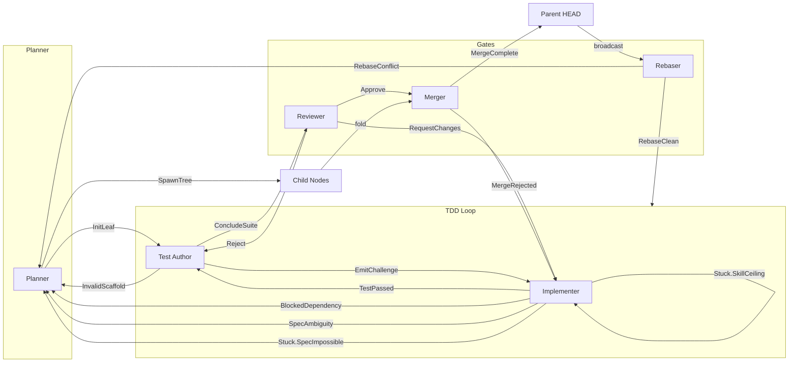

# V3 Protocol: Recursive Fractal Development

Claude Code sessions in Docker containers, recursively decomposing specs on git branches.

## Architecture

```
                              TRUNK
                                │
                    ┌───────────┴───────────┐
                    │       ROOT NODE       │
                    │   (Staff Engineer)    │
                    └───────────┬───────────┘
                                │ spawns
              ┌─────────────────┼─────────────────┐
              │                 │                 │
        ┌─────┴─────┐     ┌─────┴─────┐     ┌─────┴─────┐
        │  CHILD A  │     │  CHILD B  │     │  CHILD C  │
        │  (Senior) │     │  (Senior) │     │  (Senior) │
        └─────┬─────┘     └─────┬─────┘     └─────┬─────┘
              │                 │                 │
         ┌────┴────┐       LEAF NODE         ┌────┴────┐
         │         │      (no children)      │         │
      LEAF A1   LEAF A2                   LEAF C1   LEAF C2

        ═══════════════════════════════════════════════════
        UNFOLD: Specs decompose, branches spawn branches
        FOLD:   Completed work squash-merges back up
        ═══════════════════════════════════════════════════
```

## The Node Lifecycle

### 1. NODE_INIT (scaffold.jinja)

Node receives Spec from parent. Decides:

- **TREE**: Spec too complex → spawn child nodes
- **LEAF**: Spec simple enough → fork into worktrees

If TREE:
- Define interfaces between children
- Write contract suite (compliance tests)
- Spawn children on branches from HEAD
- Wait for children to complete

If LEAF:
- Create interface file (Types.hs)
- Create contract suite
- Fork into parallel worktrees:
  - Worktree A: Test-Author
  - Worktree B: Impl-Author

### 2. TDD Ping-Pong (test_author.jinja + implement.jinja)

Parallel worktrees communicate via MR:

```
┌──────────────┐         MR: failing test         ┌──────────────┐
│ TEST-AUTHOR  │ ───────────────────────────────▶ │ IMPL-AUTHOR  │
│ (Worktree A) │                                  │ (Worktree B) │
│              │ ◀─────────────────────────────── │              │
└──────────────┘      (waits for next test)       └──────────────┘
                              │
                              ▼
                     makes test pass
                              │
                              ▼
                     commits fix
```

**Handoff Artifact:** `test_manifest.json`
```json
{
  "spec_id": "REQ-102",
  "acceptance_criteria_map": {
    "test_stableSort": "AC-1: Sort must preserve order of equal elements"
  },
  "complexity_constraints": { "time": "O(n log n)" }
}
```

### 3. PRE_COMMIT (review.jinja)

Before merge, Review Agent gates:

**Phase 1 (Mechanical):**
- No orphaned TODOs
- No undefined bodies
- Formatting passes
- Build + tests pass

**Phase 2 (Semantic):**
- Acceptance criteria covered
- Contract suite passes
- Code quality acceptable

**Phase 3 (Changelog):**
- MergeEvent prepared for sibling cascade
- Impact level accurate

### 4. CHILD_COMPLETION (merge.jinja)

When child finishes, parent's Merge Handler:

1. Squash-merge child branch
2. Verify interface compliance via contract suite
3. Emit MergeEvent to remaining siblings
4. Advance parent HEAD

### 5. PARENT_HEAD_ADVANCED (rebase.jinja)

When sibling merges, cascade to remaining siblings:

1. Pause TDD loops
2. Rebase onto new parent HEAD
3. Resolve conflicts (sibling is Canon, you are Draft)
4. Fix drift regressions
5. Resume

## Structured Artifacts

### Spec
```yaml
id: string
description: string
acceptanceCriteria:
  - id: string
    text: string
complexityConstraints:
  time: O(...)
  space: O(...)
targetPath: string
testPath: string
```

### Test Manifest
```json
{
  "spec_id": "...",
  "target_file": "...",
  "test_suite": "...",
  "acceptance_criteria_map": { "testName": "AC-N: ..." },
  "complexity_constraints": { ... }
}
```

### MergeEvent
```yaml
author: <child node id>
impactLevel: TRIVIAL | ADDITIVE | BREAKING
changes:
  - symbol: string
    type: SIGNATURE_CHANGE | NEW_EXPORT | REMOVED_EXPORT | BEHAVIOR_CHANGE
    from: string (if applicable)
    to: string (if applicable)
    reason: string
```

### Exception
```yaml
type: SKILL_ISSUE | MISSING_DEPENDENCY | AMBIGUITY | CONTRADICTION
provenance: <exact spec sentence>
evidence: <test case or error>
attemptHistory:
  - approach: ...
    outcome: ...
```

## Exception Routing

| Exception | Action | Escalate To |
|-----------|--------|-------------|
| SkillIssue | Retry locally | None |
| MissingDependency | Block, request | Sibling/Parent |
| Ambiguity | Request clarification | Parent |
| Contradiction | Fundamental flaw | Root/Principal |

## Invariants

1. **Interface Immutability**: Once scaffold commits Types.hs, children cannot modify
2. **Test Immutability**: Impl-Author cannot change test logic
3. **Contract as Gate**: Merge requires contract suite to pass
4. **Sibling is Canon**: During rebase, merged sibling's code is authoritative
5. **MergeEvent Required**: Cannot merge without structured changelog
6. **Manifest Traceability**: Every test maps to acceptance criterion

## Templates

| Template | Trigger | Role |
|----------|---------|------|
| `scaffold.jinja` | NODE_INIT | Architect: complexity check, interface, spawn |
| `test_author.jinja` | WORKTREE_A_ACTIVE | Write failing tests with manifest |
| `implement.jinja` | NEW_TEST_MERGED | Make test pass, handle exceptions |
| `review.jinja` | NODE_PRE_COMMIT | Gate before merge |
| `merge.jinja` | CHILD_COMPLETION | Fold child, emit MergeEvent |
| `rebase.jinja` | PARENT_HEAD_ADVANCED | Cascade, adapt to sibling changes |

## Lifecycle State Machine

```mermaid
stateDiagram-v2
    [*] --> PLANNER: NODE_INIT

    state PLANNER {
        [*] --> analyzing
        analyzing --> SpawnTree: complex
        analyzing --> InitLeaf: atomic
        analyzing --> ClarificationNeeded: ambiguous
    }

    SpawnTree --> WAIT_CHILDREN: parallelize
    ClarificationNeeded --> [*]: escalate to parent

    state WAIT_CHILDREN {
        [*] --> waiting
        waiting --> waiting: MergeComplete\n(more pending)
        waiting --> GLUE: all done
    }

    InitLeaf --> TDD_LOOP: fork worktrees

    state TDD_LOOP {
        state TEST_AUTHOR {
            [*] --> writing_test
            writing_test --> EmitChallenge: test ready
            writing_test --> ConcludeSuite: all criteria done
            writing_test --> InvalidScaffold: types missing
        }

        state IMPLEMENTER {
            [*] --> implementing
            implementing --> TestPassed: green
            implementing --> RequestRetry: failed, new idea
            implementing --> BlockedDependency: need export
            implementing --> SpecAmbiguity: confused
            implementing --> Stuck: give up
        }

        EmitChallenge --> IMPLEMENTER
        TestPassed --> TEST_AUTHOR
        RequestRetry --> IMPLEMENTER: self-loop\n(max 5)
        ConcludeSuite --> REVIEWER
    }

    InvalidScaffold --> PLANNER: repair

    state REVIEWER {
        [*] --> reviewing
        reviewing --> Approve
        reviewing --> RequestChanges
        reviewing --> Reject
    }

    Approve --> MERGER
    RequestChanges --> IMPLEMENTER: inject critique
    Reject --> TEST_AUTHOR: missing criteria

    state MERGER {
        [*] --> merging
        merging --> MergeComplete
        merging --> MergeRejected
    }

    MergeComplete --> [*]: squash to parent
    MergeRejected --> IMPLEMENTER: fix violations

    GLUE --> REVIEWER: glue complete

    state REBASER {
        [*] --> rebasing
        rebasing --> RebaseClean
        rebasing --> RebaseAdapted
        rebasing --> RebaseConflict
    }

    TDD_LOOP --> REBASER: PARENT_HEAD_ADVANCED
    RebaseClean --> TDD_LOOP: resume
    RebaseAdapted --> TDD_LOOP: resume
    RebaseConflict --> PLANNER: escalate

    BlockedDependency --> PLANNER: check siblings
    SpecAmbiguity --> PLANNER: spec amendment

    state Stuck {
        SkillCeiling --> IMPLEMENTER: upgrade model
        InfiniteLoop --> IMPLEMENTER: context reset
        SpecImpossible --> PLANNER: spec challenge
        ResourceExhausted --> [*]: human escalation
    }
```

## Typed Edge Flow



## Routing Matrix

Each exit type maps to an orchestrator action. See `types.yaml` for full definitions.

| Actor | Exit Type | Action | Target | Mutation |
|-------|-----------|--------|--------|----------|
| Planner | `SpawnTree` | parallelize | Child Nodes | freeze node, await ALL_CHILDREN_DONE |
| Planner | `InitLeaf` | fork | TestAuthor + Implementer | init worktrees |
| Planner | `ClarificationNeeded` | escalate | Parent.Planner | - |
| TestAuthor | `EmitChallenge` | dispatch | Implementer | add TestChallenge to context |
| TestAuthor | `ConcludeSuite` | transition | Reviewer | lock src/, run static analysis |
| TestAuthor | `InvalidScaffold` | repair | Planner | - |
| Implementer | `TestPassed` | loop | TestAuthor | clear current task |
| Implementer | `RequestRetry` | self_loop | Implementer | increment attempts (max 5) |
| Implementer | `BlockedDependency` | escalate | Planner | check sibling exports |
| Implementer | `Stuck.SkillCeiling` | vertical_scale | Implementer | upgrade model |
| Implementer | `Stuck.InfiniteLoop` | context_reset | Implementer | wipe short-term memory |
| Implementer | `Stuck.SpecImpossible` | escalate | Planner | spec challenge |
| Reviewer | `Approve` | finalize | Merger | - |
| Reviewer | `RequestChanges` | loop | Implementer | inject CritiqueList |
| Merger | `MergeComplete` | broadcast | Siblings.Rebaser | advance HEAD |
| Rebaser | `RebaseClean` | resume | TDDLoop | - |
| Rebaser | `RebaseConflict` | escalate | Planner | - |

## Envelope Pattern

Routing envelope is small. Full payload written to context store.

```yaml
# What orchestrator sees (fast routing decision)
envelope:
  type: "BLOCKED_DEPENDENCY"
  severity: "BLOCKER"
  route_hint: "check_sibling_exports"

# What recipient reads (full context)
payload_location: "context/blockers/{node_id}.json"
```

**Why?** Orchestrator doesn't need stack traces. It just needs to know who runs next.

## Priority Mailbox

When multiple messages arrive simultaneously, process in order:

1. **`ContextShift`** (Rebase) — "Stop everything, world broke"
2. **`SemanticCritique`** (Review) — "You're done but wrong"
3. **`TestChallenge`** (New work) — "Do this next"
4. **`StatusQuery`** — "Are you alive?"

Example: Implementer emits `TestPassed` while `ContextShift` arrives.
1. Accept the `TestPassed` (commit the code)
2. Immediately schedule Rebaser
3. Queue next test until rebase confirms clean
