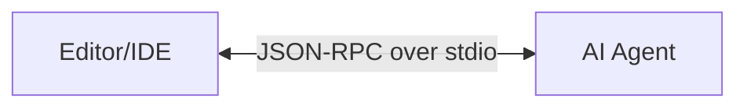
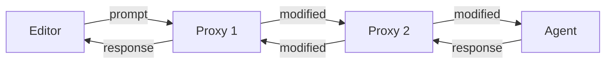
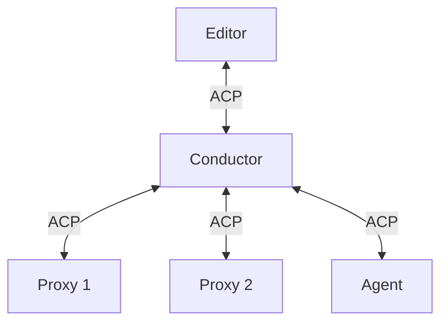

# Architecture Overview

SACP enables composable agent systems through a proxy chain architecture.

## Clients and Editors

The Agent Client Protocol (ACP) separates the **client** (typically an editor or IDE) from the **agent** (the AI model that processes requests).



This separation enables:

- Different editors to work with the same agents
- Different agents to work with the same editors
- Middleware to sit between them and add functionality

The client communicates with the agent using JSON-RPC messages over stdio, sending requests like `prompt` with user messages and receiving responses with AI-generated content. The agent maintains conversation state and coordinates tool execution.

This clean separation is the foundation that makes proxies possible.

## Proxies

Proxies sit between the client and agent, intercepting and transforming messages like middleware in a request/response chain.

### Conceptual Model

Conceptually, proxies form a linear chain where messages flow through each component:



This mental model helps understand the flow: Editor → Proxy 1 → Proxy 2 → Agent, with responses flowing back through the chain.

### What Proxies Can Do

**Modify or add prompts**: Inject system prompts, add context, or transform user messages before they reach the agent.

**Delegate to specialized agents**: Route different types of requests to different agents based on content or capabilities.

**Introduce MCP servers**: Add tool access by bridging MCP servers into the ACP conversation.

**Add observability**: Log messages, collect metrics, or trace requests through the system without modifying other components.

### Actual Implementation

The actual implementation differs from the conceptual linear chain. Instead of proxies talking directly to each other, the **conductor** sits between every component and manages all communication. See the [Conductor](#conductor) section below for details.

## Conductor

The **conductor** is the orchestrator that manages a proxy chain. From the editor's perspective, it appears as a normal ACP agent.

### Communication Model

Each component only communicates with the conductor, not directly with other components:



The conductor routes messages through the chain using the `_proxy/successor/request` protocol:

**When a proxy wants to send downstream**: It sends `_proxy/successor/request` to the conductor, which unwraps and forwards the inner message to the next component.

**When the conductor delivers upstream messages**: It wraps agent-to-client messages in `_proxy/successor/request` before sending them to proxies.

### Chain Topologies

**Linear chains** terminate in an agent:
```
Editor → Conductor → Proxy 1 → Proxy 2 → Agent
```

**Subtrees** occur when a conductor runs in proxy mode within a larger chain:
```
Editor → Proxy A → Conductor (proxy mode) → Proxy Z
                        ↓ manages
                    Proxy B → Proxy C → Proxy D
```

When the conductor itself receives the proxy capability during initialization, it enters proxy mode where the final component can forward messages to the conductor's own successor.

### Responsibilities

**Process Management**: Spawns and manages component subprocesses.

**Message Routing**: Routes messages through the proxy chain while preserving send order.

**Capability Handshake**: Negotiates proxy capability with each component during initialization. See [Protocol Reference](./protocol.md) for details.

**Ordering Guarantees**: Ensures messages maintain send order even when responses and notifications use different transport paths.

For more details on conductor implementation, see [Conductor Implementation](./conductor.md).
